# PRIP并行冗余互联协议详细设计说明书

[toc]

## 1 引言

### 1.1 编写目的

本文目的在于根据《PRIP 并行冗余互联协议需求分析说明书》,提出满足功能需求、性能需求和维护需求的合理的总体技术方案。本文内容可作为总体技术方案评审的依据,也是指导后续设计开发的基本参考。

### 1.2 项目背景

在一些重点行业,特别是电力行业自动化业务,对网络通信的通信的可靠性和实时性有着极高的要求。传统冗余通信解决方案热备份切换机制,由于切换时间过长,且代价较高不能满足要求。基于此,IEC64329-3 标准中提出了 PRP 和 HSR 两种机制满足了 0 延时切换时间的高可靠性、高可用性的需求。

要实现 PRIP 并行冗余协议,应基本基于软件实现,同时要满足 0 延时切换的高可靠行和高可用性。 要实现 PRIP 协议,需要对内核网络协议栈二次开发。本次任务要求完成《PRIP 并行冗余互联协议》,提供相应的应用程序接口,并提供配套的文档和使用说明书。

 

## 2 PRIP 并行冗余互联协议综述

本章将对 PRIP 并行冗余互联协议的产生背景、协议内容、通信模型、基本功能和通信数据格式等进行简要的介绍。

 

### 2.1 提出背景

在冗余通信方面,符合 IEC64329-3 标准的 PRP 和 HSR 两种机制满足了 0 延时切换时间的可靠所性和高可靠性要求,并被广泛应用。但 PRP 和 HSR 两种机制的实现依赖于特殊的网络设备或对网络拓扑结构有着特殊的要求。

PRIP 并行冗余互联协议,Parallel Redundancy Internet Protocol,是由北京凝思科技有限公司自主提出、论证并制定的适用于冗余网络通信的一种新型协议标准。PRIP 并行冗余互联协议可完全满足冗余通信的基本功能要求和 0 延时切换的性能要求,并且完全基于软件实现,对网络设备和网络拓扑无特殊的要求。

 

### 2.2 通信模型

如图 1 所示,使用 PRIP 协议通信的两台主机 A 和 B 都分别同时处于两个相互隔离独立的局域网内,从而确保计算机 A 和计算机 B 之间有两条独立的物理链路相连,一条被成为主链路,另一条被称为从链路。从链路对完全用户透明,用户只会感觉主链路的存在。PRIP 并行冗余互联协议的通

信模型包括冗余发送和冗余接收。

- 冗余发送流程:

  (1) 生成双包。将来之应用程序的数据包复制一份,原数据包与复制包分别称为主包和从包。

  (2) 为双份数据包分别添加构建 PRIP 协议 IP 选项。

  (3) 从包目的地址替换。确保从包从从链路发送。

  (4) 发送。

- 冗余接收流程:

  (1) 解析接收到的数据包的 PRIP 协议 IP 选项。

  (2) 根据解析结果判断数据包是否重复。若是重复的包,丢弃;否则,接收。

  (3) 从包目的地址替换。 若需要接收的包是从包,需要进行目的地址替换,确保数据包可以到达正确的应用程序。

向上层提交。

 

### 2.3 基本功能

PRIP 并行冗余互联协议具备以下四个基本功能:

​	(1) 数据冗余发送。数据冗余发送指的是:将数据包生成双份携带相同有效载荷的数据包,并为它们分别添加 PRIP 协议相关数据,最终确保将这两份携带相同载荷的数据包从不同的物理链路发送出去。

​	(2) 数据冗余接收。由于 PRIP 协议采用数据冗余发送,所以总会收到两份携带相同数据的数据包。对于首先到的那份数据包,予以接收;后到的那份,视为冗余,予以丢弃。

​	(3) 链路告警功能。在数据冗余接收过程中,根据两条链路的收包情况分析链路的运行状况,并在链路出现异常时候向用户发出告警信息。

​	(4) 不影响正常网络通信。PRIP 协议通信的存在不会对正常的网络功能造成影响,同时对正常网络性能的影响也会保持在%1 的可接受范围内。

 

### 2.4 通信数据格式

PRIP 协议 IP 选项在冗余发送时构建添加,在冗余接收时予以解析,在 PRIP 通信时作为承载协议的数据基本载体随数据包发送和接收。PRIP 协议 IP 选项是协议大部分功能赖以实现的核心,其数据格式也是 PRIP 并行冗余互联协议的基本标准。对于 PRIP 协议 IP 选项的数据格式,PRIP 协议做了IP详细的规定:

#### 2.4.1 通用 IP 选项格式

对于 IPv4 来说,在 IP 协议头中除了常规的协议头的信息外,还可以包含 IP 选项,IP 选项最大可以包含 40 个字节。 Linux 的 TCP/IP 协议栈实现了一系列 IP 选项,供应用程序使用。应用程序通过IP 选项可以跟踪 IP 数据包的发包过程。如果数据包携带了 IP 选项,IP 协议头可由原来基本的 20 个字节扩展至最多 60 个字节。 大多数 IP 选项使用的很少,不同的选项可以组合在同一数据包中。 IP 选项的格式如下图所示:

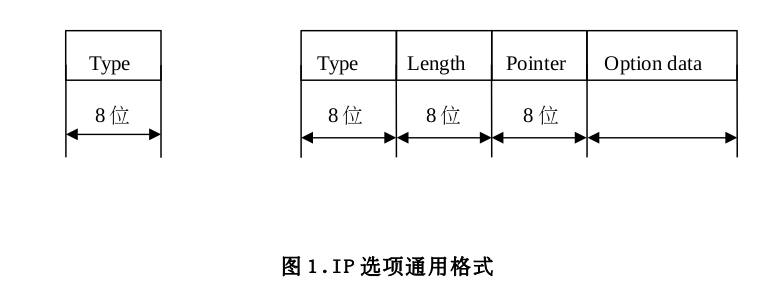 

如图 1 为通用 IP 选项的格式。IP 选项可以是单字节的,也可以是多字节的,它包含了以下几个基本的数据域。

​	(1) Type 数据域。Type 数据域是一个 8 位的数据域,它主要描述当前 IP 数据包协议头信息中设置了什么 IP 选项,以及在 IP 数据包进行分片时如何处理该选项。比较常有的 IP 选项有松散原路由并记录路由选项(Loose Source and Record Route)、严格原路由并记录路由选项(Strict Source andRecord Route)、记录时间戳选项(Timestamp)、记录路由选项(Record Route)、路由报警选项(Routeralert)等。

​	(2) Length 数据域。 Length 数据域描述选项的长度,包括 Type 和 Length 在内。占一个字节。

​	(3) Pointer 数据域。Pointer 数据域指的是从选项起始地址开始的偏移量,描述选项在何处结束,在主机解析选项时使用。占一个字节。

​	(4) Option data 数据域。Option data 数据域用于存放选项需要的或需要添加的任何数据。

 

#### 2.4.2 PRIP 协议 IP 选项数据格式

PRIP 协议 IP 选项是 PRIP 协议定义的 IP 选项。网络通信时候,PRIP 协议 IP 选项携带 IP 数据包的 PRIP 协议的相关数据,是 PRIP 协议最重要的标准,同时也完全符合通用 IP 选项格式。 PRIP 协议通信时候,PRIP 协议 IP 选项在协议栈三层数据包发送是添加。接收时,在协议栈三层解析,用于冗余接收。这样最终做到了对用户完全透明。

PRIP 协议 IP 选项的格式及其各数据域定义如图 2 所示。Type 数据域的值是 18,代表 PRIP 协议IP 选项类型编码为 18,以及在 IP 数据包分片时不复制该选项;Length 数据域的值为 14,但 RFC760

标准规定 IP 选项长度必须是四字节的倍数,因而在实际的构建 PRIP 协议 IP 选项时候会在其末尾会添加 2 个字节的填充字节;Pointer 数据域的值是 15,指的是该选项的结束位置的下一个字节在 IP选项中的偏移值为 15;Option data 数据域是 IP 选项数据域,包含 8 字节的本半轮发送时间戳、2 字节的 PRIP 序列号和 1 字节的主从标志。

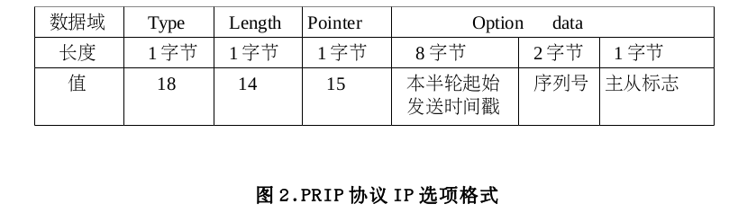 

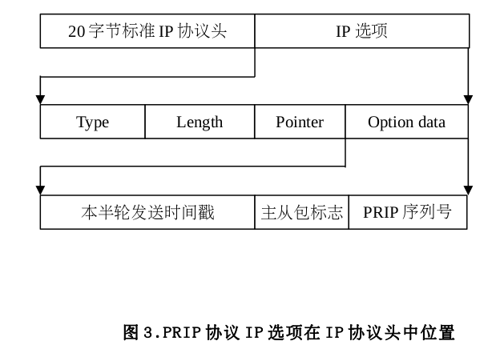  

 

## 3 需求概述

本章对 PRIP 并行冗余互联协议功能需求和性能需求进行简要介绍,保证技术方案覆盖全部需求。关于满足维护需求的设计方案在第 6 章描述。

### 3.1 功能需求

集成 PRIP 并行冗余互联协议的操作系统主要包括下面 10 个基本功能:

1. 数据冗余发送;

2. 数据冗余接收;

3. PRIP 协议配置功能;

4. 链路故障报警功能;

5. 提供 PRIP 协议应用编程接口;

6. 辅助工具;

7. 配置工具;

8. 对标准网络无影响;

9. 对硬件无特殊要求;

10. 功能性能与 PRP 协议相同。

以上就是集成 PRIP 并行冗余互联协议的操作系统的功能需求,在以后的篇幅里我们也将以此顺序详细叙述。表 1 以表格的形式列出了各功能需求,如下:

 

### 3.2 性能需求

表 2 列出了集成了 PRIP 协议的操作系统的全部性能需求,以及在需求说明书和技术方案中对应的章节。

 

 

## 4 总体设计

根据需求说明书中的描述,业务对象主要是电力等重点领域的网络通信业务。这样的应用系统对用户界面要求不是太高,但是需要网络传输的安全可靠。PRIP 并行冗余互联协议作为一种全新的、完全自主开发的通信协议,需要作为操作系统的一部分被集成到内核里面去。鉴于 Linux 的开源特性和优越的网络性能,并结合我们的传统操作系统开发技术优势,因此提出了基于 Linux 的 PRIP协议操作系统的解决方案。

两台安装了 PRIP 并行冗余互联协议操作系统的计算机的简单通信示意图如下:

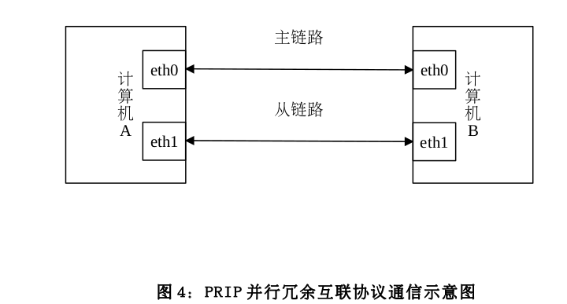 

由图 4 可知,若要使得 PRIP 协议正常运行,集成了 PRIP 并行冗余互联协议的计算机至少要有两块网卡,其中一块为 PRIP 主网卡,另一块为 PRIP 从网卡。 正常 PRIP 通信时,本计算机的 PRIP 主网卡与远端计算机的 PRIP 主网卡通信,它们之间的链路为 PRIP 主链路,本计算机的 PRIP 从网卡与远端计算机的 PRIP 从网卡通信,该链路为 PRIP 从链路。之所以 PRIP 的网卡有主从之分,主要是因为只有主网卡的接口 IP 地址才会对应用程序可见,从设备的接口 IP 地址对用户程序不可见。

如图 4,在计算机 A 上,eth0 为其 PRIP 主网卡,eth1 为其 PRIP 从网卡;在计算机 B 上,eth0为其 PRIP 主网卡,eth1 为其 PRIP 从网卡。其中,计算机 A 上 eth0 和计算机 Beth0 之间的链路为PRIP 主链路,计算机 A 上 eth0 和计算机 B 上 eth1 之间的链路为从链路。

以计算机 A 发送数据计算机 B 接收数据为例,一次简单的 RIP 协议通信的的过程如下:

- 计算机 A 的向 B 发送过程如下:

  (1) 在计算机 A 上,应用程序调用接口开启 PRIP 功能并发送数据。

  (2) 当包含来之应用程序数据的数据包进入协议栈的网络层时,若是 PRIP 连接的数据包,则将数据包复制一份,本数据包为主包,复制出来的数据包为从包。

  (3) 将从包的目的 IP 地址替换为远端计算机 B 的 PRIP 从网卡 eth1 的接口 IP 地址。

  (4)然后为主从包分别构建 IP 选项,将相同的 PRIP 流水序列号和不同的主从标志分别加入主从包的 IP 选项,即,主包的 IP 选项携带主标志,从包的 IP 携带从标志,主从包携带相同的 PRIP流水序列号。

  (5) 按照先主包后从包的顺序分别发送两个数据包。

 

- 当 PRIP 数据包到达计算机 B 时,计算机 B 的接收流程如下:

  (1) 解析 PRIP 协议 IP 选项,提取数据包的发送时间戳、PRIP 序列号和主从标识;

  (2) 进入冗余包丢弃算法丢弃重复包;

  (3) 更新相关数据统计;

  (4) 链路告警处理;

  (5) 目的 IP 替换。 查看已经接收包的主从标识,若接收的数据包是从包,则需要替换其目的 IP。

  (6) 数据包到达应用程序。

至此,完成一次 PRIP 通信。

 

### 4.1 功能需求技术方案

在 Linux 操作系统中,网络数据是由内核网络协议栈进行处理的。这一处理过程如图 5 所示。

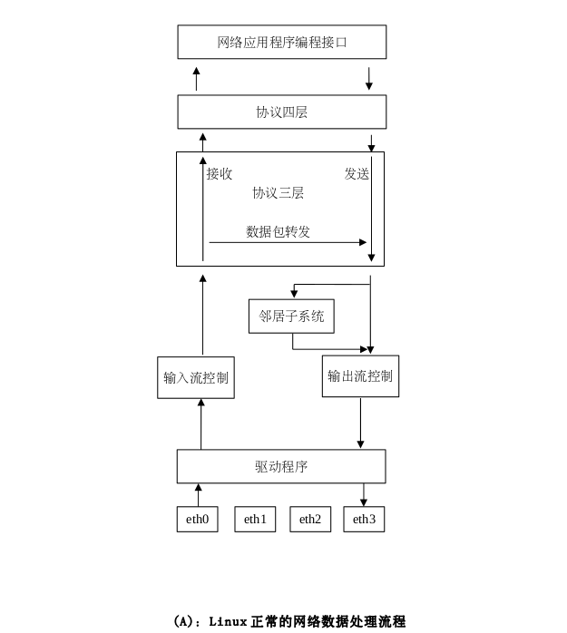  

 

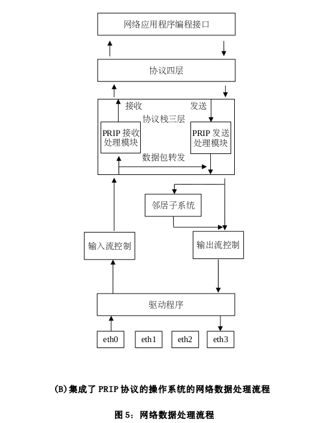  

 

当收到数据包时,会触发网卡中断,由中断服务程序完成数据接收。网卡驱动程序去掉数据包的数据链路层协议头后,接收软中断会调用协议栈三层的接口函数将数据包交给协议栈三层处理。在协议栈三层里,首先对输入包进行路由,若数据包不是发给本机的且本机设置了转发功能,那么会对数据包进行输出路由,选择合适的网络接口和下一跳目的地址发送出去。

在协议栈三层,在数据包经过路由子系统、IP 协议头正确性检查、IP 分片组装之后(如果有的话),会进入 PRIP 协议接收处理模块。在 PRIP 协议接收处理模块中,首先检查数据包是否属于PRIP 连接的包,若不是,则不做处理,将数据包继续向上层推送。 若数据包属于 PRIP 连接的包,则通过解些 Ip options 提取 PRIP 序列号和主从标志,通过查询 PRIP 序列号缓存表来判断该序列号的包是否已经收到。 若未收到,则是第一次到达的包,接收并向协议栈上层推送。 若已经受到,则属于冗余包,丢弃处理。

当应用程序发送网络数据时候,如果是进行 PRIP 通信,应用程序会调用相应的应用程序接口设置数据包的 PRIP 标志。数据包经协议栈四层处理之后,会被交给协议栈三层。在协议栈三层,数

据包在添加了三层协议头之后,会被交给 PRIP 发送模块处理。在 PRIP 发送模块里,若数据包是正常的网络数据包,则不做处理,向下发送。若数据包属于 PRIP 包,会将当前的数据包复制一份,并将复制出来的包的目的地址替换为 PRIP 从链路的远端 IP 地址。同时,用当前的 PRIP 流水序列号为两个包构建 Ip options。之后,将两个包交给路由子系统。

路由子系统会为数据包选择合适的发送网络接口和下一跳地址。同时会查看路由查询结果里是否已经为本数据包缓存了数据链路层硬件头缓存,如果有,则调用邻居子系统的发送接口执行快速发送。若没有缓存数据链路层协议头,则调用邻居子系统的发送接口进行慢速发送,此时,邻居子系统会先进行 arp 请求,来获得目的地址的 MAC 地址,然后调用相应的网卡驱动发送数据。如图 2所示:将 PRIP 并联冗余互联协议的实现放在了协议协议栈的三层,可实现需求说明文档的需求功能。这些功能需求具体来说包括:

- 实现 PRIP 数据冗余发送 。在图 5.B 中的 PRIP 发送处理模块中,会将来自应用程序的数据包复制一份,并对复制出来的数据包进行目的 IP 替换,同时为两个数据包构建相应的 Ip options,最后通过不同的网络接口发送到主从链路上。这样,两个携带相同有效载荷的数据包分别通过两个相互独立的物理链路进行传输,从而实现了关键业务数据的冗余传输。

- 实现 PRIP 冗余接收处理 。在图 5.B 中的 PRIP 接收处理模块中,对于正常的网络数据包不做处理,只处理属于 PRIP 连接的数据包。每收到一个 PRIP 数据包,会从数据包的 Ip options 里提取本包的 PRIP 序列号,根据该序列号查询本地缓存的 PRIP 序列号表,看该序列号的的数据包是否已经收到。 若没有收到,则接收,并更新本地 PRIP 序列号表中该序列号的接收状态。 否则,丢弃处理。

- PRIP 协议配置显示功能。由于互为冗余的两条链路处于不同的局域网,为实现正常的网络通信,因此在通信本机上需要用户配置对端计算机 PRIP 设备的主从网卡所处的网段。如图 4,在计算机 A 向 B 发送数据时,在 A 上需要配置计算机 B 的 eth0、 eth1 所处的网段。 这样,路由机制可以保证互为冗余的双包通过不同的链路发送到计算机 B 上。此外,由于运行环境的差异,允许用户对 PRIP运行参数进行设置,如报警阀值等。

- PRIP 协议的配置功能通过 PROC 虚拟文件实现的。在内核启动后,会在/proc 下创建 PRIP 所需文件节点,用户和内核程序通过对文件节点的读写来实现的数据交互。

- 支持冗余单链路故障报警功能。 如图 5.B,在 PRIP 接收处理模块中,每接收一个属于 PRIP 连接的包,根据该包的抛弃与否,都会更新相应的统计信息。当冗余链路中的一条连续丢包数超过设定的报警阀值,就会通过 proc 文件系统将报警信息呈现给用户。此外,还实现将程序的运行数据和相关的统计信息通过 proc 文件系统呈现给用户。

- PRIP 协议应用程序接口。 除了需要对 setsockopt()函数进行扩展以实现对每个套接字的 PRIP功能的开启与关闭之外,其他应用程序接口皆与同版本的 Linux 系统的网络编程接口兼容。

- PRIP 界面配置显示工具。本技术解决方案将为用户提供界面化配置显示工具。 该功能基于 Web服务器来进行实现,将方便用户对 PRIP 协议远程、直观地进行配置和查看。

- 对标准网络无影响 。PRIP 协议的实现和运行不会影响到 Linux 操作系统正常的网络功能,对于使用正常网络功能的用户来说,完全感受不到 PRIP 协议的存在,从而实现了对用户完全透明。

- PRIP 功能规格与 PRP 相同 。PRP(Parallel Redundancy Protocol)作为一种经过市场考验的成熟的网络通信冗余协议,其功能实现较为完备和标准化,同时也体现了用户基本需求。PRIP 并行冗余互联协议作为一种新型的网络通信冗余协议,其功能实现与 PRP 功能看齐,实现 PRP 协议所具有的全部功能。

- 对硬件无特殊要求。与 PRP(Parallel Redundancy Protocol)相比,PRIP 协议完全基于软件实现,不依赖专有硬件和特殊的网络拓扑。这也是 PRIP 较 PRP 的优势所在。

 

### 4.2 性能需求技术方案

为了保证集成 PRIP 并行冗余互联协议的操作系统具有良好的精度、灵活性、 输入输出、数据管理以及故障处理要求,我们将以凝思磐石 Linux 操作系统为基础进行开发。 该操作系统兼容普通 Linux操作系统,具有优良的网络性能,在普通服务器系统中可以轻松处理 200 万以上的网络连接。具体性能指标将在本文档最后详细予以详述。

 

## 5 模块设计

下面对各功能模块的技术实现方案进行详细介绍。为了叙述方便,将按照 4.1 节的叙述顺序将各个模块详细叙述。

### 5.1 PRIP 冗余发送功能实现

PRIP 冗余发送功能需求为:

为确保数据业务的高可靠行,PRIP 协议要求对同一份数据须生成两份,经两个相互独立的物理链路进行传输,即实现数据传输冗余。

这里,本项目将使用这样一种方案。该方案采用修改协议栈处理流程的办法,在数据包的发送路径的合适的点来进行我们的 PRIP 的发送处理。 因为这个点并不位于协议栈的 Net filter 钩子点,采用独立的模块的办法不能实现,所以需要在协议栈内部直接嵌入我们的代码。

方案如下:

该方案的实现模块被称为 PRIP 发送处理模块。该模块处于协议栈三层,即 IP 网络层内。对于IPV4 来说,IP 网络层在数据包发送方面所作的工作主要有:

​	1.构建并填充 IP 协议头。

​	2.构建 IP 选项(如果有)。

​	3.Ip 数据包的分片(如果需要)。

​	4.Ip 发送路由选路。

​	5.由网络过滤子系统检查数据包。

​	6.更新相关统计信息。

7.调用数据链路层入口函数将数据包向下层发送。

在 linux 内核中,TCP 协议和 UDP 协议数据包的发送路径不尽相同,下面将计针对两种协议不同的设计方案予以介绍。在介绍之前,再简单呈现 TCP 协议的三次握手和断开连接四次握手过程。

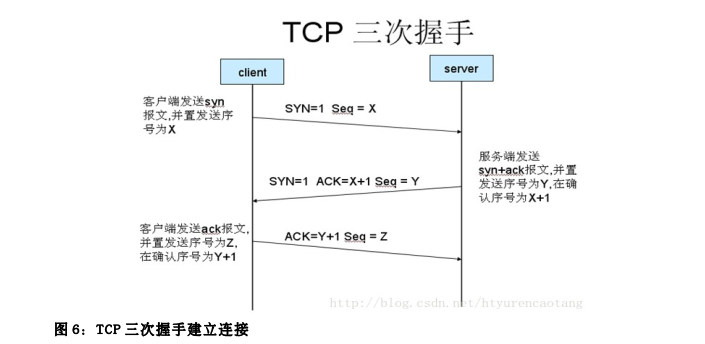 

 

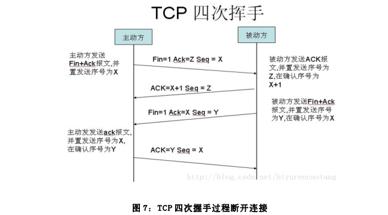 

 

在 TCP/IP 协议中,TCP 协议提供可靠的连接服务,采用三次握手建立一个连接。如图 6 所示:第一次握手:建立连接时,客户端发送 syn 包(syn=j)到服务器,并进入 SYN_SEND 状态,等待服务器确认;

第二次握手:服务器收到 syn 包,必须确认客户的 SYN(ack=j+1),同时自己也发送一个

SYN 包(syn=k),即 SYN+ACK 包,此时服务器 进入 SYN_RECV 状态;

第三次握手:客户端收到服务器的 SYN+ACK 包,向服务器发送确认包 ACK(ack=k+1),此包发送完毕,客户端和服务器进入 ESTABLISHED 状态,完成三次握手。 完成三次握手,客户端与服务器开始传送数据。

由于 TCP 连接是全双工的,因此每个方向都必须单独进行关闭。这个原则是当一方完成它的数据发送任务后就能发送一个 FIN 来终止这个方向的连接。收到一个 FIN 只意味着这一方向上没有数据流动,一个 TCP 连接在收到一个 FIN 后仍能发送数据。首先进行关闭的一方将执行主动关闭,而另一方执行被动关闭。具体过程如图 7 所示:

​	(1) 客户端 A 发送一个 FIN,用来关闭客户 A 到服务器 B 的数据传送。

​	(2) 服务器 B 收到这个 FIN,它发回一个 ACK,确认序号为收到的序号加 1。和 SYN 一样,一个 FIN 将占用一个序号。

​	(3) 服务器 B 关闭与客户端 A 的连接,发送一个 FIN 给客户端 A。

​	(4) 客户端 A 发回 ACK 报文确认,并将确认序号设置为收到序号加 1。

 

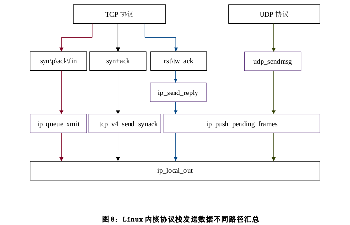 

 

Linux 内核协议栈在发送数据上不同的协议或不同类型的数据包处理放式不尽相同。 如图 8 所示,在 TCP 协议和 UDP 协议数据的发送方面存在四条不同的发送路径。

对于 TCP 协议数据来说,共有三条不同的发送路径:

​	(1) 对于正常的数据包、 TCP 三次握手 SYN 包、 TCP 三次握手 ACK 包、 TCP 断开连接四次挥手 FIN 包来说,其发送路径如图 8 中红色箭头所示。在该路径上,调用 ip_queue_xmit()函数,在该函数内部,如果数据包尚未进行路由,则对对数据包进行路由,然后调用 ip_local_out()函数进入所有包 IP网络层统一发送路径。

​	(2) 对于 TCP 协议三次握手中的 SYN+ACK 包来说,其发送路径如图 8 中黑色箭头所示。 在该路径上,调用__tcp_v4_send_synack()函数对数据包进行路由,成功之后调用 ip_local_out()函数进入所有包 IP 网络层统一发送路径。

​	(3) 对于 TCP 复位连接 RST 数据包和四次分手 LAST_ACK 数据包来说,起发送路径如图 8 中的蓝色箭头所示。在该路径上,会调用 ip_send_reply()函数对 RST 或者 LAST_ACK 数据包进行路由,成功之后调用 ip_push_pending_frames()函数,然后调用 ip_local_out()函数进入所有包 IP 网络层统一发送路径。

对于 UDP 协议数据包来说,只存在一条发送路径,如图 8 中的绿色箭头所示。在 UDP 发送路径上,会调用udp_senmsg()函数对尚未进行路由的数据包进行路由,路由成功之后 调用ip_push_pending_frames()函数,之后调用 ip_local_out()函数进入所有包 IP 网络层统一发送路径。

其中, 图 8 中棕色框中为根据 PRIP 并行冗余互联协议设计需要 进行修改的函数。包括ip_send_reply() 函 数 、 ip_queue_xmit() 函 数 、 tcp_v4_send_synack() 函 数 、 udp_sendmsg() 函 数 和ip_push_pending_frame()函数。

 

#### 5.1.1 TCP 协议 PRIP 数据冗余发送实现

根据 PRIP 并行冗余互联协议功能需求,对于 TCP 协议来说,PRIP 数据冗余发送主要完成一下几方面工作:

​	(1) 生成冗余包,即生成从包,包括复制主包数据及从包目的 IP 替换。

​	(2) 为主从包构建相应的 PRIP 协议 IP 选项。

​	(3) 为从包进行路由。

​	(4) 发送主从包。

在修该内核代码的时候,本设计方案将遵循一下两个原则:

- 就近修改原则。例如,本设计将在标准内核源码进行 IP 选项解析的地方增加 PRIP 协议 IP选项的解析;在标准内核源码对 Ip 选项进行构建的地方,本设计增加 PRIP 协议 IP 选项的构建。

- 主从包处理镜像对称原则。在从包生成以后,将保证从包具备与主包具有对等的相应特性,并在以后的处理中,使得主从包处理呈对称特性。例如,在对主包进行数据统计地方,也必须对从包进行统计;在标准内核源代码内为数据包进行路由的地方,需增加对从包的路由;若生成从包时主包已经进行过 IP 路由,则必须对生成从包单独进行路由(替换目的 IP 之后)。

遵循这两项原则,可以最大限度保留内核协议栈原有优良层次结构,并且可以简化设计,快速筛选和锁定所要修改的源码位置。

 

5.1.1.1 正常已建立连接 TCP 数据包的 PRIP 冗余发送处理

正常内核协议栈中已建立连接的 TCP 数据发送路径如图 8 中的红线箭头所示,该发送路径同时也是 TCP 三次握手 SYN 包、 TCP 三次握手 ACK 包、 TCP 断开连接四次挥手 FIN 包的发送路径。为了实现PRIP 协议数据冗余发送功能,本设计选择在函数 ip_queue_xmit()函数里面实现该功能。主要基于以下几种考虑:

-  ip_queue_xmit()函数函数实现包含了 IP 选项的创建(调用 ip_build_options()函数)。根据“就近修改”的原则,PRIP 协议 IP 选项的构建需要放在 ip_build_options()函数里面实现。ip_queue_xmit()函数包含 IP 选项的创建,就必须为从包创建 IP 选项,从包的 IP 选项的创建也最好放在这里。

- ip_queue_xmit()函数会判断数据包是否已经经过路由,如果没有的话需要为数据包进行路由。所以对从包进行路由也需要放在这里。确保主从包处理的对称兼顾。

基 于 上 述 原 因 , 本 设 计 选 在 ip_queue_xmit() 函 数 里 实 现 PRIP 协 议 冗 余 发 送 功 能 。 由 于ip_queue_xmit()函数位于协议三层的顶部,所以该发送路径实现完全位于协议三层,即 IP 网络层。

标准 Linux2.6.32 内核 ip_queue_xmit()函数位于 L3 层的最上部,它由传输层 L2 层在发送数据是调用。 该函数首先检查数据包是否已经缓存了路由信息,如果没有,就查询路由缓存。 若路由查找失败,则说明还没有为该数据包创建路由缓存,那么就接着查询路由表,并根据查询结果创建属于该数据包的路由缓存;其次,为数据包构建并初始化 IP 协议头,并查看该数据包是否设置了 IP 选项,如果有,则为该数据包构建相应的 IP 选项。最后调用 ip_local_output()函数向下发送 IP 数据包。

 

综上分析,正常数据包 PRIP 协议数据冗余发送模块工作可概括为:

​	(1) 查看主包路由缓存是否存在;若不存在重新进行路由;如果路由失败,记录主包发送失败,进入发送从包环节;如果发送成功,但路由下一跳地址不等于主包目的 IP 地址,那么记录主包发送失败,进入发送从包环节。

​	(2) 如果主包路由成功且路由下一跳地址等于目的 IP 地址。初始化主包 IP 协议头。

​	(3) 为主包构建 PRIP 协议 IP 选项。

​	(4) 复制主包生成从包。

​	(5) 发送主包,并记录主包发送成功与否。

​	(6) 对从包进行路由查询。若查询失败,记录从包路由失败;若查找成功则查看下一跳地址是否等于从包目的地址。若不等于,记录从包路由失败。

​	(7) 替换从包目的 IP 地址。

​	(8) 替换从包 PRIP 选项主标志为从标志。从包复制于主包,并且和 IP 选项一块复制,所以需要替换。

​	(9) 发送从包。如果主包和从包均发送失败,那么返回发送失败;否则,返回发送成功。

PRIP 协议数据冗余发送模块流程图如图 9 所示。

在进行 PRIP 协议冗余发送设计时,除了实现基本的功能之外,也考虑了如下几点:

- 可靠性。

在发送主包时,如果主包路由失败或者发送失败的情况,仍将进行从包的发送工作,主从包只要有一个数据包发送成功话,就会返回发送成功。 这样当因本主机主网卡 DOWN 掉而导致主包路由失败的时候,仍可将从包发送出去,保证通信的可靠进行。

- 性能。

在进行冗余发送的时候,保持主包先发从包后发的顺序,这样提高主包优先到达对端主机的概率,PRIP 冗余唯一接收算法会接收先到的主包,舍弃后到的从包。与接收从包的处理相比,接收主包少去了目的 IP 替换环节,可以直接处理,因而对协议栈的性能损耗较低。

对于从包生成的时机,本设计选在主包发送的前一刻,此时主包的 IP 协议头、PRIP 协议 IP 选项等皆已具备。因从包复制于主包,这将为从包省去 IP 协议头初始化、构建 IP 选项这些重复工作,只需对从包进行目的 IP 地址替换、和 PRIP 选项主标志替换即可,毕竟主从包的差异不大。

 

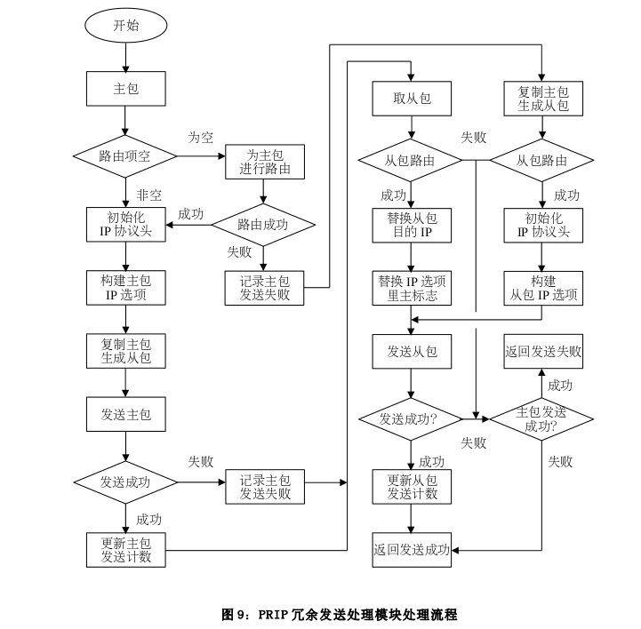 

 

5.1.1.2 TCP 协议 SYN+ACK 包 PRIP 协议冗余发送处理

如图 8,正常协议栈 TCP 协议 SYN+ACK 数据包的发送路径为黑色箭头所示。其发送路径上会调用__tcp_v4_send_synack()函数,该函数用来为服务器构造回应客户端连接请求 SYN 段的 SYN+ACK 段,并将 SYN+ACK 段封装在 IP 报文中发送给客户端。__tcp_v4_send_synack()函数调用ip_local_out()函数进入所有包 IP 网络层统一发送路径。

本设计最终选择在__tcp_v4_send_synack()函数里面实现 SYN+ACK 包 PRIP 协议冗余发送处理。主要基于以下考虑:

​	(1) __tcp_v4_send_synack()函数调用 inet_csk_route_req()函数对输出数据包进行路由,这是 SYN+ACK 数据包发送路径上的唯一一次路由查询。故 PRIP 协议从包的路由查询最好放在此处。

​	(2) __tcp_v4_send_synack()通过调用 ip_build_and_send_pkt()函数来为数据包创建 IP 选项。根据“就近修改”原则,最好将 PRIP 主从数据包的 IP 选项构建放在这里。

可见在 SYN+ACK 数据包的发送路径上,__tcp_v4_send_synack()函数里既有为数据包路由的动作,也有为数据包创建 IP 选项的动作,若将 PRIP 协议的 SYN+ACK 数据包冗余发送放在该函数里面实现可以最大限度的保留内核的原有层次结构,也更顺理成章。

__tcp_v4_send_synack()函数位于传输层,故 TCP 协议 SYN+ACK 包 PRIP 协议冗余发送处理也在传输层里实现。

 

可见 SYN+ACK 包 PRIP 协议冗余发送处理的流程与 5.1.1.1 节的正常 TCP 数据包的 PRIP 冗余发送处理流程极为相似:

​	(1) 如果主包路由缓存不存在,则为主包进行路由,并记录主包路由成功与否。主包路由失败就意味着主包不能发送。

​	(2) 获取从包目的 IP 地址。并为从包进行路由。路由成功后,判断路由下一跳是否等于从包目的IP 地址,不等则说明路由不合法,释放从包路由缓存结构。

​	(3) 为主包构造 SYN+ACK 段。并初始化 TCP 首部及 SKB 中各字段项,并填入相应的 TCP 选项(如果有)。

​	(4) 初始化主包 IP 协议头,构建主包 PRIP 协议 IP 选项。

​	(5) 复制主包,生成从包。

​	(6) 发送主包,并记录主包发送结果。

​	(7) 如果主包路由失败,则为从包构造 TCPSYN+ACK 段、 TCP 协议头及添加 TCP 选项。 初始化IP 协议头,包括从包目的 IP 地址替换,构建从包 PRIP 协议 IP 选项。

​	(8) 如果主包路由成功。只需对从包进行目的 IP 地址替换,并将从包 IP 选项里的主标志替换为从标志。因为从包复制于主包,会将 IP 协议头和 IP 选项一并复制,只需简单替换即可。

​	(9) 发送从包并记录从包发送状态。

​	(10) 如果主包和从包均发送失败,返回发送失败;否则,返回发送成功。

最后,SYN+ACK 包 PRIP 协议冗余发送处理的流程与 5.1.1.1 节的正常 TCP 数据包的 PRIP 冗余发送处理流程极为相似,故流程图参见 5.1.1.1 节的图 9。

 

5.1.1.3 TCP 协议 RST 数据包 PRIP 协议冗余发送处理

在 TCP 协议中 RST 表示复位,用来异常的关闭连接,在 TCP 的设计中它是不可或缺的。发送RST 包关闭连接时,不必等缓冲区的包都发出去,直接就丢弃缓存区的包发送 RST 包。而接收端收到 RST 包后,也不必发送 ACK 包来确认。

可见,RST 数据包虽然属于 TCP 协议范畴,但其的发送和接收跟 UDP 的特性极为相似,因而,Linux 内核协议栈对 RST 的发送在 IP 层上的处理走的是 UDP 的发送路径。

如图 8 所示,正常内核协议栈中 RST 数据发送路径如图 8 中的蓝色线箭头所示,该发送路径同时也是四次挥手的 last ack 数据包的发送路径。在该发送路径上会先调用 ip_send_reply()函数,然后调用 ip_push_pending_frames()函数,ip_push_pending_frames()函数调用 ip_local_out()函数进入所有包 IP 网络层统一发送路径。

 

本设计将对 RST 数据包发送路径上的 ip_send_reply()函数和 ip_push_pending_frames()函数进行修该以实现 PRIP 冗余发送的功能。主要基于以下考虑:

​	(1) ip_send_reply()函数会对要发送的 RST 数据包进行路由。并且,当数据路由失败的时候将放弃 RST 数据包的发送。假设这种情况:在 PRIP 协议冗余通信的时候,如果主网卡因为某种原因比如说 DOWN 掉的时候,会表现为路由不可达,但从网卡是正常工作的。 这是如果发起数据发送将是不可容忍的。所以,需要修改 p_send_reply()函数:在主包路由失败的情况下,需要对从包再进行路由,如果从包路由成功,继续进行发送工作。

​	(2) ip_push_pending_frames()函数中涉及到 ip 数据包的 IP 选项的创建,因而,根据“就近修改原则”,将主从包的 PRIP 选项的创建放在这里比较合适。最终,将在本函数里,实现从包的生成、PRIP 协议 IP 选项的构建和主从包的发送。

ip_send_reply()函数和 ip_push_pending_frames()函数位于 IP 网络层的顶部,因而 TCP 协议RST 数据包 PRIP 协议冗余发送处理是在 IP 网络层实现的。

 

可见,在 Ip_send_reply()函数里面,如果主链路不可达,就会继续以从包目的 IP 进行路由尝试,这样做在主链路故障,而从链路正常的情况下,继续发送数据。并记录是为主包还是从包进行过路由。Ip_push_pending_frames()函数与 ip_queue_xmit_prip 实现的功能类似,也是查找路由后发送主从包,但也有一些区别。即:该函数在被调用时已经获得了主路由或从路由(在 udp_sendmsg 或ip_send_reply 中查找获得)其中之一,所以路由查找只会进行一次。在该函数中,需要判断该路由是主路由还是从路由,确定方法就是在调用它的 udp_sendmsg 或 ip_send_reply 中根据获得的路由的主从性对与传入该函数的 sock 相关的 opt(可由 sock 获得)中的__data 中的选项内容中的主从标志位进行设置,如为主路由则为 0,从路由为 1。随后,在该函数中,会对将要传输的数据包的源地址目的地址进行相应的变换。其余功能则与 ip_queue_xmit_prip 类似。

 

#### 5.1.2 UDP 协议 PRIP 协议冗余发送处理

如图 8 所示,正常内核协议栈中 UDP 数据发送路径如图 8 中的棕色线箭头所示。在该发送路径上 会 先 调 用 udp_sendms() 函 数 , 然 后 调 用 ip_push_pending_frames() 函 数 ,ip_push_pending_frames()函数调用 ip_local_out()函数进入所有包 IP 网络层统一发送路径。

UDP 协议数据包的 PRIP 冗余发送与 TCP 的 RST 包的处理流程极为相似,在本节里将仅作简要叙述。

本设计将对 UDP 协议数据包发送路径上的 udp_sendmsg()函数和 ip_push_pending_frames()函数

进行修该以实现 PRIP 冗余发送的功能。主要基于以下考虑:

​	(1) UDP 协 议 数 据 包 的 路 由 是 在 udp_sendmsg() 函 数 里 完 成 的 。 在 标 准 Linux 内 核 中 ,Udp_sendmsg()函数如果 UDP 套接字没有调用 connect()系统调用的话,那么需要数据包进行路由,如果路由失败,在放弃数据包的发送。

本设计修改 udp_sendmsg()函数:在为数据包路由失败的情况下,将以从包 IP 目的地址为目的地址再次进行路由。最后记录在本函数里面,是为哪个包成功进行了路由。

​	(2) ip_push_pending_frames()函数中涉及到 ip 数据包的 IP 选项的创建,因而,根据“就近修改原则”,将主从包的 PRIP 选项的创建放在这里比较合适。最终,将在本函数里,实现从包的生成、PRIP 协议 IP 选项的构建和主从包的发送。udp_sendmsg()函数位于传输层,ip_push_pending_frames()函数位于 IP 网络层的顶部。 所以 UDP协议 PRIP 协议冗余发送处理在传输层和 IP 网络层里共同实现。udp_sendmsg()函数在对主包进行路由失败的情况下,会继续进行从包进行路由,最后将记录是为包还是从包成功进行了路由。 以供 ip_push_pending_frames()函数查看。在 ip_push_pending_frames()函数里面,查看是为主包还是为从包成功过进行了路由。如果之前对主包成功进行了路由,那么在ip_push_pending_frames() 函 数 里 对 从 包 进 行 路 由 ; 如 果 之 前 对 从 包 成 功 进 行 了 路 由 , 那 么 在ip_push_pending_frames()函数里对主包进行路由;最后,完成从包的生成、主从包 PRIP 选项的创建和主从包的发送工作。

Ip_push_pending_frames()函数在 5.1.1.3 节已经介绍过了,这里不再介绍。

 

### 5.2 PRIP 冗余接收功能实现

PRIP 冗余接收功能需求为:

正常情况下,由于 PRIP 采用数据传输冗余特性,在 PRIP 数据包接收时,会收到两份互为冗余的数据包。为了保证数据的实时性,本解决方案采用:对于接收到的这两份数据包,首先到达的数据包进行接收,后续到达的数据包予以丢弃处理,并在此过程中更新相关的统计信息。这一需求要求操作系统能够识别数据包携带的 PRIP 相关 IP 选项,并予以解析,提取出数据包的 PRIP 序列号和主从标识,并采用特定的算法对重复的数据包丢弃处理,来保证数据通信的效率和实时性。由上述可知,接收处理算法主要围绕者 IP 选项的解析和处理来实现的,因此将 PRIPS 数据接收冗余包丢弃处理的功能实现放在协议栈的 L3 层较为合适。采用独立的模块不能完全实现所需的功能,故我们的方案采用在协议栈 L3 层数据包接收路径的合适站点直接嵌入代码来实现。	

如图 10.A,正常的协议栈 L3 层数据接收流程如下:

​	(1) ip_rcv()函数。ip_rcv()函数所作的工作有:判断 IP 协议头长度是否正确,查看协议头协议信息是否正确,查看 IP 协议头校验和是否正确,以上若有一项不满足将数据包丢弃;执行网络过滤子系统钩子点 NF_INET_PRE_ROUTING 处所挂载的回调函数,之后调用 ip_rcv_finish()函数。

​	(2) ip_rcv_finish()函数。 ip_rcv_finsih()函数所作的工作有:查看数据包是否有路由信息,

若没有,则通过路由子系统进行路由信息查找;如果有 IP 选项的话,解析并处理 IP 选项;最后调用路由子系统的输入函数,即,dst->input()函数;

​	(3) ip_local_deliver()函数。dst->input()虚函数,当输入数据包不属于本机时候, dst-

\>input()函数被初始化为 ip_forword()函数,当输入数据包属于本机时,dst->input()被初始化为ip_local_deliver()函数。 这里介绍 ip_local_deliver()函数。 该函数所作的工作主要三个:首先看接收到的数据包是否是分片数据包,如果是的话,需要对 IP 分片数据包进行重组处理;其次,依次 执 行 网 络 过 滤 子 系 统 NF_INET_LOCAL_IN 钩 子 点 处 的 注 册 的 所 有 回 调 函 数 ; 最 后 , 调 用ip_local_deliver_finish()函数。

​	(4) ip_local_deliver_finish()函数。ip_local_deliver()函数功能有两个:将数据包去掉三

层协议头,使其缓存区指针指向四层协议头开始的位置;根据数据包的协议栈四层协议类型将调用相应的四层协议的入口函数将数据包传送给协议栈四层。

如图 8.B,根据功能需要,本解决方案选择在协议栈 L3 层顶部 ip_local_deliver()函数里面实现 PRIP 协议的冗余接收功能。具体位置在 ip_local_deliver()函数的数据包分片组装之后。在发送 PRIP 数据包时候,我们选择在数据包分片之前,进行 PRIP 的发送处理;在接收 PRIP 数据包的我们选择在数据包的分片之后,进行 PRIP 包的接收处理。

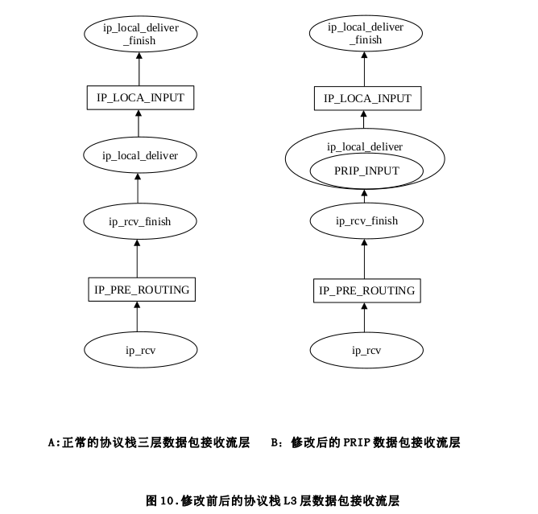 

 

PRIP 接收处理流程如图 11 所示。简述如下:

​	(1) 由于在此之前,IP 选项已经解析完毕存入数据包缓存结构体里面,所以在数据包进入 PRIP接收处理模块后,可直接从结构体 Ip_options 里获取数据包所携带的 PRIP 序列号和主从包标志。

获取 PRIP 序列号和主从包的标志之后,判断该数据包是主包还是从包。

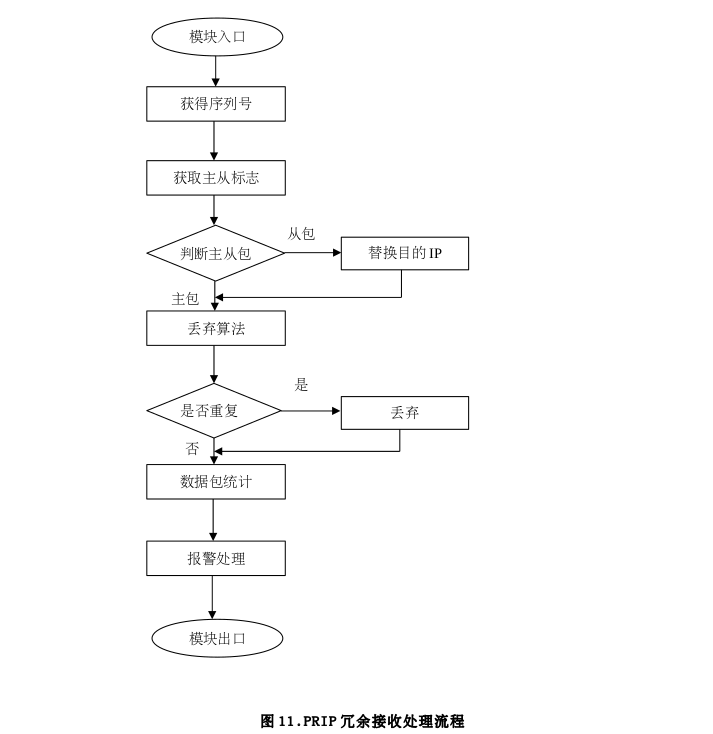 

 

​	(3) 如果数据包是从包,需要将从包的目的 IP 替换为本地 PRIP 设备的主网卡接口 IP。

​	(4) 之后将数据包交给重复包丢弃算法进行处理。 如果该序列号的数据包已经收到,进行丢弃处理;如果该序列号的数据包是第一次到达,则予以接收。

​	(5) 数据包相关统计数据更新。

​	(6) 进入报警处理。报警处理算法会根据数据包的统计数据对主从链路运行状态进行检查,之后决定是否发出告警信息。

​	(7) 最后数据包离开 PRIP 数据接收处理模块。

将 PRIP 协议冗余接收功能实现放在 ip_local_deliver()函数中,IP 分片包组装之后。主要基于两点考虑:

​	(1) IP 选项包括 PRIP 协议 IP 选项已经在之前的 ip_rcv_finish()函数里面解析完毕;

​	(2)在 IP 分片组装之后实现冗余接收可以排除主从分片包的干扰,简化设计。

例如若在 IP 分 片包组装之前进行冗余接收,同一个 IP 对儿可能收到分别属于互为冗余的主从包的多个 IP 分 片 包 ,这些包具有相同的 PRIP 序列号,这将给冗余接收算法提出更高要求,增加设计的复杂度。

prip_check()实现了 PRIP 数据包冗余接收算法和链路故障告警算法。该函数会查找属于本 IP对儿所属的接收状态位图,查看该序列号的 PRIP 数据包是否已经被接收,从而实现 PRIP 数据包的冗余接收。另外该函数还会根据主从链路接收数据包的统计情况,来判断主从链路的运行状态是否正查,如果一条链路连续丢包超过设定的阀值,就会向用户发出链路故障告警信息。

prip_check()的设计实现将在 5.2.3 节的重复包丢弃算法和 5.4 节链路故障报警功能里进行详细介绍,这里不再过多叙述。

 

本设计在 ip_local_deliver()函数里面实现了 PRIP 数据冗余接收的完整框架,具体包括:

​	(1) PRIP 选项的获取解析。(内部实现)

​	(2) 从包目的 IP 替换。(内部实现)

​	(3) 冗余接收算法。(通过调用 prip_check())

​	(4) 链路故障报警算法。(通过调用 prip_check())

 

#### 5.2.1 PRIP 协议 IP 选项处理

前面 2.4.2 节已经介绍过 PRIP 协议 IP 选项的格式,这里不再叙述,本小节将着着重介绍Linux 下的 PRIP 选项的数据结构及其在数据发送组装和数据接收中解析的处理过程。

在 linux 中 IP 选项的结构体为 struct ip_options,为了能够处理 PRIP 协议 IP 选项,需要在其里面添加 PRIP 选项的相关的成员域,其定义位于 Linux2.6.32/include/net/inet_sock.h 文件中

ip_options 结构体中存放了需要发送、前送或者接收后解析出来的 IP 选项,它描述的不是某一个类型的 IP 选项,而是一个数据包携带的所有 IP 选项的集合,下面介绍个数据域的基本含义:

- faddr:只针对对外发送数据,并设置了源路由选项时才有意义,faddr 存放源路由列表中的第一个 IP 地址。

- Optlen:该数据域表示设置了的 IP 选项的总长度,最大不超过 40 个字节。

- Srr:指的是源路由选项存放在 IP 协议头中的偏移量。

- Rr:如果 rr 值非零,IP 选项中设置了记录数据经过路由的 IP 地址选项,rr 的值代表路由器应在 IP 协议头何处记录路由选项的偏移量。

- Ts:如果 Ts 为非零值,表示 IP 选项里设置时间戳选项,而 Ts 代表了时间戳选项记录在 IP 协议头中的位置的偏移量。

- is_strictroute:该值为 TRUE 时,表示 IP 选项中设置的源路由选现是严格源路由选项。

- srr_is_hit:标志位数据域, 该位为 TRUE 时,说明数据包设置了源路由选项。在为发送数据包做路由决策时,通过 skb->dst 或路由表获取下一跳与源路由表中下一跳一致成为 IP 地址命中。

- is_change: 标志位数据域,若 IP 协议头发生变化,则设置该位。IP 协议头是否发生变化决定了是否需要重新计算检验和。

- rr_needaddr: 标志位数据域。当 IP 选项设置了记录路由选项时,如果 rr_needaddr 的值为1 时,表明协议头还有空间记录其他路由信息,这时当前站点应该就发送数据包的网络接口 IP 地址复制到协议头中 rr 指定的偏移量处。

- ts_needtime: 标志位数据域。表示时间戳选项到达站点的时间。

- router_alert:如果 IP 选项中设置了路由报警选项时,该数据域表示路由报警选项在 IP 议头存放位置的偏移量。

- __pad0:此数据域是为了是 IP 选项处于四字节对齐而加在最后的填充数据的个数。

- __data[0]:该数据域指向存放要加入数据包协议头的 IP 选项的地址。

最后,55 行到 57 行被条件编译包含的是 prip 数据域,当编译内核选择 CONFIG_PRIP 选项时候,该数据域名将生效。 prip 数据域的为 0 时,表明该数据包对应的应用程序没有使能 PRIP 功能,为普通的 IP 数据包;当 prip 数据域为非 0 时,表明该数据包为 PRIP 数据包,其值是 PRIP 协议 IP选项在 IP 协议头中的所处位置的偏移量。

在 IP 网络层发送 IP 数据包时,如果发送的是 PRIP 数据包,则需要为该数据包构建 PRIP 协议IP 选 项 , Linux 构 建 IP 选 项 的 函 数 为 ip_options_build() 函 数

如果是属于 PRIP 数据包的话,那么构建 PRIP 协议 IP 选项。调用 prip_priv_find()函数获取该IP 对儿的私有结构体 struct prip_priv,(struct prip_priv 结构体的定义及其组织方式将在5.2.2 小节详细描述) 该结构体包了本 IP 对儿 PRIP 通信所需的全部信息。prip_priv_find()函数通过 数 据 包 的 源 、 目 的 IP 计 算 哈 希 值 在 全 局 哈 希 表 prip_hash[] 里 找 到 本 IP 对 儿 的 struct prip_priv 结构体。

调用 get_pripid()函数获取 PRIP 序列号 pripid 和发送时间戳 snd_start。get_pripid()函数除了从 struct prip_priv 直接获取 PRIP 序列号 pripid 和发送时间戳 snd_start 外,还会负责PRIP 序列号 pripid 和发送时间戳 snd_start 更新和维护。详情前文中已叙述。

最后将获取 PRIP 序列号 pripid 和发送时间戳 snd_start 按照 PRIP 协议 IP 选项格式复制到 ip协议头 PRIP 选项的正确位置。

 

当 IP 网 络 层 收 到 携 带 IP 选 项 的 数 据 包 时 , Linux 下 的 IP 选 项 的 解 析 函 数 为ip_options_compile() 函 数 , 和 ip_options_build() 函 数 一 样 , 同 样 位 于 内 核 代 码Linux2.6.32/net/ipv4/ip_options.c 路径下。PRIP 协议 IP 选项也完全符合 IP 普通 IP 选项的的格式,所以将 PRIP 协议 IP 选项的解析也放在该函数里实现。

ip_options_compile()函数结构较为清晰,在一个主循环里面根据不同的 IP 选项类型依次处

理之。不过由于涉及的局部变量繁多,现先将几个主要的局部变量作几点说明:

optptr 指 向 选 项 块 中 当 前 正 在 分 析 的 位 置 。 *optptr 或 optptr[0] 指 的 是 IP 选 项 类 型 ,optptr[1]该选项的长度,optptr[2]指的是存放选项的指针,即指向该 IP 选项的数据域起始内容 。l 为尚未处理的 IP 选项的总长度,iph 为指向 IP 协议头的起始地址指针,pp_ptr 指的是在 IP 选项出错的情况下,指向出错位置的地址指针。

 

#### 5.2.2多 PRIP 主机通信实现

在更常见的多 PRIP 主机进行通信时候,一个比较容易忽视的问题就是序列号的管理问题。PRIP序列号是 PRIP 进行冗余通信的重要基础,PRIP 主机主要依据数据包携带的序列号来实现冗余包的丢弃。在一个 PRIP 主机组成的局域网内,每个 PRIP 主机在发送数据时候,都会为发送数据包添加新的 PRIP 序列号,因此在此局域网内就会存在多个 PRIP 序列号。为了避免多序列号的混乱而引起的数据接收错误,如何组织管理这些不同的序列号将显得尤为重要。每两台进行 PRIP 通信的主机被成为一个 PRIP 协议 IP 对。本解决方案为每一个 IP 对维护了一个

PRIP 通信私有数据结构体 struct prip_priv 。

该私有数据结构体包含了本 IP 对进行 PRIP 通信所需的全部信息,包括发送序列号、接收状态缓存位图、对端主网络 IP、本机主网络 IP、主网络运行状态、 从网络运行状态、主网络发包个数、主网络收包个数、 从网络发包个数、 从网络收包个数以及需要访问本私有数据结构的所需要获取的一些锁。其中最重要的是本 IP 对发送序列号和本 IP 对接收状态缓存位图。这样的话,属于每个 IP 对的两台主机进行 PRIP 通信时候,使用的是自己独有的 PRIP 序列号,可保证多 PRIP 主机通信时候的多个序列号不会发生混乱。

结构体数据成员 refcnt 和 timer 分别是该结构体的引用计数和老化定时器。timer 定时时间在结构体创建初始化时被初始化为 60s。每次使用到本结构体时会将引用计数 refcnt 加一,并将老化定时器的定时时间重新初始化为 60s。定时器定时回调函数会查看该结构体的 refcnt 是否为 0,如果是的话,则会释放接收状态位图 link 指向的内存和本结构体 struct prip_priv 的内存空间。

在内核中维护了一张全局的哈希表 prip_hash[PRIP_HASHSZ] ,哈希表容量为 64,每个 IP 对所属的 prip_priv 都会以其本机主网络 IP 和对端主网络 IP 计算出来的哈希值为索引放入这个哈希表里面。

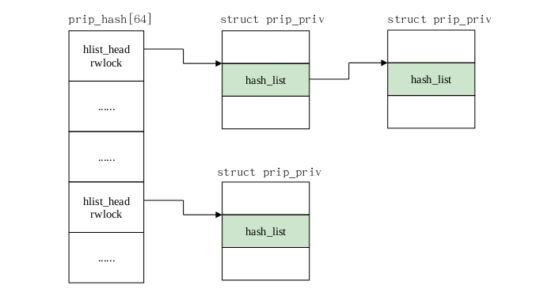 

struct prip_priv 结构体的查找实现函数为 prip_find()。 位于 Linux2.3.32/net/prip/prip.c

文件里,该文件是 PRIP 项目添加到内核的新文件。prip_find()函数代码实现如下:

注释 1:根据目的 IP 和源 IP 生成哈希值。

注释 2:每次访问 struct prip_priv 结构体都会将其老化到期时间顺延至本时刻将来 60 秒那刻。

注释 3:如果在哈希表里没有找到符合条件的 struct prip_priv 结构体,有可能是第一次接收

或发送数据,或者是已经被定时器删除,那么为本 IP 对儿重新申请一个 struct prip_priv 结构体,初始化之后,插入全局哈希表,并返回新创建的 struct prip_priv 结构体指针。

在 IP 网络层,对于 PRIP 协议数据包,在发送和接收时候均会调用该函数。在发送数据时,会根据数据包的源、目的 IP 在全局哈希表 prip_hash[PRIP_HASHSZ]里 查找到该数据包的 struct prip_priv ,进而获得本 IP 对的 PRIP 发送序列号;在接收数据时,根据接收到的数据包的源、目的 IP 在全局哈希表 prip_hash[PRIP_HASHSZ] 里查找该数据包的 struct prip_priv ,进而获得 PRIP 接收状态位图表地址,最后采用重复包丢弃算法实现数据包的唯一接收。

 

#### 5.2.3重复包丢弃算法

重复包丢弃算法是 PRIP 冗余接收模块的核心,它在 PRIP 冗余接收模块中的位置如图 9 所示。重复包丢弃算法要实现的主要功能是:对于一个数据包,根据其携带的 PRIP 序列号和发送时间戳去查询 PRIP 接收状态缓存位图,看在本轮 PRIP 序列号轮转中,该序列号的数据包是否是第一次到达,如果是,则予以接收,并更新该序列号在缓存表中的接收状态;否则,是重复包,予以丢弃。需要指出的是,当本主机与多个其他主机进行 PRIP 通信时,须在本机上为每一个通信的远端主机维护一个 PRIP 接收状态缓存位图,以保证序列号的顺承一致。最终在本机上维护了一张全局哈希表来组织这些 PRIP 接收状态缓存位图,以本机 PRIP 主 IP、远端 PRIP 主 IP 生成哈希键值进行散列,以保证查表效率。

重复包丢弃算法主要涉及三个重要的数据结构:PRIP 协议 IP 选项、PRIP 接收状态缓存位图和全局散列表。 位图散列表的容量为 64,每个桶存放的是链表头,每个链表会存放对应的 PRIP 接收状态缓存位图地址和一些辅助数据结构。

PRIP 协议 IP 选项结构如图 3 所示,PRIP 接收状态缓存表如图10 所示。

如图 12 所示,PRIP 接收状态缓存表是由 65535 个比特位置组成,共占 8192 个字节的位图表。该表有两个辅助数据 JIFFIES_L 和 JIFFIES_H,JIFFIES_L 被称为前半轮发送时间戳,指的是与本机 PRIP 通信的远端主机发送本轮 PRIP 序列号为 1 的主包时的系统 jiffies,在本轮序列号轮转的前

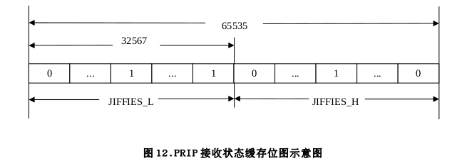  

半轮中,远端主机将一直使用该时间戳来生成数据包的 PRIP 协议 IP 选项,发送到本机。同样 ,JIFFIES_H 称为后半轮发送时间戳,指的是与本机 PRIP 通信的远端主机发送序列号为 32768 的数据包时的系统 jiffies,在发送序列号 32768 到 65535 的数据包时,均将该 jiffies 添加到数据包的 PRIP协议 IP 选项,发送到本机。简言之,在发送 PRIP 数据包时,序列号 1~32767 的数据包携带的时间戳为 JIFFIES_L,它的值为发送本轮序列号为 1 的数据包时的本地系统 jiffies。序列号 32768~65535的数据包携带的时间戳为 JIFFIES_H,值等于发送本轮序列号为 32769 的主包时的本地系统 jiffies。

重启处理。 prip_reboot 为 10s 对应的系统滴答数。 若于本机进行 PRIP 通信的对端主机进行重启,重启之后在于本机器进行 PRIP 通信。由于刚刚重启不久,那么本机接收到的数据包携带的时间戳会比较小,接近于 0,一般会小于本机接收状态缓存位图的接收时间戳,按照冗余丢弃算法,这样的包会进行丢弃。为了防止这种情况发生,需要进行重启处理。 如果收到的数据包距离上次收到数据包的时间间隔超过 10s,那么就将接收状态位图的前后半部接收时间戳清零。

重复包丢弃算法流程图如图 13 所示。在进入丢弃算法之前,PRIP 协议 IP 选项已经解析完毕,可以直接获取数据包的发送时间戳和序列号。序列号属于前半轮和属于后半轮的处理情况呈镜像对称,为了简便起见,这里只叙述序列号属于前半轮时候的情况。如下:

​	(1) 获取数据包携带的发送时间戳;

​	(2) 获取数据包的 PRIP 序列号;

​	(3) 判断数据包序列号属于前半轮还是后半轮。我们只分析序列号属于前半轮的情况;

​	(4) 将本时间戳与本地缓存的 JIFFIES_L 比较;

> > - 当时间戳小于 JIFFIES_L 时:

​				a.数据包丢弃,返回 1;

> > - 当时间戳大于 JIFFIES_L 时:

​				a.用提取的时间戳更新 JIFFIES_L;

​				b.将接收状态接收位图前半部所有位清零;

​				c.接收数据包,返回 0。

> > - 当时间戳 JIFFIES_L 时:

​				a.根据 PRIP 序列号查询接收状态位图的相应位;

​				b.判断查询到的位图位,分两种情况:

​					1). 若为 0,将之置 1,接收数据包,返回 0;

​					2). 若为 1,丢弃数据包,返回 1。

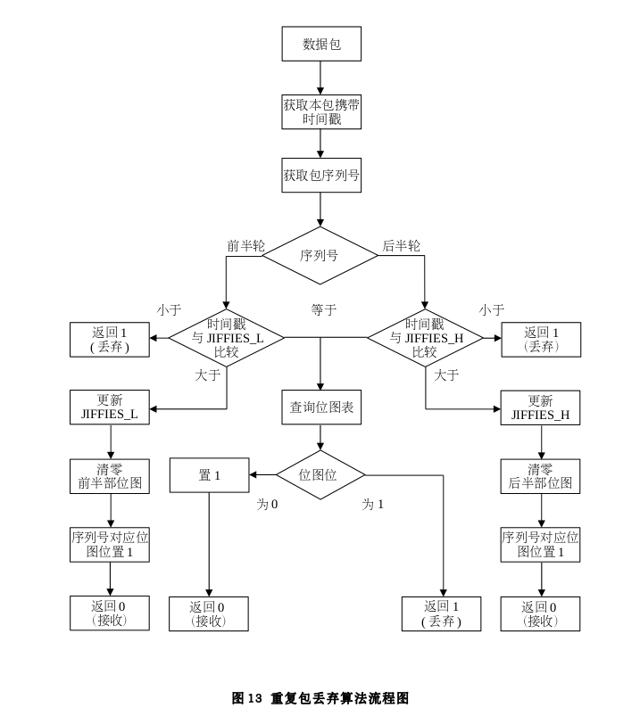 

 

 

### 5.3 PRIP 协议配置显示功能实现

PRIP 协议配置功能的需求为:

由于互为冗余的两条链路处于不同的局域网,为实现正常的网络通信,因此在通信本机上需要用户配置对端计算机 PRIP 设备的主从网卡所处的网段和子网掩码。如图 4,在计算机 A 向 B 发送数据时,在 A 上需要配置计算机 B 的 eth0、 eth1 所处的网段。 这样,路由机制可以保证互为冗余的双包通过不同的链路发送到计算机 B 上。此外,由于运行环境的差异,允许用户对 PRIP 运行参数进行设置,如报警阀值等。

PRIP 协议的配置功能通过 PROC 虚拟文件系统实现的。在内核启动后,会在/proc 目录下创建PRIP 所需文件节点,用户和内核程序通过对文件节点的读写来实现的数据交互。

如图 13 所示,对用户来说,需要配置数据项有:主网络网段、 从网络网段、主网络掩码、链路报警阀值。显示给用户的数据项有:本机 IP、引用计数、 远端主 IP、 远端从 IP、主链路状态、 从链路状态、主链路接收 PRIP 数据包个数、主链路发送 PRIP 数据包个数、 从链路接收 PRIP 数据包个数、 从链路发送 PRIP 数据包个数。每个数据项在/proc/PRIP 目录下都会创建一个 proc 文件节点与之对应。

PRIP 协议配置功能的流程如图 12 所示:

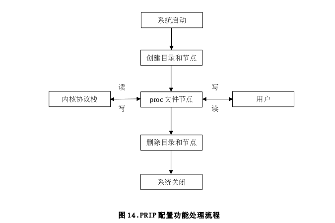 

 

如图 14 所示,PRIP 协议配置功能的处理流程可以简述为:本解决方案采用静态编译模块的形式来实现该功能,在系统启动初始化阶段会调用模块初始化函数,从而在 proc 目录下创建 PRIP 协议相关的目录和节点。在配置用户信息时,用户通过将配置信息写入对应的 proc 节点来实现配置功能,由于 proc 文件系统的数据不像其他文件系统那样存在于磁盘上,而是存在系统内存里面,所以理论上来说,这些配置数据会即时生效。同理,在用户需要获取 PRIP 协议运行的相关数据和配置信息时,可通过读取对应的 proc 文件节点来直接获取。总之,用户和 PRIP 协议通过 proc 文件来实现数据的即时交互。

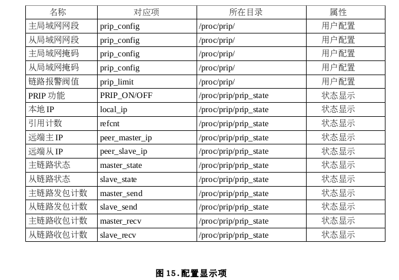 

 

#### 5.3.1 配置说明

PRIP 的配置主要是主从网段、子网掩码和链路报警阀值的配置

​	(1) 主从网段和子网掩码的配置流程:

通过/proc/prip/prip_config 文件配置主从网段和子网掩码。

格式为“172.17.0.0 192.168.0.0 16”。

设置方式为:echo “172.17.0.0 192.168.0.0 16” > /proc/prip/prip_config。

其中要求子网掩码为十进制格式,比如 255.255.0.0 子网掩码为 16,255.255.255.0 子网掩码为24。

​	(2) 链路报警阀值的配置流程:

链路报警阀值的配置是通过/proc/prip/prip_limit 文件来设置的,默认大小是 50。格式为十进制数。设置方式为:echo “100” >/proc/prip/prip_limit。

#### 5.3.2 状态显示说明

PRIP 协议的显示主要是通过/proc/prip/prip_state 文件来显示。

​	(1) 当用户没有配置 prip_config 文件时,用户访问/proc/prip/prip_state 没有任何输出。

​	(2) 当 配 置 了 prip_config 文 件 时 , 但 没 有 应 用 程 序 开 启 PRIP 功 能 时 , 用 户 访问/proc/prip/prip_state 文件时的输出为:

​			PRIP_ON/OFF

​			off

​	(3) 当配置了 prip_config 文件且有应用程序开启了 PRIP 功能时,/proc/prip/prip_state 输出如下:

注:以上显示数据仅为举例说明显示格式,并无实际意义。

以上涉及到的 proc 文件节点说明如下:

- PRIP_ON/OFF:表示 PRIP 功能是否开启。显示 on 表示开启;显示 off 表示为未开启。

- PRIP_MASTER_NET:表示 PRIP 主网络号。

- PRIP_SLAVE_NET:表示 PRIP 从网络号。

- PRIP_REFCNT:PRIP 引用计数,表示有多少套接字引用了 prip_config 文件的内容。只有当引用计数为 0 时,才可以修改 prip_config 的内容。

Ip 地址对缓存项,每一对 IP 地址对应一系列以下显示项,其老化时间是一分钟,即若该 IP地址对在一分钟内没有收到数据包,它对应的显示项将被删除。每一个 IP 对对应的显示项如下:

- local_ip: 该 IP 对的本机地址。

- referent:该 IP 对的引用计数,当超时并且引用计数为 0 时,才会被删除。

- peer_master_ip:该地址对端主网段 IP。

- peer_slave_ip:该地址对端从网段 IP。

- master_state: 该地址对主链路的状态。up 为正常;down 为故障。

- slave_state:该地址对从链路的状态。up 为正常;down 为故障。

- master_send:主链路发包个数;

- slave_send: 从链路发包个数。

- master_recv: 主链路收包个数。

- slave_recv : 从链路收包个数。

 

#### 5.3.3 代码实现

PRIP 协议配置功能模块是以静态模块的形式编译实现的,实现代码添加到内核的具体路径是linux-stable/net/new/。由于这部分自己实现代码是添加进内核源码树,所以除了实现文件外,还需在目录下添加相应的 KCONFIG 文件和 MAKEFILE 文件。本小节所涉及的内容均在该目录下。

所涉及的数据结构为主要是 PRIP_CONFIG_T,位于 linux-stable/net/new/include/net/prip.h 文件

如下:

PRIP_CONFIG_T 结构体包含了用户要获取或者配置的 PRIP 相关变量信息。各成员的变量的含义介绍如下: net_one 指的是与本机 PRIP 通信的远端计算机的 PRIP 主网卡所处的网段,同样,net_two 是指的是与本机 PRIP 通信的远端计算机的 PRIP 从网卡的网段,mask 表示远端计算机PRIP 主从网卡网络掩码;master_send_num;指的是本机 PRIP 主网卡发送 PRIP 数据包的总数,slave_send_num 指的是本机 PRIP 从网卡发送 PRIP 数据包的总数。master_recv_num 指的是本机 PRIP 主链路上接收到的 PRIP 数据包的总数,slave_recv_num 指的是本机 PRIP 从链路上接收到的 PRIP 数据包的总数。prip_send_num 指的是本机主从两条链路发送的 PRIP 数据包的总数,

prip_recv_num 指的本机主从两条链路接收到的 PRIP 数据包的总数。 master_sure 指的是本机上绑定到具体地址 PRIP 连接的总数,即,不包括显示绑定 INADDR_ANY 和未绑定本地地址的PRIP 连接,reference 本机上打开 PRIP 功能的连接的总数。

init_prip()主要完成一些模块初始化的工作。在函数开始 872-883 行, 主要完成一些初始化的工 作 , 包 括 PRIP_CONFIG_T 型 结 构 体 变 量 和 相 关 锁 的 初 始 化 、 全 局 哈 希 表prip_hash[PRIP_HASHSZ] 初始化、状态显示链表的初始化。状态显示链表上挂载着本机所有 IP 对的 prip_priv 结构体。当用户通过/proc 要获取所有 IP 对的 PRIP 状态信息时,内核将对状态显示链表产上一次遍历,将每个 prip_priv 的信息通过/proc 文件呈现给用户。当本机与一个新的主机建立PRIP 连接,将创建一个该 IP 对对应的 prip_priv 结构体,之后将该结构体分别放入到全局哈希表和状态显示链表里。可见,全局哈希表和状态显示链表均包含了本机所有的 IP 对的 prip_priv 结构体,这样冗余设计主要考虑是,哈希表主要用于快速查找,但若需要一次获取所有 prip_priv 结构体时,遍历链表的效率更高。

函数的后半部主要在/proc 目录下创建 PRIP 相关的 proc 文件目录和节点。由代码可知,该初始化函 数 在 首 先 在 /proc/ 目 录 下 创 建 一 个 prip 目 录 , 然 后 在 该 新 创 建 目 录 下 分 别 创 建prip_config、prip_state 和 prip_alarm 三个 proc 文件节点,最后还有这些节点操作函数的初始化。

 

### 5.4 链路故障报警功能实现

链路故障报警功能模块的需求为:

当接收到属于 PRIP 协议的数据包时,无论该数据包是第一此到达的包还是重复包,都会更新相关的数据包统计数据,并会根据这些信息来判断主从两条链路的运行状态,并将这些状态信息即时的反馈给用户。链路故障报警模块在 PRIP 数据包接收处理模块中的位置可参看图 11。

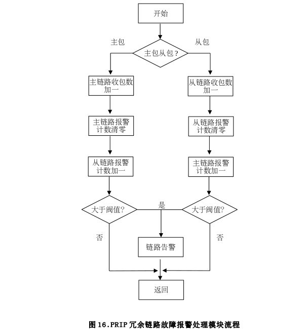  

PRIP 链路故障报警处理在函数 prip_check()函数内实现,该函数被 PRIP 数据接收处理函数ip_local_deliver()函数调用。在介绍函数之前,先对函数中涉及的重要局部变量予以说明:

priv:struct prip_priv 结构体。 在 5.2.2 节里已经介绍过,如下:

struct prip_priv{

............

struct link_entry* link; //接收状态位图,指向 8K 的内存空间

............

}

其中, struct link_entry 结构体定义如下:

struct link_entry{

char* seq_in;

int lostcount[2];

};

lostcount[0]表示的主链路上报警计数,lostcount[1]表示的从链路上的报警计数。

pos 和 isup 为 lostcount[]数组下标索引。 当 isup 为主链路,pos 表示从链路; 当 isup 为从链路,pos 表示主链路。

 

图 14 为 PRIP 链路故障报警处理模块的流程图。在叙述详细流程之前,现对图中涉及的变量予以说明:

链路收包数:指的是该链路自开机以来所收到的 PRIP 数据包的总数量;

报警计数:指的是自从本链路收到上一个数据包的时间算起,到下一个数据包到来之前,另一条链路所接收到的数据包的个数;

报警阀值:指的是一条链路连续丢包而不引起报警的个数上限制,超过这个阀值,本链路就会发出故障报警信息,报警阀值可由用户灵活配置。

PRIP 链路故障报警处理模块处理流程可简单归纳为:

进入模块后,首先判断接收到的包是主包还是从包。对于主包:

​	(1)会更新主链路接收包总数;

​	(2)主链路接收包总数加一;

​	(3)之后将主链路报警计数清零;

​	(4)之后从链路报警计数加一;

​	(5)判断从链路报警计数是否大于设置的报警阀值,若大于报警阀值,就会发出从链路故障报警信息,之后返回,否则直接返回。

同样,对于从包:

​	(1)会更新从链路接收包总数;

​	(2)从链路接收包总数加一;

​	(3)之后将从链路报警计数清零;

​	(4)之后将主链路报警计数加一;

​	(5)再判断主链路报警计数是否大于设置的报警阀值,若大于报警阀值,就会发出主链路故障报警信息,之后返回,否则直接返回。

 

### 5.5 PRIP 协议启用与关闭功能实现

#### 5.5.1 主动开启和关闭套接字 PRIP 功能

对系统中原有的 setsockopt()函数接口进行了扩展。 因为仅仅涉及到 IP 选项,选择在 setsockopt()系统调用里的 IPPROTO_IP 的相关操作做了修改。 增加了 PRIP 协议 IP 选项的相关操作。对于 TCP 协议和 UDP 协议的 setsockopt()函数都会最终调用 do_ip_setsockopt()函数类来完成 IP 选项的设置。通过修 改 do_ip_setsockopt() 函 数 来 完 成 设 置 PRIP 协 议 IP 选 项 的 功 能 。

修改后的 do_ip_setsockopt()函数代码如上所示,其中黑体部分为增加的处理 PRIP 选项的代码。

具体处理流程如下:

​	(1)保存原 socket 中对 PRIP 的设置情况,将 PRIP 的偏移赋值给变量 prip。

​	(2)解析用户传入的选项,将其保存在 opt 变量中。

​	(3)将 opt 变量中的__data 中的主从标志置 0。

​	(4)根据 prip 的值来决定是否增加 PRIP 计数:

​		如果原 socket 已经添加 PRIP 选项,且 opt 中包含 PRIP 选项,则将 PRIP 计数加一;

​		如果原 socket 未添加 PRIP 选项,则增加 PRIP 计数(添加 PRIP 选项),如果增加计数失败,则将 opt 的 prip 偏移值置为 1,并将返回值置为错误。

​		如果原 socket 已添加 PRIP 选项,且 opt 中不包含 PRIP 选项(去除 PRIP 选项),则将PRIP 计数减一。

 

#### 5.5.2 TCP 被动建立连接与套接字关闭

当设置了 PRIP 选项的服务器端监听套接字收到了一个带 PRIP 的 TCP 请求后,会相应的生成一个带 PRIP 选项的半连接 sock 并发送 SYN_ACK 包给发送请求的客户端。当服务器端收到从客户端发送的 ACK 包后,会将该 sock 置为 ESTBLISHED 状态。不论该状态的 socket 是否已经被 accept返回,PRIP 计数都将增一。以下是增加计数的相关代码:

 

#### 5.5.3 UDP 套接字关闭

UDP PRIP socket 关闭时减少 PRIP 计数比较简单

static inline void udp_lib_close(struct sock *sk, long timeout)

{

struct inet_sock *inet = inet_sk(sk);

if(inet){

if(inet->opt && inet->opt->prip){

inet->opt->prip=0;

set_prip_mode(sk,0);

}

}

sk_common_release(sk);

}

该函数只是对 PRIP 计数减一。

 

## 8 总结

根据我方的产品特点和技术优势,结合需求说明书中的各项需求描述,对 Linux 网络协议栈进行了有针对性的修改,给出了简明、高效的技术方案。该技术方案与网络协议栈结合紧密,充分利用了协议栈在处理网络数据包时的稳定性和高效性,完全可以满足透明代理操作系统的全部需求。

 

## 9 参考资料

《PRIP 并行冗余互联协议需求分析说明书》

《Understanding Linux Network Internals》

《Linux 内核设计与实现》第 2 版,Robert Love 著,陈莉君等译,机械工业出版社

《深入理解计算机系统》第 2 版,Randal E. Bryant, David R. O'Hallaron 著,龚弈利等译,机械工业出版社

《凝思磐石操作系统 V6.0 管理员指南》

《凝思磐石操作系统 V6.0 用户指南》

 

## 10 结束