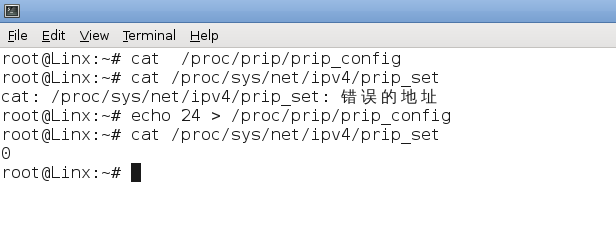

# PRIP配置模块

[toc]

## 1 功能配置

PRIP 协议的配置功能通过 proc 虚拟文件系统实现的。在内核启动后,会在/proc 目录下创建 PRIP 所需文件节点,用户和内核程序通过对文件节点的读写来实现的数据交互。

首先查看 /proc/prip/ 目录下是否有 prip_config、prip_alarm、prip_state、 prip_cache_timeout 四个文件以及/proc/sys/net/ipv4/prip_set 文件。

 

### 1.1 PRIP模式配置

其中prip_config文件是主从链路网段的配置

设置方式为：`echo 24 > /proc/prip/prip_config`

24是255.255.255.0 子网掩码的十进制格式

如下图所示：

  

插图1 prip_config文件配置

### 1.2 PRIP链路报警阀值配置

prip_alarm 文件是链路报警阀值的配置文件，默认大小是500，格式为十进制数

配置方式为：`echo 50 > /proc/prip/prip_alarm`

如下图所示：

   

插图2 prip_alarm文件配置

 

### 1.3 PRIP链路状态显示

prip_state 文件是PRIP链路状态显示文件

​	1.如果没有配置 prip_config 文件时,用户访问/proc/prip/prip_state 没有任何输出。

​	2.当 配 置 了 prip_config 文 件 时 , 但 没 有 应 用 程 序 开 启 PRIP 功 能 时 , 用 户 访问/proc/prip/prip_state 文件时的输出如下图所示

 

插图3 prip_state文件显示

 

### 1.4 PRIP缓存老化超时机制配置

prip_cache_timeout文件是缓存老化机制超时配置文件，默认大小是1

配置方式为：`echo 30 > /proc/prip/prip_cache_timeout`

 

插图4 prip_cache_timeout 文件配置

 

### 1.5 PRIP全局模式配置

/proc/sys/net/ipv4/prip_set 文件是PRIP全局模式配置文件。

PRIP全局模式：开启此模式后，应用发送的数据包都是PRIP数据包，但无需在应用中添加PRIP选项。

​	1.该文件在没有配置/proc/prip/prip_config 文件时，无法访问该文件

​	2.配置完/proc/prip/prip_config 文件后，/proc/sys/net/ipv4/prip_set 文件内容默认为0，即默认不开启PRIP全局模式，配置方式为： 
​			`echo 1 > /proc/sys/net/ipv4/prip_set`

 

插图5 prip_set 文件配置

 