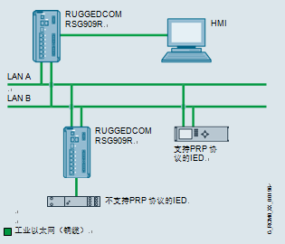
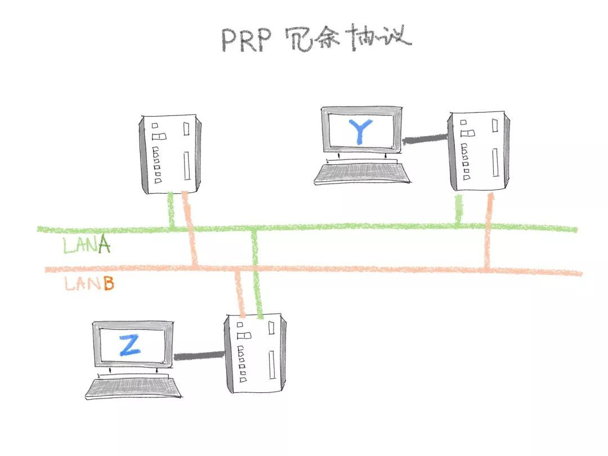
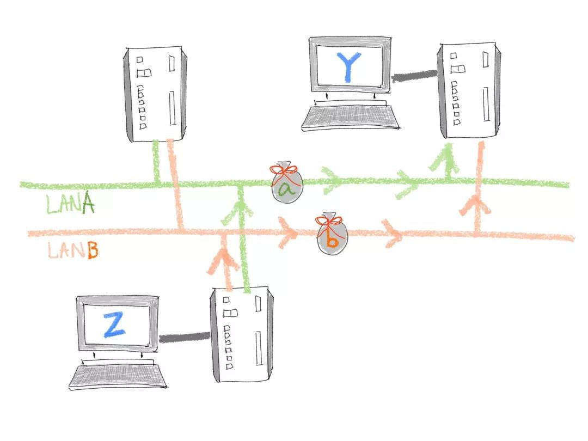
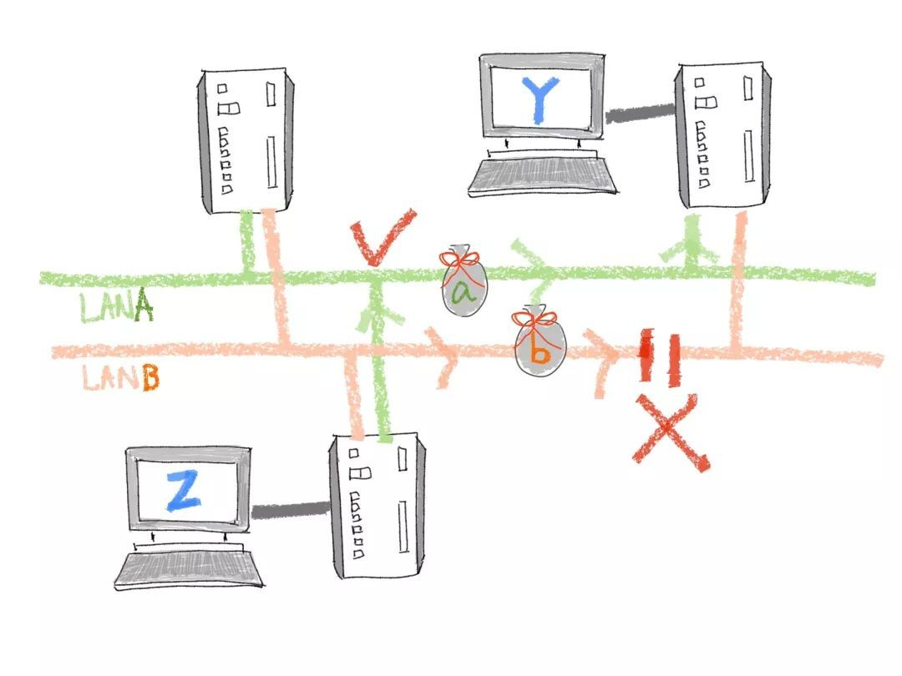
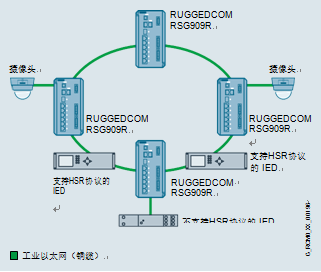
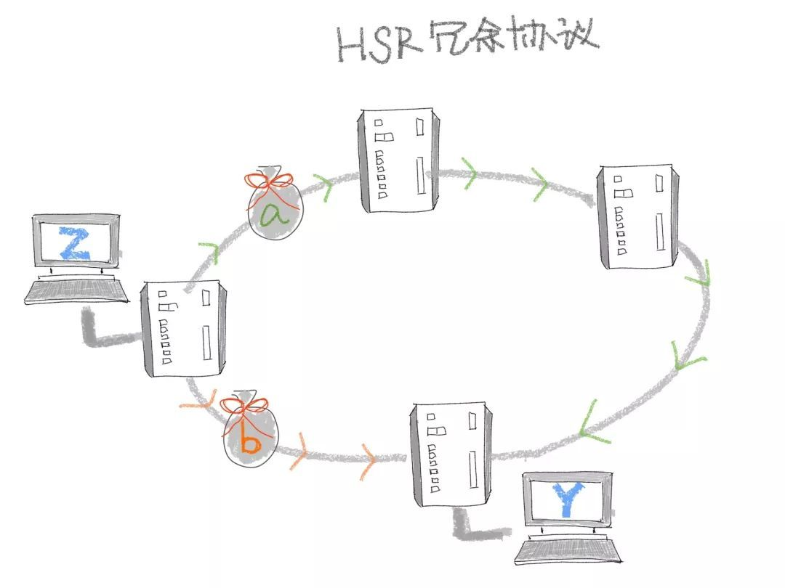
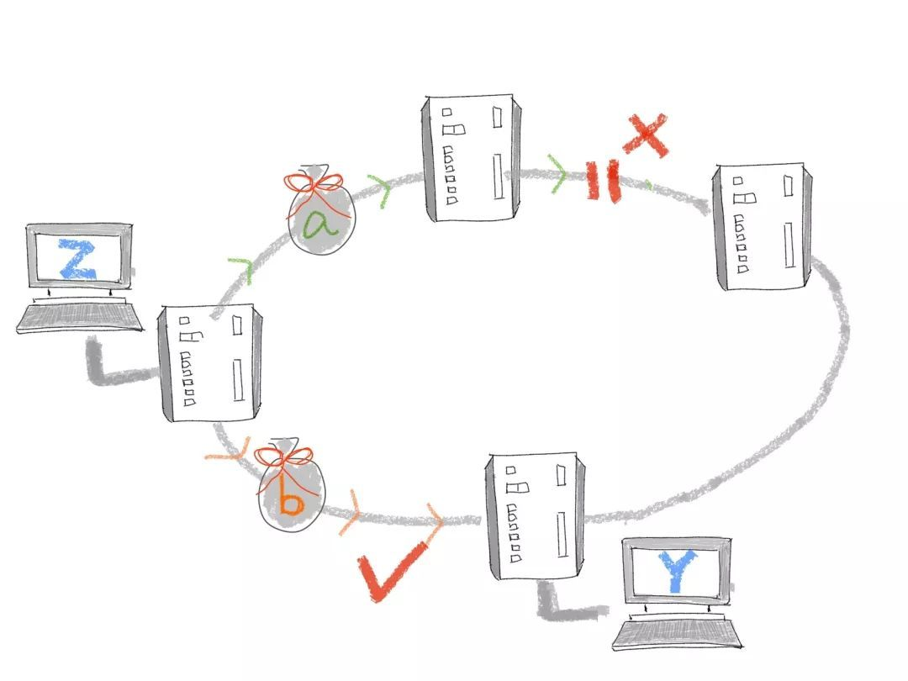
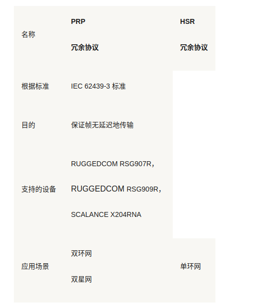
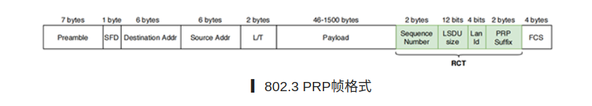

# PRP-HSR冗余协议说明

[toc]

## 1 PRP/HSR 概述

近年来，列车、工控甚至互联网等行业对网络可靠性传输的需求不断提升，加之当今的网络拓扑也越来越复杂，亟需一项兼容性好、易于使用的冗余协议。如此背景使得HSR/PRP这两项发布已久，并在电力行业已经得到广泛使用、验证的冗余协议，再次出现在人们的视野之中。

什么是HSP/PRP？

HSR/PRP全称分别为High-av[ai](http://www.elecfans.com/tags/ai/)lability Seamless Redundancy（高可靠性无缝冗余）与Parallel Redundancy Protocol（并行冗余协议），其所属的国际标准为IEC 62439，这是一个专注于解决高可靠性自动化网络传输的标准，共有7个部分，分别描述在链路层实现冗余的多种方法：

IEC 62439-1:2010

而HSR/PRP协议位于其中的第3部分，即IEC 62439-3。

 

### 1.1 PRP

PRP 网络根据 IEC 62439-3 标准使用两个单独的 LAN 进行设计。帧通过兼容设备和交换机以并行方式遍历两个网络。即使在两个网络中的任何一个发生故障的情况下，这也可以保证帧无延迟地传输。

 

 

下面展示PRP是如何运行的：

  

Z想发送数据给Y，交换机要先进行数据复制，形成数据a,b。

  

 

当线路A发生故障，导致信息传送中断时，数据b仍可通过线路B安全抵达目的地Y。

 

### 1.2 HSR 高可用性无缝冗余协议

HSR 网络是符合 IEC 62439-3 标准的专用环形网络。帧通过兼容设备和交换机在两个方向上以并行方式遍历该网络。即使在该环形网络发生单一故障的情况下，这也可以保证帧无延迟地传输。

 

 

下面展示HSR是如何运行的：

 

 

Z想发送数据给Y，交换机要先进行数据复制，形成数据a,b

 

两份数据a,b分别从（顺时针、逆时针）两个方向进行传送，后到的数据被Y丢弃。

 

当数据a经过的路段发生故障，导致信息传送中断时，数据b仍可安全抵达目的地Y。

 

### 1.3 PRP/HSR比较

  

总的来说，一个通讯终端，需要与HSR/PRP网络另一端的网络设备进行通讯。终端通过网络始终以复数形式发送数据包并由不同路径送达目的地。

当单一通讯链路出现故障的时候备用数据包仍然可以到达目的地从而完成通讯系统冗余。这和MRP，HRP最大的区别在于通讯的冗余切换是无扰的。也就是说通讯系统的中断时间是：0ms！

HSR/PRP冗余机制完全由通讯设备--交换机完成数据发送端与接收端完全没有感知。

 

## 2 PRP详细介绍

HSR/PRP协议分别提供独特的冗余机制进行网络链路的冗余备份，简要的机制介绍如下：

### 2.1 名词概念

SAN：Singly Attached Node，单端口节点，不实现PRP功能

DANP：Doubly Attached Node implemen[TI](http://bbs.elecfans.com/zhuti_715_1.html)ng PRP，PRP的双端口节点，可直接发送PRP流量

RedBox：Redundancy Box，冗余盒，将SAN传入的流量转换成PRP流量发送出去

C Frame：原始信息帧，指代用户想要冗余备份的信息

A Frame、B Frame：附带特定字段的PRP信息帧，由原始信息帧扩展而来

### 2.2 实现机制

PRP冗余机制的实现，主要依托于两个逻辑或物理分隔的子网（LAN A，LAN B，即所谓的A网、B网），以上图中的信息传输为例：PRP发送方（Source DANP）将原始信息帧（C Frame）复制一份，并在两份帧中添加一特定字段（RCT，下面会提到这个），形成PRP信息帧（A Frame、B Frame），分别从自身的两个端口发送出去（分别对应A网、B网），分别途径两个独立的子网到达同一个PRP接收方（Des[TI](http://bbs.elecfans.com/zhuti_715_1.html)na[TI](http://bbs.elecfans.com/zhuti_715_1.html)on DANP）；PRP接收方从两个端口分别接收到这两份PRP信息帧后，会经过一系列的帧处理算法进行处理，简而言之，就是依据“先来后到”的原则，将后到达的PRP信息帧消除，仅保留一份先到达的PRP信息帧，将特定字段消除后，还原成原来的原始信息，传递给上层。

那么问题来了，“A帧”和“B帧”是如何产生和消除的？具体的帧组成又是怎样的呢？

这是DANP节点的简要示意图，主要分为上层（链路层以上）、LRE（Link Redundancy Entity，链路层冗余实体）子层、下层（链路层及物理层）。可以看到PRP设备的内部实现只是在标准[以太网](http://www.elecfans.com/tags/以太网/)设备的MAC层中增添了一个LRE子层，这个子层内部实现了PRP信息帧的产生和消除算法。具体而言，就是在原始信息帧的基础上，增加了一个RCT（Redundancy Control Trailer，冗余控制体）字段，并针对这个字段进行一系列的处理，基于802.3标准以太网的PRP帧格式如下图所示：

 

 

 

### 2.3 802.3 PRP帧格式

RCT字段由6个字节组成，内部又会细分为不同的位域，指代不同的含义，简要介绍如下：

简要介绍

- Sequence Number： 16位帧序列号，LRE对同一原始信息帧复制而来的PRP帧赋予相同的序列号，并会随PRP帧的发送而递增序列号的值

- LSDU size：12位载荷大小，标识Paylo[ad](https://dfm.elecfans.com/uploads/software/hqdfm.zip?neilian)字段+RCT字段的总字节大小

- Lan Id：4位子网ID，仅有两个值可选，0xa、0xb，代表A、B两个子网

- PRP Suffix：16位PRP信息帧后缀，固定为0x88fb

LRE所实现的总体功能，就如先前所提到的：发送方向，将原始帧复制一份，打上A、B两个子网的RCT字段，向两个端口分别发送；接收方向，则是根据源MAC、RCT中的帧序列号识别某一PRP帧，后依据“先来后到”的原则，仅保留一份PRP信息帧，褪去RCT字段后传输给上层应用程序。而LRE子层内部的具体实现，有兴趣的读者可以自行移步IEC官网了解。

下面是一些抓包情况，详细测试环境此处省略，仅供各位读者参考PRP抓包的一些信息：

抓包情况——A网的SAN节点

可以在A网SAN节点中wireshark的抓包情况中看到，MEZU开发板转发[pi](http://www.elecfans.com/tags/pi/)ng帧的末尾中已经附带了6字节的RCT字段，也对应了RCT中的各个位域：

- 00 04：帧序列号

- a：LAN ID，指示这是A网

- 0 5a：即十进制的90，即RCT+Payload段的长度，104减去以太网帧的14个字节的源MAC、目的MAC、帧类型（不包含前导码和FCS）

- 88 fb：PRP帧后缀

另一边B网中的SAN节点的抓包情况也大同小异，只是LAN ID字段有所不同：

- 00 04：帧序列号

- b：LAN ID，指示这是B网

- 0 5a：即十进制的90，即RCT+Payload段的长度，104减去以太网帧的14个字节的源MAC、目的MAC、帧类型（不包含前导码和FCS）

- 88 fb：PRP帧后缀

 

## 3 总结

最后对PRP做一个简要的特点总结：

​	1、数据热交换，某个子网出现故障时，零恢复延时，不丢数据

​	2、纯二层的实现，可用于现有的任何工业以太网中，对应用层的程序透明

​	3、在任何网络拓扑结构中均可使用

​	4、支持实时应用场景的数据传输

​	5、需要搭建两个物理或逻辑独立的子网