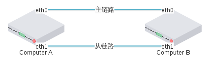
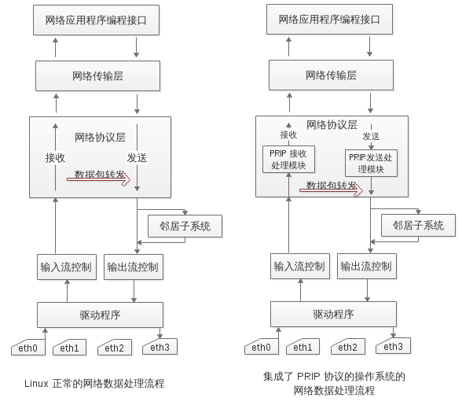
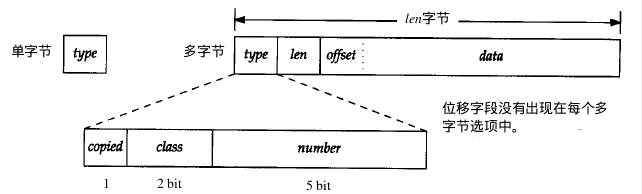
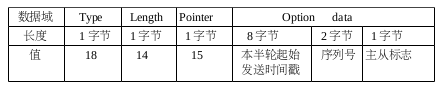
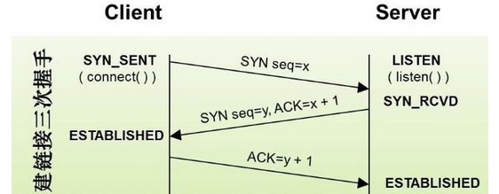
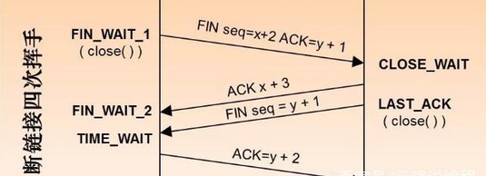
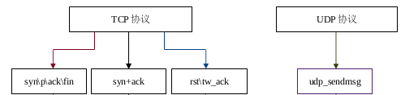
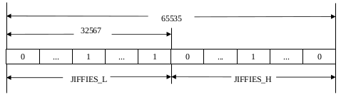
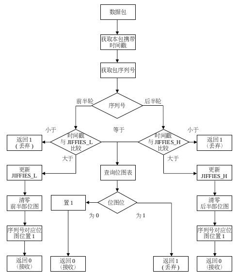
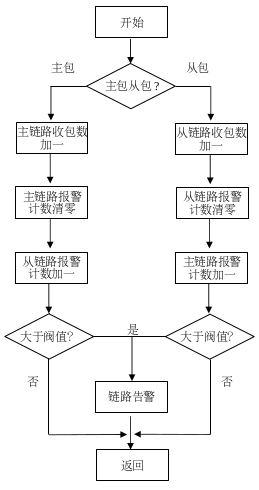

# 基于操作系统网络协议栈的并行冗余网络协议（PRIP）设计

目录：

[toc]

## 摘要

实现了一种基于操作系统网络协议栈的并行网络冗余协议，本文重点阐述了PRIP协议的实现方案以及涉及的关键算法，从实验结果表明，本协议能够与网络协议栈和谐共存，同时具有优良的网络性能。

## 引言

为了应对变电站通信网络失效，智能变电站均采用双网互备组网实现冗余容错的通信结构。传统冗余通信解决方案热备份切换机制,由于切换时间过长,且代价较高不能满足要求 ,在IEC 62439-3标准提出的并行冗余协议(parallel redundancy protocol,PRP)和高可用性无缝环网(high-availability seamless redundancy,HSR)原理，广泛应用在变电站网络设计中。PRP/HSR可以实现网络冗余容错,实现网络层故障的零秒切换,具有无缝切换的明显优势。可是HSR和PRP均在MAC层实现，需使用国外的专用设备实现，价格昂贵。而且HSR采用环形网络拓扑，与现有智能变电站独立双网的网络拓扑也不符. 

为此,摒弃 PRP/HSR 对特殊硬件和网络拓扑的依赖的缺点, 设计一种基于操作系统内核网络协议栈的并行冗余网络层协议(PRIP)来达到智能电网建设的要求.

## 1 PRIP并行冗余网络协议概述

本节对PRIP并行冗余网络协议的协议特性、通信模型、基本功能做简要说明。

### 1.1 协议特性

首先，PRIP协议是并行冗余网络协议，具有网络冗余容错功能，它通过两条链路发送数据，当单链路发生故障时，另一条链路可以保证数据的有效通信。并且我们在接收数据包时，通过设计一种冗余接收算法保证当单链路出现故障的情况下，通信向另一条链路切换的理论时间为0秒,即可以做到零秒切换。 

其次，PRIP协议纯软件实现，不依赖于特定的硬件，只需简单的网络设置，数据包的处理由操作系统内核完成，对特定的网络设备和网络拓扑也无依赖要求。

第三，PRIP协议实现在网络协议栈中，通过对数据进行分流处理：对于属于冗余通信数据包，按照本协议定义的实现方法处理；对于正常网络数据，仍将走正常协议栈处理流程。从而不会对协议栈的正常网络功能构成影响，可以做到与正常协议栈和谐共存，互不干扰。借助于内核本身网络协议栈的机制,也可达到数据处理的安全和稳定性保障。

### 1.2 通信模型 

如PRIP通信模型示意图所示，使用 PRIP 协议通信的两台主机 A 和 B 都分别同时处于两个相互隔离独立的局域网内,从而确保计算机 A 和计算机 B 之间有两条独立的物理链路相连,一条被成为主链路,另一条被称为从链路。从链路对完全用户透明,用户只会感觉主链路的存在。PRIP 并行冗余互联协议的通信模型包括冗余发送和冗余接收

 

   

​                          图 1: prip通信模型示意图

 

冗余发送流程:

​	(1) 生成双包。将来之应用程序的数据包复制一份,原数据包与复制包分别称为主包和从包。

​	(2) 为双份数据包分别添加构建 PRIP 协议 IP 选项。

​	(3) 从包目的地址替换。确保从包从从链路发送。

​	(4) 发送。

冗余接收流程:

​	(1) 解析接收到的数据包的 PRIP 协议 IP 选项。

​	(2) 根据解析结果判断数据包是否重复。若是重复的包,丢弃;否则,接收。

​	(3) 从包目的地址替换。 若需要接收的包是从包,需要进行目的地址替换,确保数据包可以到达正确的应用程序。

​	(4) 向上层提交。

### 1.3 基本功能

PRIP并行冗余网络协议具备以下四个基本功能：

​	(1) 数据冗余发送。数据冗余发送指的是:将数据包生成双份携带相同有效载荷的数据包,并为它们分别添加 PRIP 协议相关数据,最终确保将这两份携带相同载荷的数据包从不同的物理链路发送出去。

​	(2) 数据冗余接收。由于 PRIP 协议采用数据冗余发送,所以总会收到两份携带相同数据的数据包。对于首先到的那份数据包,予以接收;后到的那份,视为冗余,予以丢弃。

​	(3) 链路告警功能。在数据冗余接收过程中,根据两条链路的收包情况分析链路的运行状况,并在链路出现异常时候向用户发出告警信息。

​	(4) 不影响正常网络通信。PRIP 协议通信的存在不会对正常的网络功能造成影响,同时对正常网络性能的影响也会保持在%1 的可接受范围内。

## 2 PRIP并行冗余网络协议栈设计

PRIP协议通过IP选项来标识，PRIP的核心处理模块实现在网络协议栈网络层，通过对IP选项承载的信息来控制对PRIP协议包的处理。

### 2.1协议栈处理框图

PRIP协议实现在内核网络协议栈里,它处于网络协议层。如图2所示，左图为linux正常的网络数据处理流程，右图为集成了PRIP 协议的网络数据处理流程。

 

​                                      图 2: prip协议网络协议栈框图

在接收端，当收到数据包时,会触发网卡中断,由中断服务程序完成数据接收。网卡驱动程序去掉数据包的数据链路层协议头后,接收软中断会调用协议栈接口函数将数据包交给网络协议层处理。首先对输入包进行路由,若数据包不是发给本机的且本机设置了转发功能,那么会对数据包进行输出路由,选择合适的网络接口和下一跳目的地址发送出去。在数据包经过路由子系统、IP 协议头正确性检查、IP 分片组装之后(如果有的话),会进入 PRIP 协议接收处理模块。 

在发送端，当应用程序发送网络数据时候,如果是进行 PRIP 通信,应用程序会调用相应的应用程序接口设置数据包的 PRIP 标志。数据包经协议栈网络传输层处理之后,会被交给协议栈网络协议层。在数据包在添加了协议头之后,会被交给 PRIP 发送模块处理。PRIP处理完之后讲数据包交由路由子系统。

路由子系统会为数据包选择合适的发送网络接口和下一跳地址。同时会查看路由查询结果里是否已经为本数据包缓存了数据链路层硬件头缓存,如果有,则调用邻居子系统的发送接口执行快速发送。若没有缓存数据链路层协议头,则调用邻居子系统的发送接口进行慢速发送,此时,邻居子系统会先进行 arp 请求,来获得目的地址的 MAC 地址,然后调用相应的网卡驱动发送数据。

### 2.2. PRIP协议栈IP选项

PRIP 协议 IP 选项在冗余发送时构建添加,在冗余接收时予以解析,在 PRIP通信时作为承载协议的数据基本载体随数据包发送和接收。PRIP 协议 IP 选项是协议大部分功能赖以实现的核心,其数据格式也是 PRIP 并行冗余互联协议的基本标准。

#### 2.2.1. IP通用选项（options）

 

​                                                    图 3: ip协议IP选项

如图3所示，ip协议头中Options字段就是ip选项，所有选项都以1字节类型type字段开始。在多字节选项中，类型字段后面紧接着一个长度len字段，后边是数据字段data。大多data数据字段的第一个字节是1字节的位域offset字段，指向数据字段内的某个字节。长度字节的计算覆盖了类型、长度和数据字段。类型被继续分成三个子字段：1bit备份copied标志，2bit类class字段和5bit数字number字段。

#### 2.2.2. PRIP协议IP专用选项

   

​                                                       图 4: prip协议IP专有选项

PRIP 协议 IP 选项的格式及其各数据域定义如图 4 所示。Type 数据域的值是 18,代表 PRIP 协议IP 选项类型编码为 18,以及在 IP 数据包分片时不复制该选项;Length 数据域的值为 14,但 RFC760标准规定 IP 选项长度必须是四字节的倍数,因而在实际的构建 PRIP 协议 IP 选项时候会在其末尾会添加 2 个字节的填充字节;Pointer 数据域的值是 15,指的是该选项的结束位置的下一个字节在 IP选项中的偏移值为 15;Option data 数据域是 IP 选项数据域,包含 8 字节的本半轮发送时间戳、2 字节的 PRIP 序列号和 1 字节的主从标志。

## 3 协议模块设计

### 3.1. PRIP冗余发送 

在图2 中的 PRIP 发送处理模块中,会将来自应用程序的数据包复制一份,并对复制出来的数据包进行目的 IP 替换,同时为两个数据包构建相应的Ip options,最后通过不同的网络接口发送到主从链路上。这样,两个携带相同有效载荷的数据包分别通过两个相互独立的物理链路进行传输,从而实现了关键业务数据的冗余传输。

- PRIP协议包复制 

PRIP协议对同一份数据生成两份，经两个相互独立的物理链路进行传输。协议包的复制实现在IP网络层，复制主包数据并对从包目的IP进行替换。除了以上操作，还包括构建IP选项，IP数据包的分片以及IP发送路由选路。

- 发送路径 

在操作系统内核网络协议栈中，TCP协议和UDP协议数据包发送路径不尽相同，对于PRIP协议来说，需要针对两个协议进行分析，从而能够完成在不同路径上得以正确传输。针对TCP协议有三次握手和断开连接的四次挥手过程，如下图所示：

 

 

  

​                                图 5: TCP协议连接断开过程

对于UDP 协议，则不需要建立连接可以直接发送数据。

针对TCP和UDP协议包流程分析，PRIP协议需要如下图四条路径进行发送：

  

图 6: PRIP协议发送路径

### 3.2. PRIP冗余接收 

在图2 中的 PRIP 接收处理模块中,对于正常的网络数据包不做处理,只处理属于 PRIP 连接的数据包。每收到一个 PRIP 数据包,会从数据包的 Ip options 里提取本包的 PRIP 序列号,根据该序列号查询本地缓存的 PRIP 序列号表,看该序列号的的数据包是否已经收到。若没有收到,则接收,并更新本地 PRIP 序列号表中该序列号的接收状态。否则,丢弃处理。

#### 3.2.1 序列号的管理

PRIP序列号是 PRIP 进行冗余通信的重要基础,PRIP 主机主要依据数据包携带的序列号来实现冗余包的丢弃。在一个 PRIP 主机组成的局域网内,每个 PRIP 主机在发送数据时候,都会为发送数据包添加新的 PRIP 序列号,因此在此局域网内就会存在多个 PRIP 序列号。为了避免多序列号的混乱而引起的数据接收错误. 需要对序列号进行管理。每两台进行 PRIP 通信的主机被成为一个 PRIP 协议 IP 对,每一个 IP 对维护了一个PRIP 通信私有数据结构体，该私有数据结构体包含本IP 对发送序列号和本 IP 对接收状态缓存位图。通过hash算法组织该状态。方便对接收状态的查询。

#### 3.2.2 重复包丢弃算法

重复包丢弃算法主要涉及三个重要的数据结构:PRIP 协议 IP 选项、PRIP 接收状态缓存位图和全局散列表。位图散列表的容量为64,每个桶存放的是链表头,每个链表会存放对应的 PRIP 接收状态缓存位图地址和一些辅助数据结构。下图为PRIP接收状态缓存位图：

 

​                                 图 7: PRIP接收状态缓存位图

 

PRIP 接收状态缓存表是由 65535 个比特位置组成,共占 8192 个字节的位图表。该表有两个辅助数据 JIFFIES_L 和 JIFFIES_H,JIFFIES_L 被称为前半轮发送时间戳,指的是与本机 PRIP 通信的远端主机发送本轮 PRIP 序列号为 1 的主包时的系统 jiffies,在本轮序列号轮转的前半轮中,远端主机将一直使用该时间戳来生成数据包的 PRIP 协议 IP 选项,发送到本机。同样 ,JIFFIES_H 称为后半轮发送时间戳,指的是与本机 PRIP 通信的远端主机发送序列号为 32768 的数据包时的系统 jiffies,在发送序列号 32768 到 65535 的数据包时,均将该 jiffies 添加到数据包的 PRIP协议 IP 选项,发送到本机。简言之,在发送 PRIP 数据包时,序列号 1~32767 的数据包携带的时间戳为 JIFFIES_L,它的值为发送本轮序列号为 1 的数据包时的本地系统 jiffies。序列号 32768~65535的数据包携带的时间戳为 JIFFIES_H,值等于发送本轮序列号为 32769 的主包时的本地系统 jiffies。

重复包丢弃算法要实现的主要功能是:对于一个数据包,根据其携带的 PRIP 序列号和发送时间戳去查询 PRIP 接收状态缓存位图,看在本轮 PRIP 序列号轮转中,该序列号的数据包是否是第一次到达,如果是,则予以接收,并更新该序列号在缓存表中的接收状态;否则,是重复包,予以丢弃。需要指出的是,当本主机与多个其他主机进行 PRIP 通信时,须在本机上为每一个通信的远端主机维护一个 PRIP 接收状态缓存位图,以保证序列号的顺承一致。最终在本机上维护了一张全局哈希表来组织这些 PRIP 接收状态缓存位图,以本机 PRIP 主 IP、远端 PRIP 主 IP 生成哈希键值进行散列,以保证查表效率。下图是重复包丢弃算法。

 

​                                      图 8: prip协议重复包丢弃算法

### 3.3 链路故障报警 

在 PRIP 接收处理模块中,每接收一个属于 PRIP 连接的包,根据该包的抛弃与否,都会更新相应的统计信息。当冗余链路中的一条连续丢包数超过设定的报警阀值,就会通过 proc 文件系统将报警信息呈现给用户。如下图所示：

 

图 9: prip协议链路故障报警

## 4 测试结果

PRIP协议测试数据截图（两部分，一部分是协议能够正常冗余处理数据。 一部分是能够0切换示例）暂时无内容，测试完补充截图。

 

## 5 结语

本文完成了基于操作系统网络协议栈的并行网络冗余协议PRIP的设计，该协议减少对硬件的依赖，适配更广泛的网络环境。是区别与RPR协议的一种软件实现方案。为了达到更稳定更有效率的处理，prip协议的实现还需要进一步的开发和完善。

## 6 参考文献

[1] unix网络编程：第3版。第1卷，套接字联网API （美）Stevens,W.R.，（美）Fenner,B.，（美）Rudoff,A.M.

[2] IEEE 802.17 Working Group,”PRP Proposed Draft Standard Darwin”,v1.0,2002.