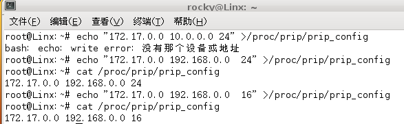
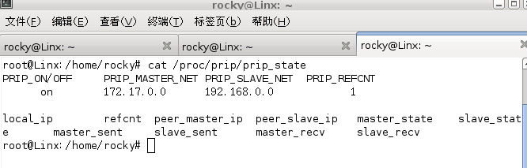
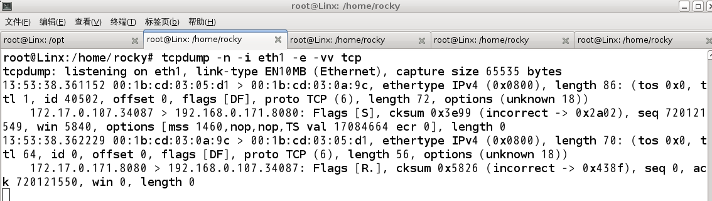
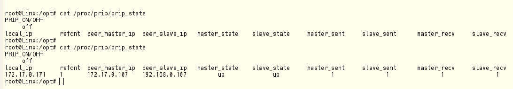
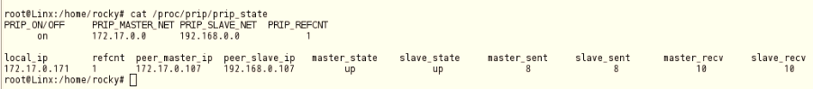

# PRIP并行冗余通信协议自测报告

[toc]

## 1 研究内容

### 1.1 研究内容

本文档是对PRIP并行冗余互联协议各项功能和性能进行的测试。

## 2 功能概述

​	PRIP并行冗余互联协议具备以下四个基本功能：

​	(1) 数据冗余发送。数据冗余发送指的是：将数据包生成双份携带相同有效载荷的数据包，并为它们分别添加PRIP协议相关数据，最终确保将这两份携带相		同载荷的数据包从不同的物理链路发送出去。

​	(2) 数据冗余接收。由于PRIP协议采用数据冗余发送，所以总会收到两份携带相同数据的数据包。对于首先到的那份数据包，予以接收；后到的那份，视为冗	余，予以丢弃。

​	(3) 链路告警功能。在数据冗余接收过程中，根据两条链路的收包情况分析链路的运行状况，并在链路出现异常时候向用户发出告警信息。

​	(4) 影响正常网络通信。PRIP协议通信的存在不会对正常的网络功能造成影响，同时对正常网络性能的影响也会保持在％1的可接受范围内。

## 3 功能测试环境

### 3.1 测试环境框架图

测试环境如下图所示，准备2台双网卡的物理机和4个千兆交换机  。中间的交换机，client 和server 为具有PRIP功能的服务器。其中，server 的eth2的IP为172.17.0.171/24，server 的eth1的IP为192.168.0.171/24，client的eth0的IP为172.17.0.107/24，client的eth1的IP为192.168.0.107/24。

在本次测试中使用172.17.0.0/24网段的链路为主链路，192.168.0.0/24网段的链路为从链路，即server端的主链路网卡为eth2，server端的从链路网卡为eth1，client端的主链路网卡为eth0，client端的从链路网卡为eth1。

 

 

图 3-1 测试环境

 

### 3.2 硬软件配置清单

 

| 序号   | 硬件配置                                          | 软件配置 |                      |      |      |
| ------ | ------------------------------------------------- | -------- | -------------------- | ---- | ---- |
| 处理器 | 内存                                              | 网卡     | 操作系统             | 软件 |      |
| server | Intel(R) Xeon(R) CPU     E5645  @ 2.40GHz（24核） | DDR3 48G | Intel 82576 千兆网卡 |      |      |
| client | Intel(R) Core(TM) i3 CPU 530 @ 2.93GHz (4核)      | DDR3 16G | Intel 82580千兆网卡  |      |      |

 

测试软件原理为：client与server端套接字启用PRIP功能，然后client端向server发送数据包，server端接受client端的数据包，通过主从网卡进行双路通信，达到PRIP并行冗余的目的。

 

## 4功能测试

### 4.1 功能测试分类

PRIP并行冗余互联协议功能测试主要从以下几个方面来进行测试：

配置文件功能测试

常规模式PRIP通信功能测试

异常模式PRIP通信功能测试

告警功能测试

0延迟切换的功能测试

对正常网络通信无影响的功能测试

 

配置文件功能测试主要是对用户所输入到配置文件中的配置项进行识别，来确保用户输入的内容有效。其主要包括输入的ip地址是否合法、十进制的网络掩码是否有效、输入的网段是否有本机的网卡ip地址在其范围内、在输入网段范围内的两块网卡其ip地址除网络号以外是否一致、更新配置文件时检查配置文件是否正在被使用、清空配置文件以及设置连续丢包报警阈值等。

常规模式PRIP通信功能测试主要是在网络环境正常的情况下对TCP协议与UDP协议的并行冗余通信的测试以及各项状态与数据的统计。

异常模式PRIP通信功能测试主要是在本机或者网络环境出现异常的情况下对PRIP并行冗余协议的功能测试，但前提是主要要有一条链路保证是能够正常连通的，其主要包括链路断开、网卡down掉等各种异常情况，详细请看下面的测试项。

告警功能测试主要是当某一链路连续丢包超过阈值时，将链路的状态设置为down状态，并打印报警信息，正常情况下为up状态。

0延迟切换的功能测试主要是在正常PRIP网络通信时，将其中一链路的网线拔掉，以此来查看网络通信是否正常。

对正常网络通信无影响的功能测试主要是在进行PRIP网络通信时同时进行正常的网络通信，来表明对系统正常的网络通信没有影响。

### 4.2 配置文件功能测试

#### 4.2.1校验配置项地址是否合法

| 用例1名称    | 校验输入的地址是否合法                                   |
| ------------ | -------------------------------------------------------- |
| 测试内容     | 设置PRIP配置文件时，校验输入的地址是否合法               |
| 测试条件     | 系统具有PRIP功能，并且运行正常                           |
| 测试过程     | 通过echo命令来给PRIP配置文件来配置合法以及不合法的IP地址 |
| 预期结果     | PRIP配置文件功能能够识别出输入的地址是否合法             |
| 测试结果     | PRIP配置文件功能能够识别出输入的地址是否合法，如下图所示 |
| 测试结果说明 | PRIP配置文件功能项具备识别所输入的地址是否合法的功能     |

 

测试过程:

通过给PRIP配置文件写入合法和不合法的地址，以此来查看PRIP配置文件功能是否具有校验输入的地址是否合法的功能。

首先，通过echo命令给PRIP配置文件输入不合法的IP地址，如下图所示：

 

图4.1 不合法地址输入的结果

然后，再通过echo命令输入正常合法的IP地址，其显示结果如下图所示：

 

图4.2  合法地址输入的结果

由上述功能测试可以得出PRIP配置文件功能能够识别输入的地址是否合法。

 

#### 4.2.2校验配置项是否包含必须的网段与掩码

| 用例2名称    | 校验配置项是否包含必须的网段与掩码                           |
| ------------ | ------------------------------------------------------------ |
| 测试内容     | 设置PRIP配置文件时，校验输入内容是否包括两个网段和掩码       |
| 测试条件     | 系统具有PRIP功能，并且运行正常                               |
| 测试过程     | 通过echo命令来给PRIP配置文件来配置完整的配置项和不完整的配置项 |
| 预期结果     | PRIP配置文件功能能够识别出配置项是否完整                     |
| 测试结果     | PRIP配置文件功能能够识别出输入的配置项是完整，如下图所示     |
| 测试结果说明 | PRIP配置文件功能项具备识别所输入的配置项是否完整的功能       |

 

测试过程：

PRIP配置项必须包含三个部分：主网络地址、从网络地址和十进制的子网掩码。这三个部分是必不可少的，下面是对PRIP配置项输入不完整的测试，测试结果如下图所示：

 

图4.3：配置项输入不完整的测试结果

然后，再对配置项输入完整进行测试，测试结果如下图所示：

 

图4.4 配置项输入完整的测试结果

通过上述的测试得出PRIP配置文件功能具备识别输入的配置项是否完整的功能。

 

#### 4.2.3校验配置项十进制子网掩码是否有效

| 用例3名称    | 校验配置项十进制子网掩码是否有效                             |
| ------------ | ------------------------------------------------------------ |
| 测试内容     | 设置PRIP配置文件时，校验输入配置项的十进制子网掩码是否合法   |
| 测试条件     | 系统具有PRIP功能，并且运行正常                               |
| 测试过程     | 通过echo命令来给PRIP配置文件来配置合法及不合法的子网掩码     |
| 预期结果     | PRIP配置文件功能能够识别出输入的十进制子网掩码是否合法       |
| 测试结果     | PRIP配置文件功能能够识别出输入的十进制子网掩码是否合法，如下图所示 |
| 测试结果说明 | PRIP配置文件功能项具备识别所输入的十进制子网掩码是否合法的功能 |

 

测试过程：

PRIP配置文件的子网掩码必须是十进制的，并且其值的范围是1-31，超出这个范围的都是无效的。下图中是对配置文件判断子网掩码是否有效的测试。

 

图4.5 判断子网掩码是否有效的测试结果

由上述的测试得出PRIP配置文件能够识别出子网掩码是否有效。

#### 4.2.4校验本机网卡IP地址是否处于配置项设置的网段

| 用例4名称    | 校验本机网卡IP地址是否处于配置项所设置的网段                 |
| ------------ | ------------------------------------------------------------ |
| 测试内容     | 设置PRIP配置文件时，校验本机是否网卡的IP地址处于配置项所设置的网段中 |
| 测试条件     | 系统具有PRIP功能，并且运行正常                               |
| 测试过程     | 本机网卡的ip地址属于或不属于PRIP配置文件设置的网段           |
| 预期结果     | PRIP配置文件功能能够识别出本机是否有网卡的ip地址属于配置项设置的网段 |
| 测试结果     | PRIP配置文件功能能够识别出本机是否有网卡的ip地址属于配置项设置的网段，如下图所示 |
| 测试结果说明 | PRIP配置文件功能具备识别出本机是否有网卡的ip地址属于配置项设置网段的功能 |

 

测试过程：

PRIP配置文件要设置的网段必须是本机有网卡的IP地址位于该网段中，通过查看本机网卡的地址来通过echo命令给PRIP配置文件设置不同的网段，来查看配置的设置结果。首先，查看本机网卡的地址，如下图所示：

 

图4.6 本机网卡的网络地址

若没有网卡的IP地址处于要设置的网段中，则设置失败，如下图所示：

 

图4.7 没有网卡网络地址处于设置网段的结果

然后将设置配置文件的网段为本机网卡存在的网段，测试结果如下图所示：

 

图4.8 网卡网络地址处于设置网段的结果

由上述测试结果得出PRIP配置文件能够识别出要设置的网段是否有网卡处于其中。

#### 4.2.5校验本机是否存在网络号外的主机地址一致的两块网卡

| 用例5名称    | 校验本机是否存在网络号外的主机地址一致的两块网卡             |
| ------------ | ------------------------------------------------------------ |
| 测试内容     | 设置PRIP配置文件时，校验本机是否有两块网卡在配置项设置的网段中，并且网络号外的主机地址是一样的 |
| 测试条件     | 系统具有PRIP功能，并且运行正常                               |
| 测试过程     | 将属于配置项网段的两个网卡的ip地址网络号外的主机地址设置相同或不同。 |
| 预期结果     | PRIP配置文件功能能够识别出本机是否有两个网卡的ip地址网络号外的主机地址相同 |
| 测试结果     | PRIP配置文件功能能够识别出本机是否有两个网卡的ip地址网络号外的主机地址相同，如下图所示 |
| 测试结果说明 | PRIP配置文件功能具备识别出本机是否有两个网卡的ip地址网络号外的主机地址是相同的功能。 |

 

测试过程：

修改本机的网卡，将要用作PRIP功能配置的两个网卡的网络地址的主机地址设置为不同的值，如下图4.9，然后通过echo命令来设置PRIP配置文件，查看输出的结果，如下图4.10。

 

图4.9两个网卡网络地址的主机地址

下图为两网卡主机地址不同时设置PRIP配置文件的输出结果：

 

图4.10 两网卡主机地址不同时PRIP配置设置结果

将两网卡的网络地址的主机地址设置为相同，如下图4.11，然后在进行设置PRIP配置文件，然后查看输出结果，如下图4.12。

 

图4.11 两网卡的主机地址相同

 

图4.12 两网卡主机地址相同时设置PRIP配置文件的输出结果

有上述测试得出PRIP配置文件功能能够识别出设置PRIP配置时系统是否有两个网卡处于要设置的PRIP的网段，并且这两个网卡网络地址的主机是否相同。

#### 4.2.6 更新配置项时校验配置文件是否被锁定

| 用例6名称    | 更新配置项时校验配置文件是否被锁定                           |
| ------------ | ------------------------------------------------------------ |
| 测试内容     | 更新配置项时检查配置文件是否被锁定，若被锁定则不允许更新，没有被锁定则允许更新。 |
| 测试条件     | 系统具有PRIP功能，并且运行正常，PRIP程序能够启用             |
| 测试过程     | 在PRIP应用程序开启和关闭时更新PRIP配置文件                   |
| 预期结果     | 在PRIP应用程序开启时是不允许修改配置文件的，PRIP应用程序关闭后可以修改配置文件。 |
| 测试结果     | 在PRIP应用程序开启时是不允许修改配置文件的，PRIP应用程序关闭后可以修改配置文件，如下图所示 |
| 测试结果说明 | PRIP配置文件功能具备锁定功能，当配置文件被使用时不允许修改。 |

 

测试过程：

在进行该项功能测试时，首先启用应用程序，如下图4.13，应用程序设置了PRIP模式，通过查看PRIP状态显示文件可知，如下图4.14所示，然后进行PRIP配置文件更新和重新设置的操作，然后查看配置文件的设置结果，如图4.15所示。

 

图4.13 启用PRIP的应用程序 

 

图4.14 	PRIP状态显示

图4.14 PRIP状态显示文件显示此时有套接字正在引用prip配置文件,也就是此时PRIP配置文件中处于锁定状态 。

 

图4.15 更新PRIP配置文件的输出结果

上述测试可以看出，有PRIP的应用程序启用时，PRIP配置文件处于被锁定的状态，此时若修改PRIP配置文件，则会出现设备或资源忙的错误。由此可以得出PRIP配置文件功能支持校验PRIP配置文件是否被锁定的功能。

#### 4.2.7 支持关闭系统的PRIP功能

| 用例7名称    | 支持关闭系统的PRIP功能                                       |
| ------------ | ------------------------------------------------------------ |
| 测试内容     | 在PRIP配置文件没有被锁定时，关闭系统的PRIP功能               |
| 测试条件     | 系统具有PRIP功能，并且运行正常                               |
| 测试过程     | 在PRIP配置未被锁定时，使用echo命令向prip配置文件写入“”空字符，即关闭系统的PRIP功能 |
| 预期结果     | 清空PRIP配置文件后，关闭系统的PRIP，应用程序设置PRIP失败     |
| 测试结果     | PRIP配置文件显示为空，应用程序设置PRIP失败，如下图所示       |
| 测试结果说明 | PRIP配置文件功能具备关闭系统PRIP的功能。                     |

 

测试过程：

在PRIP配置文件没有被锁定的情况下，如图4.16，使用echo 命令给PRIP配置文件写入空字符，然后查看PRIP配置文件的内容和PRIP状态显示，PRIP配置文件被清空后那么就是系统的PRIP功能被关闭了。

 

图4.16 PRIP配置没有被锁定的输出

  

图4.17 PRIP配置文件被清空后的显示

由上述测试得出PRIP配置文件功能支持关闭系统PRIP的功能。

#### 4.2.8 支持根据配置项的掩码自动补齐不完整输入网段的地址

| 用例8名称    | 支持根据配置项的掩码自动补齐不完整输入地址的网段             |
| ------------ | ------------------------------------------------------------ |
| 测试内容     | 设置PRIP配置文件时，若配置的网段没有完整输入，则在显示时根据掩码显示完整的网段。 |
| 测试条件     | 系统具有PRIP功能，并且运行正常                               |
| 测试过程     | 在PRIP配置未被锁定时，使用echo命令向prip配置文件写入不完整的网段地址，但是需要写入子网掩码，否则请参考4.2.2 |
| 预期结果     | 显示PRIP配置文件时网段能够自动补齐。                         |
| 测试结果     | 显示PRIP配置文件时网段能够自动补齐，如下图所示               |
| 测试结果说明 | PRIP配置文件功能具备根据配置项的掩码自动补齐不完整输入的网段地址的功能。 |

 

测试过程：

在设置PRIP配置文件时，配置项的网段地址不必全部写出，只要写出网络号中的子网掩码位，配置文件功能就可以将后面的位自动补0，如下图所示：

  

图4.18 配置文件自动补0功能

由此得出PRIP配置文件功能支持根据掩码自动补齐不完整输入网段地址的功能。

#### 4.2.9 支持根据配置项的掩码自动识别输入地址的网段

| 用例9名称    | 支持根据配置项的掩码自动识别输入地址的网段                   |
| ------------ | ------------------------------------------------------------ |
| 测试内容     | 设置PRIP配置文件时，若配置的地址是具体的ip地址而不是网络号的地址，配置文件功能能够根据掩码自动识别出该地址位于哪个网段。 |
| 测试条件     | 系统具有PRIP功能，并且运行正常                               |
| 测试过程     | 在PRIP配置未被锁定时，使用echo命令向prip配置文件写入指定具体的IP地址和子网掩码，然后查看配置文件的内容显示。 |
| 预期结果     | PRIP配置文件显示的是网络号而不是具体的地址                   |
| 测试结果     | PRIP配置文件显示的是网络号而不是具体的地址，如下图所示       |
| 测试结果说明 | PRIP配置文件功能具备根据配置的掩码自动识别输入地址的网段的功能。 |

 

测试过程：

在设置PRIP配置文件时，输入的地址可能不是和掩码对应的网段的地址，有可能是该网段中的其中一个主机地址，而此时配置文件功能能够通过根据掩码自动识别出输入地址的网段，如下图所示：

 

图 4.19 配置文件自动识别输入地址的网段功能

由此得出PRIP配置文件功能支持根据配置项的掩码自动识别出输入地址所在的网段的功能。

#### 4.2.10 支持设置连续丢包报警的阈值 

| 用例10名称   | 支持设置连续丢包报警的阈值                               |
| ------------ | -------------------------------------------------------- |
| 测试内容     | 设置连续丢包报警阈值的配置文件为不同的值，然后显示出来   |
| 测试条件     | 系统具有PRIP功能，并且运行正常                           |
| 测试过程     | 使用echo命令向prip报警阈值文件写入不同的值，然后显示出来 |
| 预期结果     | Prip报警阈值可以设置为任意值                             |
| 测试结果     | PRIP报警阈值可以设置为任意值，如下图所示                 |
| 测试结果说明 | PRIP配置文件功能具备支持设置连续丢包报警阈值的功能。     |

 

测试过程：

PRIP功能支持设置连续丢包报警阈值的功能，其值默认是500，该功能是由一个单独的文件来实现的，如下图所示：

 

图4.20 设置连续丢包报警阈值的功能

因此PRIP协议支持设置连续丢包报警阈值的功能。

### 4.3 常规模式PRIP通信功能测试

常规模式下的PRIP通信功能的测试主要是针对正常网络通信环境下的PRIP功能测试，即主从链路都能够正常连通的情况。下面是具体的常规模式下的PRIP功能测试。

#### 4.3.1 TCP协议服务端未监听时数据冗余通信

| 用例11名称   | TCP协议服务端未监听端口而发送rst的数据通信的情况             |
| ------------ | ------------------------------------------------------------ |
| 测试内容     | 服务端收到客户端发送的SYN包但是未监听相应端口时情况          |
| 测试条件     | 客户端与服务端设置了PRIP配置文件，配置项相同且系统运行正常   |
| 测试过程     | 服务端未启用相应的应用程序，然后客户端向服务端发起连接请求，通过捕包查看其数据通信 |
| 预期结果     | 客户端与服务器能够捕获SYN包与RST包的主从包，并且PRIP状态显示收发数据包的个数正确。 |
| 测试结果     | 客户端与服务器能够捕获SYN包与RST包的主从包，并且PRIP状态显示收发数据包的个数正确，如下图所示 |
| 测试结果说明 | PRIP协议支持TCP协议的SYN包与RST包的并行冗余功能。            |

 

测试过程：

在服务器端未启用应用程序去监听相应的端口，然后启用客户端的应用程序去访问服务器的相应端口，此时服务器应该会给客户端发送RST包，并且主从链路都应该发送RST包。

4.3.1.1 客户端捕包与PRIP状态显示

客户端此时还没有运行应用程序，也就是PRIP功能还没有被启用，那么PRIP的状态显示为off，如下图所示：

  

图4.21 测试前客户端PRIP的状态

然后启动客户端应用程序访问服务器发送SYN包，在主从链路进行捕包，如下图所示：

  

图4.22 客户端主链路捕包截图

 

 

图4.23 客户端从链路捕包截图

从上图中可以看到客户端发送到服务器端的SYN包在主从链路上都已经发送出去了，并且收到了服务端通过主从链路发送来的RST包。

客户端应用程序运行起来后，并且与服务端通信后，此时客户端的PRIP状态如下图所示：

图4.24 客户端收发数据包后的PRIP状态

通过上图可以看到主从链路都进行了数据包的收发，并且链路的状态为up的状态。

4.3.1.2 服务端捕包与PRIP状态显示

首先查看服务器端PRIP的状态，此时没有应用程序使用PRIP，那么其状态显示为off，如图所示：

图4.25 测试前服务器PRIP的状态

客户端启用应用程序发送SYN包后，服务器端主从链路的捕包情况如下两图所示：

图4.26 服务器主链路捕包截图

图4.27 服务器从链路捕包截图

由以上两图可以看出服务器端能够收到客户端主从链路发送出来的SYN包，并且能够将RST包通过主从链路发送出去。

服务器收到SYN发送RST后，服务器端的PRIP状态如下所示，此时系统的PRIP仍未启动，但是此时系统仍具有对端IP的PRIP缓存，PRIP缓存中记录了主从链路的收发包的个数。

图4.28 服务器收到包后的PRIP状态

从以上的测试可以得出PRIP协议支持TCP协议的SYN和RST包的发送和接收。

#### 4.3.2 TCP协议建立连接时数据冗余通信

| 用例12名称   | TCP三次握手建立连接的数据通信的情况                          |
| ------------ | ------------------------------------------------------------ |
| 测试内容     | TCP建立连接三次握手时数据冗余通信                            |
| 测试条件     | 客户端与服务端设置了PRIP配置文件，配置项相同且系统运行正常   |
| 测试过程     | 服务端启用相应的应用程序，然后客户端向服务端发起连接请求，通过捕包查看双方连接建立时的数据通信 |
| 预期结果     | 客户端与服务器能够捕获三次握手建立连接的主从包，并且PRIP状态显示收发数据包的个数正确。 |
| 测试结果     | 客户端与服务器能够捕获三次握手建立连接的主从包，并且PRIP状态显示收发数据包的个数正确，如下图所示 |
| 测试结果说明 | PRIP协议支持TCP协议连接建立的并行冗余功能。                  |

 

测试过程：

将服务端的应用程序启用后，启用客户端应用程序，然后通过在双发的主从链路上进行捕包，来查看TCP连接建立的三次握手包是否在双方的主从链路上都有进行传输。

4.3.2.1 客户端捕包与PRIP状态显示

客户端运行应用程序后会通过主从链路与服务端进行三次握手建立连接，在客户端通过tcpdump工具查看其通信过程，如下图所示：

图4.30 客户端主链路捕包截图

图4.31 客户端从链路捕包截图

此时连接已建立，然后通过netstat命令将连接建立前和连接建立后的系统网路连接的进行对比，如下图所示：

图4.32 客户端网络连接截图

由上图可以看到，客户端已与服务端建立连接，同时可以得出虽然主从链路都发送了tcp连接建立的三次握手包，但是只生成了一个连接，说明PRIP协议支持重复包丢弃的功能。

然后再通过查看客户端系统PRIP的状态，来得到主从链路的状态以及主从链路收发包的个数，便于与服务器端的PRIP状态显示的主从链路收发包的个数做对比，看双方是否一致。客户端PRIP状态如下图所示：

图4.33 客户端PRIP状态显示

4.3.2.2 服务端捕包与PRIP状态显示 

首先将服务器端的监听应用程序启用，此时在客户端启用应用程序连接服务器前，查看服务器的PRIP的状态，如下图所示：

 图4.34 服务端未接受连接前PRIP状态

通过上图可以看到，服务器的PRIP功能已启用，也就是PRIP配置文件被锁定了，但是此时还没有PRIP的包进行通信，所以目前还没有PRIP缓存项。

客户端启用应用程序连接服务端，然后在服务器端进行捕包，如下两图所示：

图4.35 服务端主链路捕包截图

图4.36 服务端从链路捕包截图

由以上两图可以看到服务端主从链路都能收到客户端发送来的数据包，并且都能够发送应答包，只是其数据包的顺序可能会不一致。其是由于主从数据包到来的顺序不一样，但是只要收到其中一个包就会回应主从应答包，等收到与之重复的数据包时就会将重复包丢弃。

在服务端使用netstat命令来查看连接建立前和连接建立后的系统网络连接，如下图所示：

图4.37 服务端接受连接前后网络连接

由上图可以看到，服务端只建立了一个连接，说明PRIP协议能够将重复包进行丢弃。

服务端与客户端建立连接后，查看服务端PRIP的状态，因为与客户端有数据包通信，所以服务端PRIP状态能够看到PRIP缓存项，并能显示与该路IP地址的主从链路的状态以及主从链路的收发包个数。服务端PRIP状态显示如下所示：

图4.38 服务端建立连接后PRIP状态显示

由以上的测试可以得出PRIP协议支持TCP协议建立连接三次握手的数据冗余通信功能。

#### 4.3.3 TCP协议连接建立后数据冗余通信

| 用例13名称   | TCP连接建立后有效数据的数据冗余通信                          |
| ------------ | ------------------------------------------------------------ |
| 测试内容     | TCP连接建立后有效数据的数据冗余通信                          |
| 测试条件     | 客户端与服务端设置了PRIP配置文件，配置项相同且系统运行正常   |
| 测试过程     | 客户端与服务端建立连接后进行有效数据的通信，通过捕包查看有效数据的冗余通信 |
| 预期结果     | 客户端与服务器能够捕获连接建立后有效数据通信的主从包，并且PRIP状态显示收发数据包的个数正确。 |
| 测试结果     | 客户端与服务器能够捕获连接建立后有效数据通信的主从包，并且PRIP状态显示收发数据包的个数正确，如下图所示 |
| 测试结果说明 | PRIP协议支持TCP协议连接建立后数据通信的并行冗余功能。        |

 

测试过程：

服务端启用监听应用程序，然后使用客户端应用程序进行连接，连接建立后双方进行有效数据包的通信，然后通过捕包来查看双方的通信过程，并且查看双方的PRIP状态，查看双方主从链路的收发包的个数是否相等。

4.3.3.1 客户端捕包与PRIP状态显示

客户端启用应用程序与服务器建立连接，连接建立后双方进行有效数据包的通信，然后对其主从链路的网卡进行捕包，如下图所示：

图4.39 客户端主链路捕包截图

图4.40 客户端从链路捕包截图

以上两图可以看到双方连接建立后，进行的有效数据包的通信也能够实现并行冗余通信。

客户端连接建立通信前后系统的网络连接如下图所示：

图4.41 客户端系统网络连接

客户端连接建立并与服务端通信后，系统PRIP的状态如下图所示：

图4.42 客户端系统PRIP状态显示

4.3.3.2 服务端捕包与PRIP状态显示

服务端启用监听应用程序后等待客户端进行连接，在服务端主从链路网卡上进行捕包，以此来查看双方有效数据包的并行冗余通信情况，如以下两图所示：

图4.43 服务端主链路捕包截图

图 4.44 服务端从链路捕包截图

使用netstat命令查看服务器与客户端建立连接并通信前后，服务端系统的网络连接，如下图所示：

 图4.45 服务端与客户端建立连接前后系统的网络连接

服务端与客户端建立连接数据通信后，系统的PRIP状态，如下图所示：

图4.46 服务器系统PRIP状态显示

由以上的测试显示PRIP协议支持TCP协议有效数据内容的并行冗余通信的功能。

#### 4.3.4 TCP协议断开连接时数据冗余通信

| 用例14名称   | TCP连接断开时四次握手的数据冗余通信                          |
| ------------ | ------------------------------------------------------------ |
| 测试内容     | TCP连接断开时四次握手的数据冗余通信                          |
| 测试条件     | 客户端与服务端设置了PRIP配置文件，配置项相同且系统运行正常   |
| 测试过程     | 客户端与服务端断开连接时，通过捕包查看数据包的冗余通信       |
| 预期结果     | 客户端与服务器能够捕获连接断开时四次握手的主从包，并且PRIP状态显示收发数据包的个数正确。 |
| 测试结果     | 客户端与服务器能够捕获连接断开时四次握手的主从包，并且PRIP状态显示收发数据包的个数正确，如下图所示 |
| 测试结果说明 | PRIP协议支持TCP协议连接断开数据通信的并行冗余功能。          |

 

测试过程：

服务端启用监听服务应用程序后，客户端应用程序连接服务器，等连接建立数据通信完毕后客户端立即断开连接。通过捕包来查看双方的通信状况，并查看双方的PRIP状态。

4.3.4.1 客户端捕包与PRIP状态显示

客户端启用应用程序去连接服务器，等数据通信完毕后，立即与服务器断开连接，客户端主从链路网卡的捕包如下图所示：

图4.47 客户端主链路捕包截图

图4.48 客户端从链路捕包截图

客户端与服务端通信后，系统的PRIP状态显示，如下图所示：

图4.49 客户端系统RRIP状态显示

4.3.4.1 服务端捕包与PRIP状态显示

服务器端启用监听应用程序，在服务器的主从链路上捕包如下图所示：

图4.50 服务端主链路捕包截图

图4.51 服务端从链路捕包截图

服务端系统PRIP状态显示，如下图所示：

图4.52 服务端PRIP状态显示

由以上的截图可以看到不管是客户端的主动断开连接还是服务器端的被动断开连接，其通信过程都能实现PRIP的并行冗余，并且双方PRIP状态显示的对应主从链路的收发包的个数相等。

由以上的测试可以得出PRIP协议支持TCP协议连接断开的四次握手包的并行冗余的功能。

#### 4.3.5 TCP协议keepalive保活数据冗余通信

| 用例15名称   | TCP协议keepalive保活的数据冗余通信                           |
| ------------ | ------------------------------------------------------------ |
| 测试内容     | TCP协议keepalive保活的数据冗余通信                           |
| 测试条件     | 客户端与服务端设置了PRIP配置文件，配置项相同且系统运行正常   |
| 测试过程     | 客户端与服务端连接建立后使用keepalive机制发送保活包，通过捕包查看保活数据包的冗余通信 |
| 预期结果     | 客户端与服务器能够捕获keepalive保活包的主从包，并且PRIP状态显示收发数据包的个数正确。 |
| 测试结果     | 客户端与服务器能够捕获keepalive保活包的主从包，并且PRIP状态显示收发数据包的个数正确，如下图所示 |
| 测试结果说明 | PRIP协议支持TCP协议keepalive保活数据通信的并行冗余功能。     |

 

测试过程：

在服务端应用程序中加入keepalive保活机制，当客户端在设置的时间内没有发送数据包时，服务端给其发送ack保活包，通过在双方的主从链路上进行捕包，来查看ack保活包能否进行并行冗余传输。

4.3.5.1 客户端捕包与PRIP状态显示

修改客户端的应用程序，使之与服务端建立连接进行通信后不断开连接，然后等待服务端发送ack保活包。通过在主从链路上捕包来查看通信过程。

客户端主从链路通信过程，如下两图所示：

图4.53 客户端主链路捕包截图

图4.54 客户端从链路捕包截图

客户端系统PRIP状态显示，如下图所示：

图4.55 客户端PRIP状态显示

4.3.5.2 服务端捕包与PRIP状态显示

服务端修改应用程序添加keepalive保活机制，然后对主从链路的网卡进行捕包，查看其网络通信过程。

服务器端主从网卡的通信过程如下两图所示：

图4.56 服务端主链路网卡的捕包截图 

图4.57 服务器端从链路网卡捕包的截图

服务器端系统PRIP状态显示，如下图所示：

图4.58 服务端PRIP状态显示

由以上测试可以看出，在客户端与服务器端连接建立并通信完成后，在超过设置的时间后服务器给客户端发送了ack保活包，客户端给其回复了应答包，并且在主从链路都进行了保活包的传输。所以由此次测试可以得出PRIP协议支持TCP协议的keepalive保活数据包的并行冗余传输功能。

#### 4.3.6 UDP协议数据冗余通信并验证重复报文丢弃

| 用例16名称   | UDP协议数据冗余通信并验证重复报文丢弃的功能                  |
| ------------ | ------------------------------------------------------------ |
| 测试内容     | UDP协议数据冗余通信并验证重复报文丢弃的功能                  |
| 测试条件     | 客户端与服务端设置了PRIP配置文件，配置项相同且系统运行正常   |
| 测试过程     | 客户端与服务端启用UDP协议的PRIP应用程序，通过捕包查看保活数据的冗余通信 |
| 预期结果     | 客户端与服务器能够捕获UDP通信数据包的主从包，而应用程序只收到其中一个包，且PRIP状态显示收发数据包的个数正确。 |
| 测试结果     | 客户端与服务器能够捕获UDP通信数据包的主从包，而应用程序只收到其中一个包，且PRIP状态显示收发数据包的个数正确，如下图所示 |
| 测试结果说明 | PRIP协议支持UDP协议数据通信的并行冗余并且具备重复包丢弃的功能。 |

 

测试过程：

客户端与服务器启用udp协议的应用程序，然后通过查看双方主从链路的通信过程以及应用程序收到内容来验证此功能。

4.3.6.1 客户端捕包与PRIP状态显示

客户端启用UDP应用程序，通过对主从链路网卡捕包来查看其通信过程，如下图所示：

图4.59 客户端主链路网卡捕包截图

图4.60 客户端从链路网卡捕包截图

客户端应用程序通信内容的显示如下图所示：

图4.61 客户端应用程序的内容显示

客户端系统PRIP状态显示，如下图所示：

图4.62 客户端PRIP状态显示

4.3.6.1 服务端捕包与PRIP状态显示

服务端启用UDP应用程序，通过对主从链路网卡捕包来查看其通信过程，如下图所示：

图4.63 服务端主链路网卡捕包截图

图4.64 服务端从链路网卡捕包截图

服务端应用程序通信内容显示，如下图所示：

图4.65 服务端应用程序内容显示

服务端系统PRIP状态显示，如下图所示：

图4.66 服务端PRIP状态显示

通过上述测试的结果可以看到，UDP数据通信数据包能够进行并行冗余通信，同时客户端通过主从链路共发送了两数据包，但服务器应用程序只显示了一条内容，所以可以说明服务端将冗余重复包丢弃了。通过PRIP状态显示可以看到客户端与服务器端主从链路发送的数据包的个数是一致的。

由上述测试可以得出，PRIP协议支持UDP协议的并行冗余通信的功能，同时具有重复包丢弃的功能。

 

### 4.4 异常模式PRIP通信功能测试

异常模式下PRIP通信功能测试的前提是要保证主从双链路至少要有一条链路是相通的，如果出现主从双链路都不能正常连通的情况，这已超出PRIP协议规范的内容，具体原因请排查具体的网络环境，这里就不做陈述了。

下面是具体PRIP协议规范中可能出现的异常情况的测试，并且下面的测试项测试时丢包告警阈值都为2。

#### 4.4.1 通信双方有一方一条链路没有插网线的情况

| 用例17名称   | 通信双方有一方一条链路没有插网线时PRIP协议的数据通信         |
| ------------ | ------------------------------------------------------------ |
| 测试内容     | 通信双方有一方一条链路没有插网线时PRIP协议的数据通信         |
| 测试条件     | 客户端与服务端设置了PRIP配置文件，配置项相同且系统运行正常   |
| 测试过程     | 拔掉通信双方的某一方的其中一条链路的网线，然后通过捕包查看数据通信以及通过prip状态显示文件查看链路状态 |
| 预期结果     | 客户端与服务器仍能正常通信，但其中出错的那条链路的状态显示为down状态 |
| 测试结果     | 客户端与服务器仍能正常通信，但其中出错的那条链路的状态显示为down状态 |
| 测试结果说明 | 通信双方有任意一方的任意一条链路没有插网线的异常情况下，PRIP的并行冗余功能仍能够保证双方正常通信，并通过PRIP状态显示异常，便于用户查找问题的原因。 |

 

测试过程：

将通信双方的某一链路的网卡的网线拔掉，然后双方进行TCP和UDP网络通信，以此来查看双方的网络通信的捕包情况，以及双方系统的PRIP状态显示。此种异常情况可能有以下四种情况导致。

4.4.1.1 客户端主链路出错导致的情况

将客户端的主链路网卡eth0的网线拔出进行以下测试。

首先使用mii-tool 工具查看客户端和服务器端主从链路网卡的网线连接情况，如以下两图所示。

 

图4.4.1-1 客户端主从链路网卡网线连接

由上图可知，客户端主链路网卡没有插入网线，从链路网卡已插入网线。

 

图4.4.1-2 服务端主从链路网线连接

由上图可知，服务器端的主从链路都已插入网线。

通信双方使用TCP协议的应用程序进行通信，然后对其双方的主从链路的网卡进行捕包，并查看双方的PRIP状态显示。

客户端的主从链路的捕包情况，如下图所示：

 

图4.4.1-3 客户端主链路网卡捕包情况

由于客户端主链路网卡没有插网线，所以主链路网卡没有数据包收发。

 

图4.4.1-4 客户端从链路网卡捕包情况

由上图可知，客户端从链路能够正常收发双方通信的从包，从而保证了双方应用程序的正常通信。双方建立连接的情况如下图所示：

 

图4.4.1-5 客户端显示双方连接建立情况

客户端系统PRIP状态显示，如下图所示：

 

图4.4.1-6 客户端系统PRIP状态显示

由上图可知，客户端主链路的状态为down状态，便于用户排查异常情况的原因。故障网卡的发送计数不为0，是由于若将数据包成功放入网卡的发送缓冲区中就会计数加一，只要网卡处于启用状态并且缓冲区未满就可放入。

服务端主从链路网卡的捕包情况，如下两图所示：

 

图4.4.1-7 服务端主链路网卡捕包情况

由于客户端主链路没有插网线，所以服务端不会收到客户端发送来的主包。而服务端发送出去的主包由于查找不到下一跳的mac地址，所以服务端发送给客户端的主包也发送不出去，也就捕获不到。

 

图4.4.1-8 服务端从链路网卡的捕包情况

由上图可知，服务端从链路网卡能够正常收发数据包，正是由于客户端与服务器端从链路能够正常收发数据包才保证了双方的正常通信。

服务端显示双方连接建立情况如下图所示：

 

图4.4.1-9 服务端显示双方连接建立的情况

服务端系统的PRIP状态显示，如下图所示：

 

图4.4.1-10 服务端PRIP状态显示

服务端PRIP主链路状态显示为down状态。故障网卡的发送计数不为0，是由于若将数据包成功放入网卡的发送缓冲区中就会计数加一，只要网卡处于启用状态并且缓冲区未满就可放入。

通信双方使用UDP协议的应用程序进行通信，客户端应用程序连续发送五个数据包，服务端收到客户端的每一个数据包都会对其发送回应包。对通信双方主从链路捕包来查看其通信情况，以及双方系统的PRIP状态显示。

客户端主从链路的捕包情况如下图所示：

 

图4.4.1-11 UDP通信时客户端主链路捕包情况

 

图4.4.1-12 	UDP通信时客户端从链路捕包情况

客户端系统PRIP状态显示如下图所示：

 

图4.4.1-13 客户端系统PRIP状态显示

服务器端主从链路网卡的捕包情况如下图所示：

 

图4.4.1-13 UDP通信时服务端主链路捕包情况

 

图4.4.1-14 UDP通信时服务端从链路的捕包情况

服务端系统PRIP状态显示如下图所示：

 

图4.4.1-15 服务器端PRIP状态显示

由以上测试可以看出，在客户端主链路网卡网线没插的异常情况下，客户端与服务端进行UDP协议通信和TCP协议通信的情况是一致的，都能够保证双方的正常通信，并且能够通过PRIP状态显示将异常情况显示出来，以便于用户排查。

4.4.1.2 客户端从链路出错导致的情况

将客户端的从链路网卡eth1的网线拔出进行以下测试。

首先使用mii-tool 工具查看客户端和服务器端主从链路网卡的网线连接情况，如以下两图所示。

 

图4.4.1-16 客户端主从链路网卡网线连接

由上图可知，客户端从链路网卡没有插入网线，主链路网卡已插入网线。

 

图4.4.1-17 服务端主从链路网线连接

由上图可知，服务器端的主从链路都已插入网线。

通信双方使用TCP协议的应用程序进行通信，然后对其双方的主从链路的网卡进行捕包，并查看双方的PRIP状态显示。

客户端的主从链路的捕包情况，如下图所示：

 

图4.4.1-18 客户端从链路网卡捕包情况

由于客户端从链路网卡没有插网线，所以从链路网卡没有数据包收发。

 

图4.4.1-19 客户端主链路网卡捕包情况

由上图可知，客户端主链路能够正常收发双方通信的从包，从而保证了双方应用程序的正常通信。双方建立连接的情况如下图所示：

 

图4.4.1-20 客户端显示双方连接建立情况

客户端系统PRIP状态显示，如下图所示：

 

图4.4.1-21 客户端系统PRIP状态显示

由上图可知，客户端从链路的状态为down状态，便于用户排查异常情况的原因。故障网卡的发送计数不为0，是由于若将数据包成功放入网卡的发送缓冲区中就会计数加一，只要网卡处于启用状态并且缓冲区未满就可放入。

服务端主从链路网卡的捕包情况，如下两图所示：

 

图4.4.1-22 服务端从链路网卡捕包情况

由于客户端从链路没有插网线，所以服务端不会收到客户端发送来的从包。而服务端发送出去的从包由于查找不到下一跳的mac地址，所以服务端发送给客户端的从包也发送不出去，也就捕获不到。

 

图4.4.1-23 服务端主链路网卡的捕包情况

由上图可知，服务端主链路网卡能够正常收发数据包，正是由于客户端与服务器端主链路能够正常收发数据包才保证了双方的正常通信。

服务端显示双方连接建立情况如下图所示：

 

图4.4.1-24 服务端显示双方连接建立的情况

服务端系统的PRIP状态显示，如下图所示：

 

图4.4.1-25 服务端PRIP状态显示

服务端PRIP从链路状态显示为down状态。故障网卡的发送计数不为0，是由于若将数据包成功放入网卡的发送缓冲区中就会计数加一，只要网卡处于启用状态并且缓冲区未满就可放入。

通信双方使用UDP协议的应用程序进行通信，客户端应用程序连续发送五个数据包，服务端收到客户端的每一个数据包都会对其发送回应包。对通信双方主从链路捕包来查看其通信情况，以及双方系统的PRIP状态显示。

客户端主从链路的捕包情况如下图所示：

 

图4.4.1-26 UDP通信时客户端从链路捕包情况

 

图4.4.1-27	UDP通信时客户端主链路捕包情况

客户端系统PRIP状态显示如下图所示：

 

图4.4.1-28 客户端系统PRIP状态显示

服务器端主从链路网卡的捕包情况如下图所示：

 

图4.4.1-29 UDP通信时服务端从链路捕包情况

 

图4.4.1-30 UDP通信时服务端主链路的捕包情况

服务端系统PRIP状态显示如下图所示：

 

图4.4.1-31 服务器端PRIP状态显示

由以上测试可以看出，在客户端从链路网卡网线没插的异常情况下，客户端与服务端进行UDP协议通信和TCP协议通信的情况是一致的，都能够保证双方的正常通信，并且能够通过PRIP状态显示将异常情况显示出来，以便于用户排查。

4.4.1.3 服务端主链路出错导致的情况

将服务端的主链路网卡eth2的网线拔出进行以下测试。

首先使用mii-tool 工具查看客户端和服务器端主从链路网卡的网线连接情况，如以下两图所示。

 

图4.4.1-32 客户端主从链路网卡网线连接

由上图可知，客户端主从链路网卡都已插入网线。

 

图4.4.1-33 服务端主从链路网线连接

由上图可知，服务器端的主链路没有插入网线，从链路已插入网线。

通信双方使用TCP协议的应用程序进行通信，然后对其双方的主从链路的网卡进行捕包，并查看双方的PRIP状态显示。

客户端的主从链路的捕包情况，如下图所示：

 

图4.4.1-34 客户端主链路网卡捕包情况

由于服务端主链路没有插网线，所以客户端发送出去的主包由于查找不到下一跳的mac地址，所以客户端发送给服务端的主包也发送不出去，也就捕获不到。

 

s

图4.4.1-35 客户端从链路网卡捕包情况

由上图可知，客户端从链路能够正常收发双方通信的从包，从而保证了双方应用程序的正常通信。双方建立连接的情况如下图所示：

 

图4.4.1-36 客户端显示双方连接建立情况

客户端系统PRIP状态显示，如下图所示：

 

图4.4.1-37 客户端系统PRIP状态显示

由上图可知，客户端主链路的状态为down状态，便于用户排查异常情况的原因。故障网卡的发送计数不为0，是由于若将数据包成功放入网卡的发送缓冲区中就会计数加一，只要网卡处于启用状态并且缓冲区未满就可放入。

服务端主从链路网卡的捕包情况，如下两图所示：

 

图4.4.1-38服务端主链路网卡捕包情况

由于服务端主链路网卡没有插网线，所以主链路网卡没有数据包收发。

 

图4.4.1-39 服务端从链路网卡的捕包情况

由上图可知，服务端从链路网卡能够正常收发数据包，正是由于客户端与服务器端从链路能够正常收发数据包才保证了双方的正常通信。

服务端显示双方连接建立情况如下图所示：

 

图4.4.1-40 服务端显示双方连接建立的情况

服务端系统的PRIP状态显示，如下图所示：

 

图4.4.1-41 服务端PRIP状态显示

服务端PRIP主链路状态显示为down状态。故障网卡的发送计数不为0，是由于若将数据包成功放入网卡的发送缓冲区中就会计数加一，只要网卡处于启用状态并且缓冲区未满就可放入。

通信双方使用UDP协议的应用程序进行通信，客户端应用程序连续发送五个数据包，服务端收到客户端的每一个数据包都会对其发送回应包。对通信双方主从链路捕包来查看其通信情况，以及双方系统的PRIP状态显示。

客户端主从链路的捕包情况如下图所示：

 

图4.4.1-42 UDP通信时客户端主链路捕包情况

 

图4.4.1-43 	UDP通信时客户端从链路捕包情况

客户端系统PRIP状态显示如下图所示：

 

图4.4.1-44 客户端系统PRIsP状态显示

服务器端主从链路网卡的捕包情况如下图所示：

 

图4.4.1-45 UDP通信时服务端主链路捕包情况

 

图4.4.1-46 UDP通信时服务端从链路的捕包情况

服务端系统PRIP状态显示如下图所示：

 

图4.4.1-47 服务器端PRIP状态显示

由以上测试可以看出，在服务端主链路网线没插的异常情况下，客户端与服务端进行UDP协议通信和TCP协议通信的情况是一致的，都能够保证双方的正常通信，并且能够通过PRIP状态显示将异常情况显示出来，以便于用户排查。

4.4.1.4 服务端从链路出错导致的情况

将服务端的从链路网卡eth1的网线拔出进行以下测试。

首先使用mii-tool 工具查看客户端和服务器端主从链路网卡的网线连接情况，如以下两图所示。

 

图4.4.1-48 客户端主从链路网卡网线连接

由上图可知，客户端的主从链路都已插入网线。

 

图4.4.1-49 服务端主从链路网线连接

由上图可知，服务器端的从链路网卡没有插入网线，主链路网卡已插入网线。

通信双方使用TCP协议的应用程序进行通信，然后对其双方的主从链路的网卡进行捕包，并查看双方的PRIP状态显示。

客户端的主从链路的捕包情况，如下图所示：

 

图4.4.1-50 客户端从链路网卡捕包情况

由于服务端从链路没有插网线，所以客户端发送出去的从包由于查找不到下一跳的mac地址，所以客户端发送给服务端的从包也发送不出去，也就捕获不到。

 

图4.4.1-51 客户端主链路网卡捕包情况

由上图可知，客户端主链路能够正常收发双方通信的从包，从而保证了双方应用程序的正常通信。双方建立连接的情况如下图所示：

 

图4.4.1-52 客户端显示双方连接建立情况

客户端系统PRIP状态显示，如下图所示：

 

图4.4.1-53 客户端系统PRIP状态显示

由上图可知，客户端从链路的状态为down状态，便于用户排查异常情况的原因。故障网卡的发送计数不为0，是由于若将数据包成功放入网卡的发送缓冲区中就会计数加一，只要网卡处于启用状态并且缓冲区未满就可放入。

服务端主从链路网卡的捕包情况，如下两图所示：

 

图4.4.1-54 服务端从链路网卡捕包情况

由于服务端从链路网卡没有插网线，所以从链路网卡没有数据包收发。

 

 

图4.4.1-55 服务端主链路网卡的捕包情况

由上图可知，服务端主链路网卡能够正常收发数据包，正是由于客户端与服务器端主链路能够正常收发数据包才保证了双方的正常通信。

服务端显示双方连接建立情况如下图所示：

 

图4.4.1-56 服务端显示双方连接建立的情况

服务端系统的PRIP状态显示，如下图所示：

 

图4.4.1-57 服务端PRIP状态显示

服务端PRIP从链路状态显示为down状态。故障网卡的发送计数不为0，是由于若将数据包成功放入网卡的发送缓冲区中就会计数加一，只要网卡处于启用状态并且缓冲区未满就可放入。

通信双方使用UDP协议的应用程序进行通信，客户端应用程序连续发送五个数据包，服务端收到客户端的每一个数据包都会对其发送回应包。对通信双方主从链路捕包来查看其通信情况，以及双方系统的PRIP状态显示。

客户端主从链路的捕包情况如下图所示：

 

图4.4.1-58 UDP通信时客户端从链路捕包情况

 

图4.4.1-59	UDP通信时客户端主链路捕包情况

客户端系统PRIP状态显示如下图所示：

 

图4.4.1-60 客户端系统PRIP状态显示

服务器端主从链路网卡的捕包情况如下图所示：

 

图4.4.1-61 UDP通信时服务端从链路捕包情况

 

图4.4.1-62 UDP通信时服务端主链路的捕包情况

服务端系统PRIP状态显示如下图所示：

 

图4.4.1-63 服务器端PRIP状态显示

由以上测试可以看出，在服务端从链路网卡网线没插的异常情况下，客户端与服务端进行UDP协议通信和TCP协议通信的情况是一致的，都能够保证双方的正常通信，并且能够通过PRIP状态显示将异常情况显示出来，以便于用户排查。

#### 4.4.2 通信双方某一链路两端都没有插网线的情况

| 用例18名称   | 通信双方某一条链路两端都没有插网线时PRIP协议的数据通信       |
| ------------ | ------------------------------------------------------------ |
| 测试内容     | 通信双方某一条链路两端都没有插网线时PRIP协议的数据通信       |
| 测试条件     | 客户端与服务端设置了PRIP配置文件，配置项相同且系统运行正常   |
| 测试过程     | 将通信双方其中一条链路的网线都拔掉，然后通过捕包查看数据通信以及通过prip状态显示文件查看链路状态 |
| 预期结果     | 客户端与服务器仍能正常通信，其中出错的那条链路的状态显示为down状态 |
| 测试结果     | 客户端与服务器仍能正常通信，其中出错的那条链路的状态显示为down状态 |
| 测试结果说明 | 通信双方在任意一条链路的两端都没有插网线的情况下是可以正常通信的，并且能够通过PRIP状态将出问题的链路显示出来，便于用户查找问题的原因。 |

 

测试过程：

将通信双方的某条链路两端的网卡的网线都拔掉，然后双方进行TCP和UDP网络通信，以此来查看双方的网络通信的捕包情况，以及双方系统的PRIP状态显示。此种异常情况可能有以下两种情况导致。

4.4.2.1 主链路两端出错导致的情况

 将客户端的主链路网卡eth0和服务端主链路网卡eth2的网线拔出进行以下测试。

首先使用mii-tool 工具查看客户端和服务器端主从链路网卡的网线连接情况，如以下两图所示。

 

图4.4.2-1 客户端主从链路网卡网线连接

由上图可知，客户端主链路网卡没有插入网线，从链路网卡已插入网线。

 

图4.4.2-2 服务端主s从链路网线连接

由上图可知，服务器端的主链路网卡没有插入网线，从链路网卡已插入网线。

通信双方使用TCP协议的应用程序进行通信，然后对其双方的主从链路的网卡进行捕包，并查看双方的PRIP状态显示。

客户端的主从链路的捕包情况，如下图所示：

 

图4.4.2-3 客户端主链路网卡捕包情况

由于客户端主链路网卡没有插网线，所以主链路网卡无法进行数据包的收发。

 

图4.4.2-4 客户端从链路网卡捕包情况

由上图可知，客户端从链路能够正常收发双方通信的从包，从而保证了双方应用程序的正常通信。双方建立连接的情况如下图所示：

 

图4.4.2-5 客户端显示双方连接建立情况

客户端系统PRIP状态显示，如下图所示：

 

图4.4.2-6 客户端系统PRIP状态显示

由上图可知，客户端主链路的状态为down状态，便于用户排查异常情况的原因。故障网卡的发送计数不为0，是由于若将数据包成功放入网卡的发送缓冲区中就会计数加一，只要网卡处于启用状态并且缓冲区未满就可放入。

服务端主从链路网卡的捕包情况，如下两图所示：

 

图4.4.2-7 服务端主链路网卡捕包情况

由于服务器主链路网卡没有插网线，所以无法进行数据包的收发。

 

图4.4.2-8 服务端从链路网卡的捕包情况

由上图可知，服务端从链路网卡能够正常收发数据包，正是由于客户端与服务器端从链路能够正常收发数据包才保证了双方的正常通信。

服务端显示双方连接建立情况如下图所示：

 

图4.4.2-9 服务端显示双方连接建立的情况

服务端系统的PRIP状态显示，如下图所示：

 

图4.4.2-10 服务端PRIP状态显示

服务端PRIP主链路状态显示为down状态。故障网卡的发送计数不为0，是由于若将数据包成功放入网卡的发送缓冲区中就会计数加一，只要网卡处于启用状态并且缓冲区未满就可放入。

通信双方使用UDP协议的应用程序进行通信，客户端应用程序连续发送五个数据包，服务端收到客户端的每一个数据包都会对其发送回应包。对通信双方主从链路捕包来查看其通信情况，以及双方系统的PRIP状态显示。

客户端主从链路的捕包情况如下图所示：

 

图4.4.2-11 UDP通信时客户端主链路捕包情况

 

图4.4.2-12 	UDP通信时客户端从链路捕包情况

客户端系统PRIP状态显示如下图所示：

 

图4.4.2-13 客户端系统PRIP状态显示

服务器端主从链路网卡的捕包情况如下图所示：

 

图4.4.2-13 UDP通信时服务端主链路捕包情况

 

图4.4.2-14 UDP通信时服务端从链路的捕包情况

服务端系统PRIP状态显示如下图所示：

 

图4.4.2-15 服务器端PRIP状态显示

由以上测试可以看出，在通信双方主链路两端网卡网线都没插的异常情况下，客户端与服务端进行UDP协议通信和TCP协议通信的情况是一致的，都能够保证双方的正常通信，并且能够通过PRIP状态显示将异常情况显示出来，以便于用户排查。

4.4.2.2 从链路两端出错导致的情况

将客户端从链路网卡eth1和服务端从链路网卡eth1的网线拔出进行以下测试。

首先使用mii-tool 工具查看客户端和服务器端主从链路网卡的网线连接情况，如以下两图所示。

 

图4.4.2-16 客户端主从链路网卡网线连接

由上图可知，客户端从链路网卡没有插入网线，主链路网卡已插入网线。

 

图4.4.2-17 服务端主从链路网线连接

由上图可知，服务器端的从链路网卡没有插入网线，主链路网卡已插入网线。

通信双方使用TCP协议的应用程序进行通信，然后对其双方的主从链路的网卡进行捕包，并查看双方的PRIP状态显示。

客户端的主从链路的捕包情况，如下图所示：

 

图4.4.2-18 客户端从链路网卡捕包情况

由于客户端从链路网卡没有插网线，所以从链路网卡没有数据包收发。

 

图4.4.2-19 客户端主链路网卡捕包情况

由上图可知，客户端主链路能够正常收发双方通信的从包，从而保证了双方应用程序的正常通信。双方建立连接的情况如下图所示：

 

图4.4.2-20 客户端显示双方连接建立情况

客户端系统PRIP状态显示，如下图所示：

 

图4.4.2-21 客户端系统PRIP状态显示

由上图可知，客户端从链路的状态为down状态，便于用户排查异常情况的原因。故障网卡的发送计数不为0，是由于若将数据包成功放入网卡的发送缓冲区中就会计数加一，只要网卡处于启用状态并且缓冲区未满就可放入。

服务端主从链路网卡的捕包情况，如下两图所示：

 

图4.4.2-22 服务端从链路网卡捕包情况

由于服务端从链路网卡没有插线，所以无法进行数据包的收发。

 

图4.4.2-23 服务端主链路网卡的捕包情况

由上图可知，服务端主链路网卡能够正常收发数据包，正是由于客户端与服务器端主链路能够正常收发数据包才保证了双方的正常通信。

服务端显示双方连接建立情况如下图所示：

 

图4.4.2-24 服务端显示双方连接建立的情况

服务端系统的PRIP状态显示，如下图所示：

 

图4.4.2-25 服务端PRIP状态显示

服务端PRIP从链路状态显示为down状态。故障网卡的发送计数不为0，是由于若将数据包成功放入网卡的发送缓冲区中就会计数加一，只要网卡处于启用状态并且缓冲区未满就可放入。

通信双方使用UDP协议的应用程序进行通信，客户端应用程序连续发送五个数据包，服务端收到客户端的每一个数据包都会对其发送回应包。对通信双方主从链路捕包来查看其通信情况，以及双方系统的PRIP状态显示。

客户端主从链路的捕包情况如下图所示：

 

图4.4.2-26 UDP通信时客户端从链路捕包情况

 

图4.4.2-27	UDP通信时客户端主链路捕包情况

客户端系统PRIP状态显示如下图所示：

s

图4.4.2-28 客户端系统PRIP状态显示

服务器端主从链路网卡的捕包情况如下图所示：

 

图4.4.2-29 UDP通信时服务端从链路捕包情况

 

图4.4.2-30 UDP通信时服务端主链路的捕包情况

服务端系统PRIP状态显示如下图所示：

 

图4.4.2-31 服务器端PRIP状态显示

由以上测试可以看出，在客户端与服务端从链路网卡网线都没插的异常情况下，客户端与服务端进行UDP协议通信和TCP协议通信的情况是一致的，都能够保证双方的正常通信，并且能够通过PRIP状态显示将异常情况显示出来，以便于用户排查。

#### 4.4.3 通信双方有一方一个网卡down掉的情况

| 用例19名称   | 通信双方有一方一个网卡down掉时PRIP协议的数据通信             |
| ------------ | ------------------------------------------------------------ |
| 测试内容     | 通信双方有一方一个网卡down掉时PRIP协议的数据通信             |
| 测试条件     | 客户端与服务端设置了PRIP配置文件，配置项相同且系统运行正常   |
| 测试过程     | Down掉通信双方的某一方的其中一个网卡，然后通过捕包查看数据通信以及通过prip状态显示文件查看链路状态 |
| 预期结果     | 客户端与服务器仍能正常通信，但其中出错的那条链路的状态显示为down状态 |
| 测试结果     | 客户端与服务器仍能正常通信，但其中出错的那条链路的状态显示为down状态 |
| 测试结果说明 | 通信双方有任意一方的任意一个网卡被down掉后，PRIP的并行冗余功能能够保证其正常通信，并能通过PRIP状态显示出链路有异常，便于用户排查问题。 |

 

测试过程：

将通信双方的某一方的某个链路的网卡down掉，然后使双方进行TCP和UDP的应用通信，对其通信过程通过捕包查看，并查看双方系统的PRIP状态显示。此种异常现象包括以下四种情况。

4.4.3.1  客户端主链路出错导致的情况

将客户端的主链路网卡eth0 down掉进行以下测试。

首先使用ifconfig命令查看客户端和服务器端主从链路网卡状态，如以下两图所示。

 

图4.4.3-1 客户端主从链路网卡状态

由上图可知，客户端主链路网卡被down掉了，从链路网卡处于up状态。

 

图4.4.3-2 服务端主从链路网卡状态

由上图可知，服务器端的主从链路网卡都处于up状态。

通信双方使用TCP协议的应用程序进行通信，然后对其双方的主从链路的网卡进行捕包，并查看双方的PRIP状态显示。

客户端的主从链路的捕包情况，如下图所示：

 

图4.4.3-3 客户端主链路网卡捕包情况

由于客户端主链路网卡未处于UP状态，所以主链路网卡不能捕包。

 

图4.4.3-4 客户端从链路网卡捕包情况

由上图可知，客户端从链路能够正常收发双方通信的从包，从而保证了双方应用程序的正常通信。双方建立连接的情况如下图所示：

 

图4.4.3-5 客户端显示双方连接建立情况

客户端系统PRIP状态显示，如下图所示：

 

图4.4.3-6 客户端系统PRIP状态显示

由上图可知，客户端主链路的状态为down状态，便于用户排查异常情况的原因。故障网卡的发送计数为0，是由于该网卡未处于UP状态，所以无法将数据包放入弃发送缓冲区。

服务端主从链路网卡的捕包情况，如下两图所示：

 

图4.4.3-7 服务端主链路网卡捕包情况

由于客户端主链路网卡处于down状态，所以服务端不会收到客户端发送来的主包。而服务端发送出去的主包由于查找不到下一跳的mac地址，所以服务端发送给客户端的主包也发送不出去，也就捕获不到。

 

图4.4.3-8 服务端从链路网卡的捕包情况

由上图可知，服务端从链路网卡能够正常收发数据包，正是由于客户端与服务器端从链路能够正常收发数据包才保证了双方的正常通信。

服务端显示双方连接建立情况如下图所示：

 

图4.4.3-9 服务端显示双方连接建立的情况

服务端系统的PRIP状态显示，如下图所示：

 

图4.4.3-10 服务端PRIP状态显示

服务端PRIP主链路状态显示为down状态。故障网卡的发送计数不为0，是由于若将数据包成功放入网卡的发送缓冲区中就会计数加一，只要网卡处于启用状态并且缓冲区未满就可放入。

通信双方使用UDP协议的应用程序进行通信，客户端应用程序连续发送五个数据包，服务端收到客户端的每一个数据包都会对其发送回应包。对通信双方主从链路捕包来查看其通信情况，以及双方系统的PRIP状态显示。

客户端主从链路的捕包情况如下图所示：

 

图4.4.3-11 UDP通信时客户端主链路捕包情况

 

图4.4.3-12 	UDP通信时客户端从链路捕包情况

客户端系统PRIP状态显示如下图所示：

 

图4.4.3-13 客户端系统PRIP状态显示

服务器端主从链路网卡的捕包情况如下图所示：

 

图4.4.3-13 UDP通信时服务端主链路捕包情况

 

图4.4.3-14 UDP通信时服务端从链路的捕包情况

服务端系统PRIP状态显示如下图所示：

 

图4.4.3-15 服务器端PRIP状态显示

由以上测试可以看出，在客户端主链路网卡处于down状态的异常情况下，客户端与服务端进行UDP协议通信和TCP协议通信的情况是一致的，都能够保证双方的正常通信，并且能够通过PRIP状态显示将异常情况显示出来，以便于用户排查。

4.4.3.2 客户端从链路出错导致的情况

将客户端的从链路网卡eth1down掉进行以下测试。

首先使用ifconfig命令查看客户端和服务器端主从链路网卡状态，如以下两图所示。

 

图4.4.3-16 客户端主从链路网卡状态

由上图可知，客户端从链路网卡处于down状态，主链路网卡处于up状态。

 

图4.4.3-17 服务端主从链路网卡状态

由上图可知，服务器端的主从链路网卡都处于up状态。

通信双方使用TCP协议的应用程序进行通信，然后对其双方的主从链路的网卡进行捕包，并查看双方的PRIP状态显示。

客户端的主从链路的捕包情况s，如下图所示：

 

图4.4.3-18 客户端从链路网卡捕包情况

由于客户端从链路网卡处于down状态，所以从链路网卡不能进行数据包收发。

 

图4.4.3-19 客户端主链路网卡捕包情况

由上图可知，客户端主链路能够正常收发双方通信的从包，从而保证了双方应用程序的正常通信。双方建立连接的情况如下图所示：

 

图4.4.3-20 客户端显示双方连接建立情况

客户端系统PRIP状态显示，如下图所示：

 

图4.4.3-21 客户端系统PRIP状态显示

由上图可知，客户端从链路的状态为down状态，便于用户排查异常情况的原因。故障网卡的发送计数为0，是由于该网卡处于down状态，所以无法将数据包放入其发送缓冲区中。

服务端主从链路网卡的捕包情况，如下两图所示：

 

图4.4.3-22 服务端从链路网卡捕包情况

由于客户端从链路处于down状态，所以服务端不会收到客户端发送来的从包。而服务端发送出去的从包由于查找不到下一跳的mac地址，所以服务端发送给客户端的从包也发送不出去，也就捕获不到。

 

图4.4.3-23 服务端主链路网卡的捕包情况

由上图可知，服务端主链路网卡能够正常收发数据包，正是由于客户端与服务器端主链路能够正常收发数据包才保证了双方的正常通信。

服务端显示双方连接建立情况如下图所示：

 

图4.4.3-24 服务端显示双方连接建立的情况

服务端系统的PRIP状态显示，如下图所示：

 

图4.4.3-25 服务端PRIP状态显示

服务端PRIP从链路状态显示为down状态。故障网卡的发送计数不为0，是由于若将数据包成功放入网卡的发送缓冲区中就会计数加一，只要网卡处于启用状态并且缓冲区未满就可放入。

通信双方使用UDP协议的应用程序进行通信，客户端应用程序连续发送五个数据包，服务端收到客户端的每一个数据包都会对其发送回应包。对通信双方主从链路捕包来查看其通信情况，以及双方系统的PRIP状态显示。

客户端主从链路的捕包情况如下图所示：

 

图4.4.3-26 UDP通信时客户端从链路捕包情况

 

图4.4.3-27	UDP通信时客户端主链路捕包情况

客户端系统PRIP状态显示如下图所示：

 

图4.4.3-28 客户端系统PRIP状态显示

服务器端主从链路网卡的捕包情况如下图所示：

 

图4.4.3-29 UDP通信时服务端从链路捕包情况

 

图4.4.3-30 UDP通信时服务端主链路的捕包情况

服务端系统PRIP状态显示如下图所示：

 

图4.4.3-31 服务器端PRIP状态显示

由以上测试可以看出，在客户端从链路网卡出于down状态的异常情况下，客户端与服务端进行UDP协议通信和TCP协议通信的情况是一致的，都能够保证双方的正常通信，并且能够通过PRIP状态显示将异常情况显示出来，以便于用户排查。

4.4.3.3 服务端主链路出错导致的情况

将服务端的主链路网卡eth2 down掉进行以下测试。

首先使用ifconfig命令查看客户端和服务器端主从链路网卡的状态，如以下两图所示。

 

图4.4.3-32 客户端主从链路网卡状态

由上图可知，客户端主从链路网卡都处于up状态。

 

图4.4.3-33 服务端主从链路网卡状态

由上图可知，服务器端的主链路网卡处于down状态，从链路网卡处于up状态。

通信双方使用TCP协议的应用程序进行通信，然后对其双方的主从链路的网卡进行捕包，并查看双方的PRIP状态显示。

客户端的主从链路的捕包情况，如下图所示：

s

图4.4.3-34 客户端主链路网卡捕包情况

由于服务端主链路处于down状态，所以客户端发送出去的主包由于查找不到下一跳的mac地址，所以客户端发送给服务端的主包也发送不出去，也就捕获不到。

 

图4.4.3-35 客户端从链路网卡捕包情况

由上图可知，客户端从链路能够正常收发双方通信的从包，从而保证了双方应用程序的正常通信。双方建立连接的情况如下图所示：

 

图4.4.3-36 客户端显示双方连接建立情况

客户端系统PRIP状态显示，如下图所示：

 

图4.4.3-37 客户端系统PRIP状态显示

由上图可知，客户端主链路的状态为down状态，便于用户排查异常情况的原因。故障网卡的发送计数不为0，是由于若将数据包成功放入网卡的发送缓冲区中就会计数加一，只要网卡处于启用状态并且缓冲区未满就可放入。

服务端主从链路网卡的捕包情况，如下两图所示：

 

图4.4.3-38服务端主链路网卡捕包情况

由于服务端主链路网卡处于 down状态，所以主链路网卡不能进行数据包收发。

 

图4.4.3-39 服务端从链路网卡的捕包情况

由上图可知，服务端从链路网卡能够正常收发数据包，正是由于客户端与服务器端从链路能够正常收发数据包才保证了双方的正常通信。

服务端显示双方连接建立情况如下图所示：

 

图4.4.3-40 服务端显示双方连接建立的情况

服务端系统的PRIP状态显示，如下图所示：

 

图4.4.3-41 服务端PRIP状态显示

服务端PRIP主链路状态显示为down状态。故障网卡的发送计数为0，是由于该网卡处于down状态，无法将数据包放入其发送缓冲区中。

通信双方使用UDP协议的应用程序进行通信，客户端应用程序连续发送五个数据包，服务端收到客户端的每一个数据包都会对其发送回应包。对通信双方主从链路捕包来查看其通信情况，以及双方系统的PRIP状态显示。

客户端主从链路的捕包情况如下图所示：

 

图4.4.3-42 UDP通信时客户端主链路捕包情况

 

图4.4.3-43 	UDP通信时客户端从链路捕包情况

客户端系统PRIP状态显示如下图所示：

 

图4.4.3-44 客户端系统PRIP状态显示

服务器端主从链路网卡的捕包情况如下图所示：

 

图4.4.3-45 UDP通信时服务端主链路捕包情况

 

图4.4.3-46 UDP通信时服务端从链路的捕包情况

服务端系统PRIP状态显示如下图所示：

 

图4.4.3-47 服务器端PRIP状态显示

由以上测试可以看出，在服务端主链路网卡处于down状态的异常情况下，客户端与服务端进行UDP协议通信和TCP协议通信的情况是一致的，都能够保证双方的正常通信，并且能够通过PRIP状态显示将异常情况显示出来，以便于用户排查。

4.4.3.4 服务端从链路出错导致的情况

将服务端的从链路网卡eth1 down掉进行以下测试。

首先使用ifconfig命令查看客户端和服务器端主从链路网卡的状态，如以下两图所示。

 

图4.4.3-48 客户端主从链路网卡网线连接

由上图可知，客户端的主从链路都处于up状态。

 

图4.4.3-49 服务端主从链路网线连接

由上图可知，服务器端的从链路网卡处于down状态，主链路网卡处于up状态。

通信双方使用TCP协议的应用程序进行通信，然后对其双方的主从链路的网卡进行捕包，并查看双方的PRIP状态显示。

客户端的主从链路的捕包情况，如下图所示：

 

图4.4.3-50 客户端从链路网卡捕包情况

由于服务端从链路处于down状态，所以客户端发送出去的从包由于查找不到下一跳的mac地址，所以客户端发送给服务端的从包也发送不出去，也就捕获不到。

 

图4.4.3-51 客户端主链路网卡捕包情况

由上图可知，客户端主链路能够正常收发双方通信的从包，从而保证了双方应用程序的正常通信。双方建立连接的情况如下图所示：

 

图4.4.3-52 客户端显示双方连接建立情况

客户端系统PRIP状态显示，如下图所示：

 

图4.4.3-53 客户端系统PRIP状态显示

由上图可知，客户端从链路的状态为down状态，便于用户排查异常情况的原因。故障网卡的发送计数不为0，是由于若将数据包成功放入网卡的发送缓冲区中就会计数加一，只要网卡处于启用状态并且缓冲区未满就可放入。

服务端主从链路网卡的捕包情况，如下两图所示：

 

 

图4.4.3-54 服务端从链路网卡捕包情况

由于服务端从链路网卡处于down状态，所以从链路网卡不能进行数据包收发。

 

 

图4.4.3-55 服务端主链路网卡的捕包情况

由上图可知，服务端主链路网卡能够正常收发数据包，正是由于客户端与服务器端主链路能够正常收发数据包才保证了双方的正常通信。

服务端显示双方连接建立情况如下图所示：

 

图4.4.3-56 服务端显示双方连接建立的情况

服务端系统的PRIP状态显示，如下图所示：

 

图4.4.3-57 服务端PRIP状态显示

服务端PRIP从链路状态显示为down状态。故障网卡的发送计数为0，是由于该网卡处于down状态，无法将数据包放入其发送缓冲区中。

通信双方使用UDP协议的应用程序进行通信，客户端应用程序连续发送五个数据包，服务端收到客户端的每一个数据包都会对其发送回应包。对通信双方主从链路捕包来查看其通信情况，以及双方系统的PRIP状态显示。

客户端主从链路的捕包情况如下图所示：

 

图4.4.3-58 UDP通信时客户端从链路捕包情况

 

图4.4.3-59	UDP通信时客户端主链路捕包情况

客户端系统PRIP状态显示如下图所示：

 

图4.4.3-60 客户端系统PRIP状态显示

服务器端主从链路网卡的捕包情况如下图所示：

 

图4.4.3-61 UDP通信时服务端从链路捕包情况

 

图4.4.3-62 UDP通信时服务端主链路的捕包情况

服务端系统PRIP状态显示如下图所示：

 

图4.4.3-63 服务器端PRIP状态显示

由以上测试可以看出，在服务端从链路网卡处于down状态的异常情况下，客户端与服务端进行UDP协议通信和TCP协议通信的情况是一致的，都能够保证双方的正常通信，并且能够通过PRIP状态显示将异常情况显示出来，以便于用户排查。

#### 4.4.4 通信双方某一链路两端的网卡都down掉的情况

| 用例20名称   | 通信双方某一链路两端的网卡都down掉时PRIP协议的数据通信       |
| ------------ | ------------------------------------------------------------ |
| 测试内容     | 通信双方某一链路两端的网卡都down掉时PRIP协议的数据通信       |
| 测试条件     | 客户端与服务端设置了PRIP配置文件，配置项相同且系统运行正常   |
| 测试过程     | Down掉通信双方某链路两端的网卡，然后通过捕包查看数据通信以及通过prip状态显示文件查看链路状态 |
| 预期结果     | 客户端与服务器仍能正常通信，其中出错的那条链路的状态显示为down状态 |
| 测试结果     | 客户端与服务器仍能正常通信，其中出错的那条链路的状态显示为down状态 |
| 测试结果说明 | 通信双方任意一条链路两端网卡都被down掉的情况下，PRIP并行冗余功能都能保证双方通信的正常进行，并能通过PRIP状态显示将出现问题的链路显示出来，便于用户排查问题。 |

 

测试过程：

将通信双方的某条链路两端的网卡都down掉，然后双方进行TCP和UDP网络通信，以此来查看双方的网络通信的捕包情况，以及双方系统的PRIP状态显示。此种异常情况可能有以下两种情况导致。

4.4.4.1 主链路两端出错导致的情况

 将客户端的主链路网卡eth0和服务端主链路网卡eth2都down掉进行以下测试。

首先使用ifconfig 命令查看客户端和服务器端主从链路网卡的状态，如以下两图所示。

 

图4.4.4-1 客户端主从链路网卡状态

由上图可知，客户端主链路网卡处于down状态，从链路网卡处于up状态。

 

图4.4.4-2 服务端主从链路网卡状态

由上图可知，服务器端的主链路网卡处于down状态，从链路网卡处于up状态。

通信双方使用TCP协议的应用程序进行通信，然后对其双方的主从链路的网卡进行捕包，并查看双方的PRIP状态显示。

客户端的主从链路的捕包情况，如下图所示：

 

图4.4.4-3 客户端主链路网卡捕包情况

由于客户端主链路网卡处于down状态，所以主链路网卡无法进行数据包的收发。

 

图4.4.4-4 客户端从链路网卡捕包情况

由上图可知，客户端从链路能够正常收发双方通信的从包，从而保证了双方应用程序的正常通信。双方建立连接的情况如下图所示：

 

图4.4.4-5 客户端显示双方连接建立情况

客户端系统PRIP状态显示，如下图所示：

 

图4.4.4-6 客户端系统PRIP状态显示

由上图可知，客户端主链路的状态为down状态，便于用户排查异常情况的原因。故障网卡的发送计数为0，是由于该网卡处于down状态，无法将数据包放入其发送缓冲区中。

服务端主从链路网卡的捕包情况，如下两图所示：

 

图4.4.4-7 服务端主链路网卡捕包情况

由于服务器主链路网卡处于down状态，所以无法进行数据包的收发。

 

图4.4.4-8 服务端从链路网卡的捕包情况

由上图可知，服务端从链路网卡能够正常收发数据包，正是由于客户端与服务器端从链路能够正常收发数据包才保证了双方的正常通信。

服务端显示双方连接建立情况如下图所示：

s

图4.4.4-9 服务端显示双方连接建立的情况

服务端系统的PRIP状态显示，如下图所示：

 

图4.4.4-10 服务端PRIP状态显示

服务端PRIP主链路状态显示为down状态。故障网卡的发送计数为0，是由于该网卡处于down状态，无法将数据包放入其发送缓冲区中。

通信双方使用UDP协议的应用程序进行通信，客户端应用程序连续发送五个数据包，服务端收到客户端的每一个数据包都会对其发送回应包。对通信双方主从链路捕包来查看其通信情况，以及双方系统的PRIP状态显示。

客户端主从链路的捕包情况如下图所示：

 

图4.4.4-11 UDP通信时客户端主链路捕包情况

 

图4.4.4-12 	UDP通信时客户端从链路捕包情况

客户端系统PRIP状态显示如下图所示：

 

图4.4.4-13 客户端系统PRIP状态显示

服务器端主从链路网卡的捕包情况如下图所示：

 

图4.4.4-13 UDP通信时服务端主链路捕包情况

 

图4.4.4-14 UDP通信时服务端从链路的捕包情况

服务端系统PRIP状态显示如下图所示：

s

图4.4.4-15 服务器端PRIP状态显示

由以上测试可以看出，在通信双方主链路两端网卡网线都处于down状态的异常情况下，客户端与服务端进行UDP协议通信和TCP协议通信的情况是一致的，都能够保证双方的正常通信，并且能够通过PRIP状态显示将异常情况显示出来，以便于用户排查。

4.4.4.2 从链路两端出错导致的情况

将客户端从链路网卡eth1和服务端从链路网卡eth1都down掉进行以下测试。

首先使用ifconfig命令查看客户端和服务器端主从链路网卡的状态，如以下两图所示。

 

图4.4.4-16 客户端主从链路网卡状态

由上图可知，客户端从链路网卡处于down状态，主链路网卡处于up状态。

 

图4.4.4-17 服务端主从链路网卡状态

由上图可知，服务器端的从链路网卡处于down状态，主链路网卡处于up状态。

通信双方使用TCP协议的应用程序进行通信，然后对其双方的主从链路的网卡进行捕包，并查看双方的PRIP状态显示。

客户端的主从链路的捕包情况，如下图所示：

ss

图4.4.4-18 客户端从链路网卡捕包情况

由于客户端从链路网卡处于down状态，所以从链路网卡无法进行数据包收发。

 

图4.4.4-19 客户端主链路网卡捕包情况

由上图可知，客户端主链路能够正常收发双方通信的从包，从而保证了双方应用程序的正常通信。双方建立连接的情况如下图所示：

 

图4.4.4-20 客户端显示双方连接建立情况

客户端系统PRIP状态显示，如下图所示：

s

图4.4.4-21 客户端系统PRIP状态显示

由上图可知，客户端从链路的状态为down状态，便于用户排查异常情况的原因。故障网卡的发送计数为0，是由于该网卡处于down状态，无法进行数据包的收发。

服务端主从链路网卡的捕包情况，如下两图所示：

 

图4.4.4-22 服务端从链路网卡捕包情况

由于服务端从链路网卡处于down状态，所以无法进行数据包的收发。

 

图4.4.4-23 服务端主链路网卡的捕包情况

由上图可知，服务端主链路网卡能够正常收发数据包，正是由于客户端与服务器端主链路能够正常收发数据包才保证了双方的正常通信。

服务端显示双方连接建立情况如下图所示：

 

图4.4.4-24 服务端显示双方连接建立的情况

服务端系统的PRIP状态显示，如下图所示：

 

图4.4.4-25 服务端PRIP状态显示

服务端PRIP从链路状态显示为down状态。故障网卡的发送计数为0，是由于该网卡处于down状态，无法进行数据包的收发。

通信双方使用UDP协议的应用程序进行通信，客户端应用程序连续发送五个数据包，服务端收到客户端的每一个数据包都会对其发送回应包。对通信双方主从链路捕包来查看其通信情况，以及双方系统的PRIP状态显示。

客户端主从链路的捕包情况如下图所示：

 

图4.4.4-26 UDP通信时客户端从链路捕包情况

s

图4.4.4-27	UDP通信时客户端主链路捕包情况

客户端系统PRIP状态显示如下图所示：

 

图4.4.4-28 客户端系统PRIP状态显示

服务器端主从链路网卡的捕包情况如下图所示：

 

图4.4.4-29 UDP通信时服务端从链路捕包情况

 

图4.4.4-30 UDP通信时服务端主链路的捕包情况

服务端系统PRIP状态显示如下图所示：

 

图4.4.4-31 服务器端PRIP状态显示

由以上测试可以看出，在客户端与服务端从链路网卡网线都处于down状态的异常情况下，客户端与服务端进行UDP协议通信和TCP协议通信的情况是一致的，都能够保证双方的正常通信，并且能够通过PRIP状态显示将异常情况显示出来，以便于用户排查。

#### 4.4.5 中间交换机有一链路的网线没插的情况

| 用例21名称   | 中间交换机有一链路的网线没插时PRIP协议的数据通信             |
| ------------ | ------------------------------------------------------------ |
| 测试内容     | 中间交换机有一链路的网线没插时PRIP协议的数据通信             |
| 测试条件     | 客户端与服务端设置了PRIP配置文件，配置项相同且系统运行正常   |
| 测试过程     | 将某一链路的交换机间的网线拔掉，然后通过捕包查看双方数据通信以及通过prip状态显示文件查看链路状态 |
| 预期结果     | 客户端与服务器仍能正常通信，但其中出错的那条链路的状态显示为down状态 |
| 测试结果     | 客户端与服务器仍能正常通信，但其中出错的那条链路的状态显示为down状态 |
| 测试结果说明 | 中间交换机有一链路的网线没插的情况下，PRIP的并行冗余功能能够保证双方通信正常进行，并且PRIP状态显示能够将出问题的链路显示出来，便于用户排查问题的原因。 |

 

测试过程：

将双方主从链路上的交换机间的网线拔掉，然后双方进行TCP和UDP的网络通信，通过对双方主从链路网卡捕包来查看其通信过程，并查看双方系统的PRIP状态。此异常现象包括以下两种情况。

4.4.5.1 主链路交换机间出错导致的情况

将客户端和服务端的主链路交换机switchA 和switchB间的网线拔出进行以下测试。

首先使用mii-tool 和ping工具查看客户端和服务器端主从链路网卡的网线连接情况以及链路网络状况，如以下两图所示。

 

图4.4.5-1 客户端主从链路网卡网线连接及链路网络状况

由上图可知，客户端主从链路网卡都已插入网线，但是主链路网络是不通的，从链路网络是相通的。

 

图4.4.5-2 服务端主从链路网线连接及链路网络状态

由上图可知，服务器端的主从链路网卡都已插入网线，但是主链路网络是不通的，从链路网络是相通的。

通信双方使用TCP协议的应用程序进行通信，然后对其双方的主从链路的网卡进行捕包，并查看双方的PRIP状态显示。

客户端的主从链路的捕包情况，如下图所示：

 

图4.4.5-3 客户端主链路网卡捕包情况

由于客户端主链路网络不通，无法查询到下一跳的mac地址，所以TCP主包发送不出去。

 

图4.4.5-4 客户端从链路网卡捕包情况

由上图可知，客户端从链路能够正常收发双方通信的从包，从而保证了双方应用程序的正常通信。双方建立连接的情况如下图所示：

 

图4.4.5-5 客户端显示双方连接建立情况

客户端系统PRIP状态显示，如下图所示：

 

图4.4.5-6 客户端系统PRIP状态显示

由上图可知，客户端主链路的状态为down状态，便于用户排查异常情况的原因。

服务端主从链路网卡的捕包情况，如下两图所示：

 

图4.4.5-7 服务端主链路网卡捕包情况

由于服务器主链路网络不通，由于查询不到下一条的mac地址，所以tcp 通信的主包发送不出去。

s

图4.4.5-8 服务端从链路网卡的捕包情况

由上图可知，服务端从链路网卡能够正常收发数据包，正是由于客户端与服务器端从链路能够正常收发数据包才保证了双方的正常通信。

服务端显示双方连接建立情况如下图所示：

 

图4.4.5-9 服务端显示双方连接建立的情况

服务端系统的PRIP状态显示，如下图所示：

 

图4.4.5-10 服务端PRIP状态显示

服务端PRIP主链路状态显示为down状态。

通信双方使用UDP协议的应用程序进行通信，客户端应用程序连续发送五个数据包，服务端收到客户端的每一个数据包都会对其发送回应包。对通信双方主从链路捕包来查看其通信情况，以及双方系统的PRIP状态显示。

客户端主从链路的捕包情况如下图所示：

 

图4.4.5-11 UDP通信时客户端主链路捕包情况

 

图4.4.5-12 	UDP通信时客户端从链路捕包情况

客户端系统PRIP状态显示如下图所示：

 

图4.4.5-13 客户端系统PRIP状态显示

服务器端主从链路网卡的捕包情况如下图所示：

 

图4.4.5-14UDP通信时服务端主链路捕包情况

 

图4.4.5-15 UDP通信时服务端从链路的捕包情况

服务端系统PRIP状态显示如下图所示：

 

图4.4.5-16 服务器端PRIP状态显示

由以上测试可以看出，在通信双方主链路中间交换机网线没插的异常情况下，客户端与服务端进行UDP协议通信和TCP协议通信的情况是一致的，都能够保证双方的正常通信，并且能够通过PRIP状态显示将异常情况显示出来，以便于用户排查。

4.4.5.2 从链路交换机间出错导致的情况

将客户端和服务端从链路网络中间交换机switchC和switchD间的网线拔出进行以下测试。

首先使用mii-tool 和ping工具查看客户端和服务器端主从链路网卡的网线连接情况及链路网络状况，如以下两图所示。

 

图4.4.5-17 客户端主从链路网卡网线连接及链路网络状况

由上图可知，客户端主从链路网卡都已插入网线，但是从链路网络是不通的，主链路网络是相通的。

 

图4.4.5-18 服务端主从链路网线连接及链路网络状况

由上图可知，服务器端的主从链路网卡都已插入网线，但是从链路网络是不通的，主链路网络是相通的。

通信双方使用TCP协议的应用程序进行通信，然后对其双方的主从链路的网卡进行捕包，并查看双方的PRIP状态显示。

客户端的主从链路的捕包情况，如下图所示：

 

图4.4.5-19 客户端从链路网卡捕包情况

由于客户端从链路网络是不通的，无法获得arp应答，所以tcp通信数据包发送不出去。

 

图4.4.5-20 客户端主链路网卡捕包情况

由上图可知，客户端主链路能够正常收发双方通信的从包，从而保证了双方应用程序的正常通信。双方建立连接的情况如下图所示：

 

图4.4.5-21 客户端显示双方连接建立情况

客户端系统PRIP状态显示，如下图所示：

 

图4.4.5-22 客户端系统PRIP状态显示

由上图可知，客户端从链路的状态为down状态，便于用户排查异常情况的原因。

服务端主从链路网卡的捕包情况，如下两图所示：

 

图4.4.5-23 服务端从链路网卡捕包情况

由于服务端从链路网络不通，无法获取arp应答，所以tcp通信数据包发送不出去。

 

图4.4.5-24 服务端主链路网卡的捕包情况

由上图可知，服务端主链路网卡能够正常收发数据包，正是由于客户端与服务器端主链路能够正常收发数据包才保证了双方的正常通信。

服务端显示双方连接建立情况如下图所示：

 

图4.4.5-25 服务端显示双方连接建立的情况

服务端系统的PRIP状态显示，如下图所示：

 

图4.4.5-26 服务端PRIP状态显示

服务端PRIP从链路状态显示为down状态。

通信双方使用UDP协议的应用程序进行通信，客户端应用程序连续发送五个数据包，服务端收到客户端的每一个数据包都会对其发送回应包。对通信双方主从链路捕包来查看其通信情况，以及双方系统的PRIP状态显示。

客户端主从链路的捕包情况如下图所示：

 

图4.4.5-27 UDP通信时客户端从链路捕包情况

 

图4.4.5-28	UDP通信时客户端主链路捕包情况

客户端系统PRIP状态显示如下图所示：

 

图4.4.5-29 客户端系统PRIP状态显示

服务器端主从链路网卡的捕包情况如下图所示：

 

图4.4.5-30 UDP通信时服务端从链路捕包情况

s

图4.4.5-31 UDP通信时服务端主链路的捕包情况

服务端系统PRIP状态显示如下图所示：

 

图4.4.5-32 服务器端PRIP状态显示

由以上测试可以看出，在客户端和服务端从链路网络中间交换机网线没插的异常情况下，客户端与服务端进行UDP协议通信和TCP协议通信的情况是一致的，都能够保证双方的正常通信，并且能够通过PRIP状态显示将异常情况显示出来，以便于用户排查。

#### 4.4.6 TCP服务端生成新套接字设置PRIP失败的情况

| 用例22名称   | TCP服务端生成新的套接字设置PRIP失败的情况（仅支持TCP）       |
| ------------ | ------------------------------------------------------------ |
| 测试内容     | TCP服务端生成新的套接字设置PRIP失败的情况（仅支持TCP）       |
| 测试条件     | 客户端与服务端设置了PRIP配置文件，配置项相同且系统运行正常   |
| 测试过程     | 强制系统生成TCP新的连接套接字时设置PRIP失败                  |
| 预期结果     | 连接会被RST掉，从而断开连接                                  |
| 测试结果     | 连接会被RST掉，从而断开连接                                  |
| 测试结果说明 | PRIP并行冗余协议具有自我校验异常情况的功能，并能及时提醒用户进行问题排查。 |

 

测试过程：

由于此现象是小概率事件，因此修改内核源码强制要求系统生成TCP新的连接套接字时设置PRIP失败。使用客户端应用程序去连接服务器，查看其通信过程和客户端应用程序的运行状态。

客户端主从链路捕包情况如下：

 

图4.4.6-1 客户端主链路捕包截图

 

图4.4.6-2 客户端从链路捕包截图

客户端应用程序运行状态如下所示：

 

图4.4.6-3 客户端应用程序运行状态

服务端主从链路捕包情况如下所示：

 

图4.4.6-4 服务端从链路捕包截图

 

图4.4.7-5 服务端从链路捕包截图

由以上测试可知，当服务端生成新的TCP连接时若设置PRIP失败的话，会给对端发送rst包，会让该连接断开，促使客户端重新连接服务端，从而保证PRIP并行冗余的真正在运行。

#### 4.4.7 套接字绑定的地址不属于PRIP配置指定网段的情况

| 用例23名称   | 套接字绑定的地址不属于PRIP配置指定网段的情况                 |
| ------------ | ------------------------------------------------------------ |
| 测试内容     | 套接字绑定的地址不属于PRIP配置指定网段的情况                 |
| 测试条件     | 客户端与服务端设置了PRIP配置文件，配置项相同且系统运行正常   |
| 测试过程     | 修改应用程序使得其绑定的地址不是PRIP配置的网段，然后编译运行，查看其运行结果。 |
| 预期结果     | 程序setsockopt设置失败，但是还能connet连接，只不过connet的结果返回连接不可达。 |
| 测试结果     | 程序setsockopt设置失败，但是还能connet连接，只不过connet的结果返回连接不可达。 |
| 测试结果说明 | PRIP并行冗余协议具有自我校验异常情况的功能，并能及时提醒用户进行问题排查。 |

 

此种情况有可能是由于主机有多于两个网卡时，应用程序绑定的地址是PRIP配置之外的地址，但使用了PRIP的功能导致的。

测试过程：

首先将客户端添加的新的网eth2为10.0.0.107，然后重新设置PRIP配置文件为“10.0.0.0 192.168.0.0 24”，如下图4.4.7-1所示，然后客户端应用程序继续使用172.17.0.107作为bind的地址，再使用客户端应用程序去连接服务器，然后查看客户端应用程序的状态，如下图4.4.7-2所示。

 

图4.4.7-1 客户端网卡配置与PRIP配置

 

图4.4.7-2 客户端应用程序运行状态

#### 4.4.8 服务端套接字没有设置PRIP的情况

| 用例24名称   | 服务端套接字没有设置PRIP的情况（仅支持TCP）                  |
| ------------ | ------------------------------------------------------------ |
| 测试内容     | 服务端套接字没有设置PRIP的情况（仅支持TCP）                  |
| 测试条件     | 客户端与服务端设置了PRIP配置文件，配置项相同且系统运行正常   |
| 测试过程     | 修改服务器端的程序，使得监听套接字没有设置PRIP选项，然后使用客户端设置了PRIP的套接字去连接，查看网络数据通信的情况 |
| 预期结果     | 虽然服务器监听套接字没有设置PRIP，但是客户端使用PRIP套接字去连接，那么服务端新生成的连接是使用PRIP协议的。 |
| 测试结果     | 服务器监听套接字没有设置PRIP的情况下，客户端使用PRIP套接字去连接，服务端新生成的连接仍然是使用PRIP协议的。 |
| 测试结果说明 | PRIP并行冗余协议支持TCP协议通信服务端具有自适应的功能。      |

 

测试过程：

修改服务器端的程序，使得监听套接字没有设置PRIP选项，然后使用客户端设置了PRIP的套接字去连接，查看网络数据通信的情况

首先服务端启用监听应用程序，然后查看端口监听情况与PRIP状态显示，如下图所示：

 

图4.4.8-1 服务端端口监听与prip启用情况

由上图可知，服务器8080端口已被监听，但是该监听套接字没有设置PRIP功能。

客户端启用应用程序去连接服务器，通过捕包工具查看其通信过程。

 

图4.4.8-2 客户端主链路网卡捕包截图

 

图4.4.8-3 客户端从链路捕包截图

客户端显示双方连接情况，如下图所示：

 

图4.4.8-4 客户端显示双方连接情况

 

图 4.4.8-5 服务端主链路捕包截图

 

图4.4.8-6 服务端从链路捕包截图

服务端显示双方连接情况，如下图所示：

 

图4.4.8-7 服务端显示双方连接截图

由上面的测试可知，虽然服务端套接字没有设置PRIP，但是客户端套接字启用了PRIP功能，而服务端与客户端通信仍然使用的是PRIP并行冗余。

#### 4.4.9 客户端访问PRIP配置网段外的地址时的情况

| 用例25名称   | 通信双方PRIP配置不一样的情况                                 |
| ------------ | ------------------------------------------------------------ |
| 测试内容     | 通信双方PRIP配置不一样的情况                                 |
| 测试条件     | 客户端与服务端系统支持PRIP协议且系统运行正常                 |
| 测试过程     | 设置客户端的PRIP配置文件，然后使用应用程序访问PRIP配置网段外的地址，查看应用程序的运行状态。 |
| 预期结果     | 客户端套接字设置PRIP选项能够成功，但是connect连接会失败，返回网络不可达。 |
| 测试结果     | 客户端套接字设置PRIP选项能够成功，但是connect连接会失败，返回网络不可达。 |
| 测试结果说明 | PRIP并行冗余协议具有自动校验错误的功能，并能及时反馈，便于用户排查。 |

 

测试过程：

设置客户端的PRIP配置文件，然后使用应用程序访问PRIP配置网段外的地址，查看应用程序的运行状态。

客户端网卡设置和PRIP配置如下图所示：

 

图4.4.9-1 客户端网卡和PRIP配置

启用客户端应用程序，查看应用程序运行状态，如下图所示：

 

图4.4.9-2 应用程序运行状态

如图，PRIP协议内部会使得启用prip选项的套接字连接PRIP配置网络外的地址时返回网络不可达。

#### 4.4.10 通信双方PRIP配置不一样的情况

| 用例26名称   | 通信双方PRIP配置不一样的情况                                 |
| ------------ | ------------------------------------------------------------ |
| 测试内容     | 通信双方PRIP配置不一样的情况                                 |
| 测试条件     | 客户端与服务端系统支持PRIP协议且系统运行正常                 |
| 测试过程     | 修改客户端和服务器端的配置和网卡地址使其两端的配置不相同，具体不同参考下面的具体测试，然后查看网络数据通信的情况 |
| 预期结果     | 主链路不同，则无法通信，客户端会超时；从链路不同，则能正常通信，主链路显示down状态；主从都不同，则无法通信，客户端会超时。 |
| 测试结果     | 主链路不同，则无法通信，客户端会超时；从链路不同，则能正常通信，主链路显示down状态；主从都不同，则无法通信，客户端会超时。 |
| 测试结果说明 | PRIP并行冗余协议具有自动校验错误的功能，并能及时反馈，便于用户排查故障。 |

 

测试过程：

将客户端与服务端双方的PRIP配置文件设置为不同，具体分为以下三种情况，然后通过捕包查看其双方通信过程。

4.4.10.1 双方配置文件有一个网段相同，另一个网段不同的情况

此种情况下又分为两种情况：

 1、主链路网段相同，从链路网段不同。

 2、主链路网段不同，从链路网段相同。

首先将服务端添加的新的网eth0为10.0.0.171，然后重新设置PRIP配置文件为“10.0.0.0 192.168.0.0 24”，客户端PRIP配置文件保持不变。

然后先将192.168.0.0/24作为双方的主网段进行通信，查看客户端应用程序的状态以双方的通信过程。再将192.168.0.0/24作为从网段进行通信，同时查看客户端应用程序的状态以双方的通信过程。

客户端网卡和PRIP配置如下图所示：

 

图4.4.10-1 客户端网卡和PRIP配置

服务端网卡和PRIP配置如下图所示：

 

图4.4.10-2 服务端网卡和PRIP配置

一、主链路网段相同，从链路网段不同的情况

将192.168.0.0网段作为双方通信的主网段，启用客户端应用程序去连接服务器，通过捕包查看双方的通信过程，并查看客户端应用程序和双方系统的PRIP的状态。

客户端主从链路捕包如下图所示：

 

图4.4.10-3 客户端主链路捕包截图

由于此次测试中192.168.0.0网段作为主链路网段，并且双方主链路网段又是相同的，所以主链路网段能够正常通信。

ss

图4.4.10-4 客户端从链路捕包截图

由于双方从链路网段是不同的，所以客户端能将从包发送出去，但收不到服务端的回应的从包。

由于双方主链路能够正常通信，所以双方能够建立连接，客户端应用程序状态及客户端显示双方连接情况，如下图所示。

 

 

图4.4.10-5 客户端应用程序状态

 

 

图4.4.10-6 客户端显示双方连接情况

客户端PRIP状态显示如下图所示：

 

图4.4.10-7 客户端PRIP状态显示

图中显示从链路的状态为down状态，并且收到的从包数为0 。

服务端主从链路捕包情况如下图所示：

 

图4.4.10-8 服务端主链路捕包截图

由于此次测试中192.168.0.0网段作为主链路网段，并且双方主链路网段又是相同的，所以主链路网段能够正常通信。

 

图4.4.10-9 服务端从链路捕包截图

由于服务器端eth2的网络地址在客户端的从网段内，所以能收到客户端的从包，但是服务端的从网段与客户端不同，所以服务端发给客户端的从包不会经过该网卡发送出去。

服务端显示双方连接建立的情况如下图所示：

 

图4.4.10-10 服务端显示双方连接建立情况

服务端系统PRIP状态显示如下图所示：

 

图4.4.10-11 服务端系统PRIP状态显示

如图，从链路的状态为down状态，表示从链路出现问题了。

由上述测试可以看出，双方配置文件主链路网络相同时，是可以通信的，只是从链路的状态会显示为down 状态，通过状态提示用户需要排查故障原因。

主链路网段不同，从链路网段相同

将192.168.0.0网段作为双方通信的从网段，启用客户端应用程序去连接服务器，通过捕包查看双方的通信过程，并查看客户端应用程序和双方系统的PRIP的状态。

客户端主从链路捕包如下图所示：

 

图4.4.10-12 客户端主链路捕包截图

 

图4.4.10-13 客户端从链路捕包截图

如上两图，客户端主从链路发送出去的数据包都没有收到服务器端的回应包，而客户端应用程序的运行状态如下图所示：

 

图4.4.10-14 客户端应用程序运行状态

客户端PRIP状态显示，如下图所示：

 

图4.4.10-15 客户端PRIP状态显示

服务端主从链路捕包情况，如下图所示：

 

图4.4.10-16 服务端主链路捕包截图

 

图4.4.10-17 服务端从链路捕包截图

如图，服务端主从链路都收到了客户端主从链路发送来的连接请求包，但是服务器端根据SYN的包的源IP地址判断出双方的PRIP配置文件不同，则将该数据包丢弃，造成客户端连接超时，并配合系统的PRIP状态显示提示用户双方的PRIP冗余通信存在故障。

由以上的测试可以看出，只要主链路网络是相同的，主链路就可以正常通信，但是从链路不能正常通信，并且从链路的PRIP状态显示为DOWN的状态。若主链路网络不同，则主从链路都不能正常通信，服务器会将该PRIP数据包丢掉，客户端应用程序为超时的状态。

4.4.10.2 双方配置文件两个网段都不同的情况

服务器会将不属于本机PRIP配置网段的PRIP数据包丢弃，对端会表现为超时的状态。

客户端PRIP配置文件保持不变，如图4.4.10-1所示，将服务端启用两个新的网卡，将其ip地址设置为10.0.0.0/24和10.1.0.0/24网段的地址，并将这两个网段设置为服务器端PRIP的配置，如图4.4.10-18所示。

 

图4.4.10-18 服务端网卡和PRIP配置

启用客户端应用程序去连接服务器，通过捕包查看双方的通信过程，并查看客户端应用程序和双方系统的PRIP的状态。

客户端主从链路捕包如下图所示：

 

图4.4.10-19 客户端主链路捕包截图

 

图4.4.10-20 客户端从链路捕包截图

如上两图，客户端主从链路发送出去的数据包都没有收到服务器端的回应包，而客户端应用程序的运行状态如下图所示：

s

图4.4.10-21 客户端应用程序运行状态

客户端PRIP状态显示，如下图所示：

s

图4.4.10-22 客户端PRIP状态显示

服务端主从链路捕包情况，如下图所示：

 

图4.4.10-23 服务端主链路捕包截图

 

图4.4.10-24 服务端从链路捕包截图

服务端主从链路都收到了客户端主从链路发送来的连接请求包，但是服务器端根据SYN的包的源IP地址判断出双方的PRIP配置文件不同，则将该数据包丢弃，造成客户端连接超时，并配合系统的PRIP状态显示提示用户双方的PRIP冗余通信存在故障。

 

4.4.10.3 双方配置文件子网掩码导致网段不同的情况

通信双方网络的子集是可以正常访问并且双方PRIP的状态显示的主从链路的状态也都为UP状态。

通信双方子集范围外的地址通信时，由以下两种情况。当客户端的子网范围大于服务端的子网范围时，即客户端的子网掩码值小于服务端的子网掩码值，请参照4.4.9.2项。当客户端的子网范围小于服务端的子网范围时，即客户端的子网掩码大于服务端的子网掩码，请参照4.4.9。

通信双方的主从网段有一个网段在子集范围内，另一个在子集范围外时，请参照4.4.10.1。

通信双方配置网段存在子集的测试如下：

将客户端的PRIP配置网段设置为服务端PRIP配置网段的子集，如下图所示：

s

图4.4.10-25 客户端网卡和PRIP配置

 

图4.4.10-26 服务端网卡和PRIP配置

启用客户端应用程序去连接服务器，通过捕包查看双方的通信过程，并查看双方系统的PRIP的状态。

客户端主从链路捕包如下图所示：

 

图4.4.10-27 客户端主链路捕包截图

 

图4.4.10-28 客户端从链路捕包截图

由上两图可知，双方主从链路都能够正常通信，所以双方能够建立连接，客户端显示双方连接情况，如下图所示。

 

 

图4.4.10-29 客户端显示双方连接情况

客户端PRIP状态显示如下图所示：

 

图4.4.10-30 客户端PRIP状态显示

图中显示主从链路的状态和收发包的个数都是正常的 。

服务端主从链路捕包情况如下图所示：

 

图4.4.10-31 服务端主链路捕包截图

 

图4.4.10-32 服务端从链路捕包截图

服务端显示双方连接建立的情况如下图所示：

 

图4.4.10-33 服务端显示双方连接建立情况

服务端系统PRIP状态显示如下图所示：

 

图4.4.10-34 服务端系统PRIP状态显示

由上述测试可以看出，双方配置文件的子集是可以正常通信的。

#### 4.4.11 当PRIP配置文件还没设置就进行通信的情况

| 用例27名称   | 当PRIP配置文件还没有设置就进行通信的情况                     |
| ------------ | ------------------------------------------------------------ |
| 测试内容     | 当PRIP配置文件还没有设置就进行通信的情况                     |
| 测试条件     | 客户端与服务端系统支持PRIP协议且系统运行正常                 |
| 测试过程     | 在没有设置PRIP配置文件之前就运行使用PRIP协议的应用程序，然后查看其运行结果。 |
| 预期结果     | 应用程序setsockopt设置PRIP失败，然后客户端会connect连接失败，服务器端会丢弃所有的PRIP的数据包。 |
| 测试结果     | 应用程序setsockopt设置PRIP失败，然后客户端会connect连接失败，服务器端会丢弃所有的PRIP的数据包。 |
| 测试结果说明 | PRIP并行冗余协议具有自我校验异常情况的功能，并能及时提示用户进行问题排查。 |

 

测试过程：

在没有设置PRIP配置文件之前就运行使用PRIP协议的应用程序，然后查看其运行结果。此次测试包括以下两种情况。

4.4.11.1 客户端还没设置时的情况。

将客户端的PRIP配置文件清空，如图4.4.11.1所示，然后启用客户端应用程序，查看应用程序的运行状态，如图4.4.11.2所示。

 

图4.4.11.1 客户端网卡和PRIP配置

由上图可知，客户端系统的PRIP配置已被清空。

 

图4.4.11.2 客户端应用程序运行状态

由上图可知，客户端套结字设置PRIP选项出错，并且connect返回网络不可达。

4.4.11.2 服务器还没设置时的情况。

将客户端的PRIP配置文件设置正常，如图4.4.11.3所示，然后将服务端的PRIP配置文件清空，如图4.4.11.4所示。

 

图4.4.11.3 客户端网卡和PRIP配置

 

图4.4.11.4 服务端网卡和PRIP配置

如图，服务端PRIP配置文件已清空。

启用客户端应用程序去连接服务器，通过捕包查看双方的通信过程，并查看客户端应用程序和双方系统的PRIP的状态。

客户端主从链路捕包如下图所示：

 

图4.4.11-5 客户端主链路捕包截图

 

图4.4.11-6 客户端从链路捕包截图

如上两图，客户端主从链路发送出去的数据包都没有收到服务器端的回应包，而客户端应用程序的运行状态如下图所示：

 

图4.4.11-7 客户端应用程序运行状态

客户端PRIP状态显示，如下图所示：

 

图4.4.11-8 客户端PRIP状态显示

服务端主从链路捕包情况，如下图所示：

 

图4.4.11-9 服务端主链路捕包截图

 

图4.4.11-10 服务端从链路捕包截图

服务端主从链路都收到了客户端主从链路发送来的连接请求包，但是服务器端检查出系统的PRIP配置文件还未设置，则将该数据包丢弃，造成客户端连接超时，并配合系统的PRIP状态显示提示用户双方的PRIP冗余通信存在故障。

 

 

#### 4.4.12 网卡down掉后该机存在默认路由的情况

| 用例28名称   | 网卡down掉后主机存在默认路由的情况                           |
| ------------ | ------------------------------------------------------------ |
| 测试内容     | 网卡down掉后主机存在默认路由的情况                           |
| 测试条件     | 客户端与服务端设置了PRIP配置文件，配置项相同且系统运行正常   |
| 测试过程     | 将服务端或客户端的某一网卡down掉，同时给系统添加默认路由，然后查看双方的网络数据通信。 |
| 预期结果     | 被down掉的那个网卡的地址所在的网段的数据包不会通过默认路由发送出，只有正常的那个网段的数据包能够发送出去，并且应用程序通信正常。 |
| 测试结果     | 被down掉的那个网卡的地址所在的网段的数据包不会通过默认路由发送出，只有正常的那个网段的数据包能够发送出去，并且应用程序通信正常 |
| 测试结果说明 | PRIP并行冗余协议的数据包只会在PRIP配置的局域网络中传输，在找不到局域网路由时则不会发送，从而不会根据其他的路由项发送该PRIP数据包。 |

 

测试过程：

将客户端的从链路的网卡eth1 down掉，然后在主链路网卡eth0上添加默认路由项，如图4.4.12.1所示。

 

图4.4.12-1 客户端网卡和路由的配置

此时启用客户端应用程序，通过捕包查看其通信过程，并查看双方系统的PRIP状态。

客户端主从链路捕包情况如下所示：

 

图4.4.12-2 客户端主链路捕包截图

 

图4.4.12-3 客户端从链路捕包截图

由于客户端从链路网卡处于down状态，所以无法进行数据发送和捕包，而在主链路上存在默认路由，但是客户端主链路网卡并没有发送从包，所以PRIP协议数据只会在对应局域网中传输，不会根据其他路有项改变传输路径。

#### 4.4.13 系统异常关机重启后重新运行程序的情况

| 用例29名称   | 系统异常关机重启后重新运行程序的情况                         |
| ------------ | ------------------------------------------------------------ |
| 测试内容     | 系统异常关机重启后重新运行程序的情况                         |
| 测试条件     | 客户端与服务端设置了PRIP配置文件，配置项相同且系统运行正常   |
| 测试过程     | 应用程序未启用keepalive机制，在双方连接建立后正在通信时，将客户端强制关闭重启，重启后在服务端保存的客户端PRIP的缓存项没有老化时重新连接服务端，查看一下网络通信和服务端应用程序对数据的处理。 |
| 预期结果     | 在服务端保存的客户端的prip缓存项没有老化时，客户端就已经重启完并连接通信后数据依然会被接收，不会被当做前一轮或前几轮的旧的数据包被丢弃掉 |
| 测试结果     |                                                              |
| 测试结果说明 |                                                              |

 

测试过程：

由于硬件资源的限制，此项测试暂未进行。

#### 4.4.14 系统内存不足无法分配PRIP缓存的情况

| 用例30名称   | 系统内存不足无法分配PRIP缓存的情况                           |
| ------------ | ------------------------------------------------------------ |
| 测试内容     | 系统内存不足无法分配PRIP缓存的情况                           |
| 测试条件     | 客户端与服务端设置了PRIP配置文件，配置项相同且系统运行正常   |
| 测试过程     | 使用新的客户端ip地址去连接服务器这时强制分配与该地址对应prip缓存的内存失败。 |
| 预期结果     | 服务端会由于内存不足无法分配与该地址对应prip缓存，从而会丢弃该PRIP数据包，造成对端超时。若客户端内存不足无法分配对应的缓存则不发送该数据包。 |
| 测试结果     | 服务端会由于内存不足无法分配与该地址对应prip缓存，从而会丢弃该PRIP数据包，造成对端超时。若客户端内存不足无法分配对应的缓存则不发送该数据包。 |
| 测试结果说明 | PRIP并行冗余协议具有自我校验异常情况的功能，并能及时提示用户进行问题排查。 |

 

测试过程：

由于此种现象为系统极端情况，无法复现。此次测试时修改内核源码强制内存分配失败，以此来查看其处理的过程。

4.4.14.1 客户端内存不足的情况

当客户端内存不足时，客户端内核中会将该包丢弃，不会将该数据包发送出去，如下图所示：

 

图4.4.14.1-1 客户端主链路捕包截图

 

图4.4.14-2 客户端从链路捕包截图

客户端应用程序的运行状态会显示连接超时，如下图所示：

 

图4.4.14-3客户端应用程序运行状态

4.4.14.2 服务端内存不足的情况

当服务端内存不足时，服务端收到该包后会将该包丢弃，客户端由于收不到服务端的回应包而显示连接超时。

客户端主从链路捕包情况，如下图所示：

 

图4.4.14-4 客户端主链路捕包截图

 

图4.4.14-5 客户端从链路捕包截图

 

图4.4.14-6 服务端主链路捕包截图

 

图4.4.14-7 服务端从链路捕包截图

 

图4.4.14-8 客户端应用程序运行状态

### 4.5 告警功能测试

#### 4.5.1 某链路连续丢包大于阈值时其状态显示为down，并打印告警信息

| 用例31名称   | 某链路连续丢包大于阈值时其状态显示为down，并打印告警信息     |
| ------------ | ------------------------------------------------------------ |
| 测试内容     | 某链路连续丢包大于阈值时其状态显示为down，并打印告警信息     |
| 测试条件     | 客户端与服务端设置了PRIP配置文件，配置项相同且系统运行正常   |
| 测试过程     | 取任意一种链路异常情况（此次测试是采用某个网卡的网线被拔掉），使得其中通信双方有一端处于连续丢包的状态。 |
| 预期结果     | 当连续丢包的个数大于PRIP设置的丢包阈值时，该主机会设置相应链路为down状态，并且在/var/log/messsages中打印告警信息。 |
| 测试结果     | 当连续丢包的个数大于PRIP设置的丢包阈值时，该主机会设置相应链路为down状态，并且在/var/log/messsages中打印告警信息。 |
| 测试结果说明 | PRIP并行冗余协议支持连续丢包告警功能                         |

 

测试过程：

在服务端程序中启用keepalive机制，在双方发送ack保护包时，将客户端从链路网卡eth1的网线拔掉，然后查看双方PRIP链路状态显示，同时查看/var/log/syslog文件是否打印告警信息。此次测试设置的连续丢包阈值是2.

在将客户端从链路网卡eth1网线拔掉前后，客户端系统PRIP状态显示内容的变化，如下图所示：

 

图4.5.1-1 客户端PRIP状态显示内容的变化

由上图可以看出，当客户端从链路网卡网线被拔出后，从链路的状态从UP变为了DOWN状态。

客户端日志/var/log/messages中打印的告警信息如下所示：

 

图4.5.1-2 客户端日志打印的告警信息

服务端PRIP状态显示内容的变化，如下图所示：

s

图4.5.1-3 服务端PRIP状态显示内容的变化

由上图可以看出，当客户端从链路网卡网线被拔出后，从链路的状态从UP变为了DOWN状态。

服务端日志/vat/log/messages中打印的告警信息，如下所示：

ss

图4.5.1-4 服务端日志打印的告警信息

### 4.6 0延时切换功能测试

| 用例32名称   | 0延时切换功能测试                                            |
| ------------ | ------------------------------------------------------------ |
| 测试内容     | 0延时切换功能                                                |
| 测试条件     | 客户端与服务端设置了PRIP配置文件，配置项相同且系统运行正常   |
| 测试过程     | 先将服务器从链路网卡的网线拔掉，使用主链路进行通信，然后插入从链路的网线再将主链路的网线拔掉，查看客户端与服务端应用程序有何异常情况，同时通过捕包查看网络通信的情况。 |
| 预期结果     | 客户端与服务端应用程序没有任何异常，从链路网卡捕获的数据包的序号是接替主链路网卡发送和接收的。 |
| 测试结果     | 客户端与服务端应用程序没有任何异常，从链路网卡捕获的数据包的序号是接替主链路网卡发送和接收的。 |
| 测试结果说明 | PRIP并行冗余协议具备0延时切换功能。                          |

 

测试过程：

服务端应用程序启用keepalive机制，客户端在启用应用程序之前，首先将客户端的从链路的网卡eth1的网线拔掉，然后启动客户端应用程序，程序启动后再将客户端从链路的网卡eth1的网线插入，将客户端主链路网卡eth0的网线拔掉，然后分析客户端在主从链路上捕获的数据包的seq号是否连续。

客户端主链路网卡捕包情况，如下图所示：

 

图4.6-1 客户端主链路捕包截图

 

图4.6-2 客户端从链路捕包截图

由以上两图可以看出，当从链路网线插入，并将主链路网线拔掉后，从链路网卡捕获的数据包的seq号是接续主链路捕获的数据包的seq号的，说明PRIP协议支持0延时切换功能。

### 4.7 对正常网络通信无影响的功能测试

#### 4.7.1 非PRIP的客户端连接启用PRIP的服务器端生成非PRIP的连接

| 用例33名称   | 对正常网络通信无影响的功能测试                               |
| ------------ | ------------------------------------------------------------ |
| 测试内容     | 非PRIP的客户端连接启用PRIP的服务端生成非PRIP的连接           |
| 测试条件     | 客户端与服务端设置了PRIP配置文件，配置项相同且系统运行正常   |
| 测试过程     | 服务端监听套接字设置PRIP模式，客户端套接字没有设置PRIP模式，然后通过捕包查看网络数据通信。 |
| 预期结果     | 网络通信的是单路的数据通信，PRIP的从链路没有该连接的数据包，并且该连接的数据的IP选项中没有PRIP的项。 |
| 测试结果     | 网络通信的是单路的数据通信，PRIP的从链路没有该连接的数据包，并且该连接的数据的IP选项中没有PRIP的项。 |
| 测试结果说明 | PRIP并行冗余协议对正常网络通信功能无影响。                   |

 

测试过程：

服务端监听套接字设置PRIP模式，客户端套接字没有设置PRIP模式，然后通过捕包查看网络数据通信。

启动服务端PRIP监听应用程序，然后启用客户端非PRIP应用程序去连接服务端，首先查看服务端PRIP状态和与客户端连接情况，如下图所示：

 

图4.7.1-1 服务端PRIP状态显示和连接情况

由上图可知，服务端启动的是PRIP监听应用程序，与客户端建立连接后，没有生成新PRIP的套接字。

客户端PRIP状态和与服务器连接情况如下图所示：

 

图4.7.1-2 客户端PRIP状态显示和连接情况

由上图可以看出，客户端启用的是非PRIP应用程序，并且与服务器建立连接后仍未启用PRIP功能。

客户端的主从链路的捕包情况如下图所示：

 

图4.7.1-3 客户端主链路网卡捕包截图

 

图4.7.1-4 客户端从链路网卡捕包截图

 

服务端主从链路的捕包情况如下图所示：

 

图4.7.1-5 服务端主链路捕包截图

 

​        图4.7.1-6 服务端从链路捕包截图

由上图可以看到，双方通信的数据包没有带有PRIP选项，是正常的网络通信的数据包，而从链路没有捕获到其通信的数据包。

由上面的测试可以得出，PRIP协议的通信不会影响正常的网络通信功能。

#### 4.7.2 在通信双方都运行PRIP的同时再进行非PRIP的网络通信

| 用例34名称   | 对正常网络通信无影响的功能测试                               |
| ------------ | ------------------------------------------------------------ |
| 测试内容     | 在通信双方都运行PRIP的同时再运行非PRIP的网络通信             |
| 测试条件     | 客户端与服务端设置了PRIP配置文件，配置项相同且系统运行正常   |
| 测试过程     | 在使用PRIP功能的网络通信进行时，再进行正常的网络通信，查看PRIP协议通信对正常网络通信有无影响。 |
| 预期结果     | PRIP模式的程序和非PRIP模式的应用程序都运行正常，两者互不影响。 |
| 测试结果     | PRIP模式的程序和非PRIP模式的应用程序都运行正常，两者互不影响。 |
| 测试结果说明 | PRIP并行冗余协议对正常网络通信功能无影响。                   |

 

测试过程：

客户端与服务端进行PRIP通信，服务端监听的是8080端口，双方使用主从链路进行通信。正常的客户端与服务端网络通信，服务端监听8085端口，双方使用PRIP的主链路进行通信。

首先将双方的PRIP的连接建立起来，然后在服务端启用监听8085端口的正常的网络服务应用程序，通过捕包查看其通信状态，并查看系统的PRIP状态显示。

客户端PRIP状态显示和连接情况，如下图所示：

 

图4.7.2-1 客户端PRIP状态显示和连接情况

由图可知，客户端与服务端的8080端口和8085端口都建立了连接，并且启用了PRIP，而PRIP的引用计数只为1，说明只有一个套接字使用PRIP功能与服务端相连，即为前面所述的8080端口的连接。

服务端PRIP状态显示和连接情况，如下图所示：

 

图4.7.2-2 服务端PRIP状态显示和连接情况

由上图可知，服务端启动了PRIP功能，并且在8080和8085端口服务上都与客户端建立了连接，而PRIP的引用计数为2，说明客户端只建立了一个PRIP的连接，因为监听套接字占用了一个引用计数。所以现在是客户端与服务器8080端口的连接是启用了PRIP的，而客户端与服务器8085端口的连接是正常的网络连接，那么通过捕包查看这两个连接的通信情况，看其是否互相有影响。

首先是客户端与服务端8080端口PRIP连接的捕包情况，客户端主从链路的捕包情况如下图所示：

 

图4.7.2-3 客户端主链路PRIP连接捕包截图

 

图4.7.2-4 客户端从链路PRIP连接捕包截图

服务端主从链路PRIP的连接捕包情况，如下图所示：

 

图4.7.2-5 服务端主链路PRIP连接捕包截图

 

图4.7.2-6 服务端从链路PRIP连接捕包截图

由以上截图可知，启用PRIP功能的TCP连接双方主从链路的数据包的收发一切正常。

客户端正常网络连接的数据包在主从链路网卡上的收发情况，如下图所示：

 

图4.7.2-7 客户端正常网络连接主链路网卡捕包截图

 

图4.7.2-8 客户端正常网络从链路网卡捕包截图

 

图4.7.2-9 服务端正常网络主链路网卡捕包截图

 

图4.7.2-10 服务端正常网络从链路捕包截图

由于正常网络连接没有启用PRIP功能，所以在从链路网卡不会捕获到任何与其相关的数据包。而正常网络连接在相应网卡上的数据包的收发一切正常。

由上面的测试可知，PRIP并行冗余协议对正常的网络通信没有影响。

## 5 性能测试

性能测试正在后续进行中。