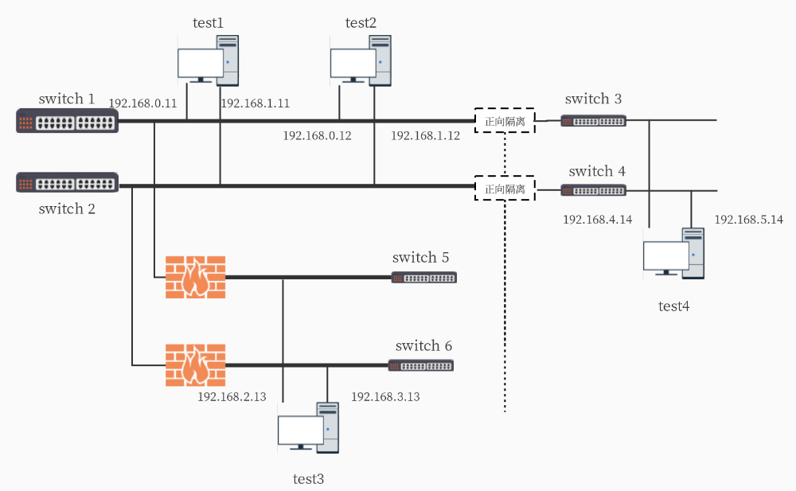

# 并行冗余网络协议软件测试说明

[TOC]

## 1概述

### 1.1项目背景

在冗余通信方面,符合 IEC64329-3 标准的 PRP 和 HSR 两种机制满足了 0 延时切换时间的可靠性和高可靠性要求,并被广泛应用。但 PRP 和 HSR 两种机制的实现依赖于特殊的网络设备或对网络拓扑结构有着特殊的要求。

PRIP 并行冗余互联协议,Parallel Redundancy Internet Protocol,是由北京凝思科技有限公司自主提出、论证并制定的适用于冗余网络通信的一种新型协议标准。PRIP 并行冗余互联协议可完全满足冗余通信的基本功能要求和 0 延时切换的性能要求,并且完全基于软件实现,对网络设备和网络拓扑无特殊的要求。

 

### 1.2编写目的

指导linux操作系统在部署prip内核后的验证测试。

 

### 1.3术语定义

无

 

## 2测试环境

### 2.1硬件环境

#### 2.1.1硬件列表

表格 1: 测试机列表

| 测试机名称 | 用途         | 备注 |
| ---------- | ------------ | ---- |
| test1      | PRIP测试机器 |      |
| test2      | PRIP测试机器 |      |
| test3      | PRIP测试机器 |      |
| test4      | PRIP测试机器 |      |

 

#### 2.1.2 硬件信息

cpu：

- test1：

  ​	Intel Xeon X5650 2.67GHz*24 4*4GB 1333MHz

- test2：

  ​	Inetl Xeon X5650 2.67GHz*24 2*4GB 1333MHz

网卡：

- test1：

  Intel Corporation 82576 Gigabit Network Connection

  Intel Corporation 82576 Gigabit Network Connection

  Intel Corporation 82599ES 10-Gigabit SFI/SFP+ Network Connection

  Subsystem:Intel Corporation Ethernet Server Adapter X502-2

  Intel Corporation 82599ES 10-Gigabit SFI/SFP+ Network Connection

  Subsystem:Intel Corporation Ethernet Server Adapter X502-2

- test2:

  Intel Corporation 82576 Gigabit Network Connection

  Intel Corporation 82576 Gigabit Network Connection

  Intel Corporation 82599ES 10-Gigabit SFI/SFP+ Network Connection

  Intel Corporation 82599ES 10-Gigabit SFI/SFP+ Network Connection

 

### 2.2软件环境

### 2.3网络环境

测试机间能够正常互相通信，并且网口ip配置符合prip特性

 

### 2.4环境搭建

测试对象机的环境搭建内容：

准备一个安装介质（U盘）。

操作系统产品ISO镜像文件

 

配置两台测试机器的网口

如下：

- test1：eth0：192.168.0.11 eth1：192.168.1.11
- test2：eth0：192.168.0.12 eth1：192.168.1.12
- test3：eth0：192.168.2.13 eth1：192.168.3.13
- test4：eth0：192.168.4.14 eth1：192.168.5.14

 

## 3测试项

表格 3: 测试项

| 序号 | 测试项             | 标识符 | 测试项描述                        |
| ---- | ------------------ | ------ | --------------------------------- |
| 1    | TCP数据冗余通信    |        | 测试开启PRIP后的TCP数据传输情况   |
| 2    | UDP数据冗余通信    |        | 测试开启PRIP后的UDP数据传输情况   |
| 3    | 插拔网线测试TCP    |        | 测试网线故障时对TCP通信的影响     |
| 4    | 插拔网线测试UDP    |        | 测试网线故障对UDP通信的影响       |
| 5    | ifconfig测试TCP    |        | 测试网卡故障时对TCP通信的影响     |
| 6    | ifconfig测试UDP    |        | 测试网卡故障时对UDP通信的影响     |
| 7    | ifdown/ifup测试TCP |        | 测试网卡故障时对TCP通信的影响     |
| 8    | ifdown/ifup测试UDP |        | 测试网卡故障时对UDP通信的影响     |
| 5    | TCP吞吐量          |        | 测试开启prip和关闭prip的TCP吞吐量 |
| 6    | UDP吞吐量          |        | 测试开启prip和关闭prip的UDP吞吐量 |

 

## 4基本测试用例

### 4.1 PRIP基础功能测试

netserver在test1机器上执行一次即可

#### 4.1.1 使用netperf测试TCP数据冗余通信

| 用例名称 | TCP数据冗余通信                                              | 用例编号 | 用户字段 项目代号 = PRIP-XXX-XXX-010 |
| :------: | ------------------------------------------------------------ | -------- | ------------------------------------ |
| 测试目的 | 测试开启PRIP后的TCP数据传输情况                              |          |                                      |
| 预置条件 | 成功部署PRIP内核软件包                                       |          |                                      |
|  序 号   | 测试步骤及预期结果                                           |          |                                      |
|    1     | 开启prip全局模式         `echo 24 > /proc/prip/prip_config`         `echo 1 > /proc/sys/net/ipv4 /prip_set` |          |                                      |
|    2     | 在test2机器上执行         `netperf -t TCP_STREAM -H 192.168.190.11 -l 30`   并且另开窗口执行         `sar -n DEV 1tcpdump -i eth0tcpdump -i eth2` |          |                                      |
| 实测结果 |                                                              |          |                                      |
| 测试结论 | 通过Pass （ ） 失败Fail （ ） 未测试 NT （ ）                |          |                                      |
|   备注   |                                                              |          |                                      |

 

 

#### 4.1.2使用netperf测试UDP数据冗余通信

| 用例名称 | UDP数据冗余通信                                              | 用例编号 | 用户字段 项目代号 = PRIP-XXX-XXX-010 |
| :------: | ------------------------------------------------------------ | -------- | ------------------------------------ |
| 测试目的 | 测试开启PRIP后的UDP数据传输情况                              |          |                                      |
| 预置条件 | 成功部署PRIP内核软件包                                       |          |                                      |
|  序 号   | 测试步骤及预期结果                                           |          |                                      |
|    1     | 开启prip全局模式         `echo 24 > /proc/prip/prip_config`         `echo 1 > /proc/sys/net/ipv4 /prip_set` |          |                                      |
|    2     | 在test2机器上执行        `netperf -t UDP_STREAM -H 192.168.190.11 -l 30 -- -m 65400`   并且另开窗口执行        `sar -n DEV 1 tcpdump -i eth0tcpdump -i eth2` |          |                                      |
| 实测结果 |                                                              |          |                                      |
| 测试结论 | 通过Pass （ ） 失败Fail （ ） 未测试 NT （ ）                |          |                                      |
|   备注   |                                                              |          |                                      |

 

 

### 4.2 PRIP的UDP组播测试

| 用例名称 | UDP组播数据冗余传输                                          | 用例编号 | 用户字段 项目代号 = PRIP-XXX-XXX-010 |
| -------- | ------------------------------------------------------------ | -------- | ------------------------------------ |
| 测试目的 | 测试开启PRIP后的UDP组播数据传输情况                          |          |                                      |
| 预置条件 | 成功部署PRIP内核软件包                                       |          |                                      |
| 序 号    | 测试步骤及预期结果                                           |          |                                      |
| 1        | 开启prip全局模式         `echo 24 > /proc/prip/prip_config`         `echo 1 > /proc/sys/net/ipv4 /prip_set` |          |                                      |
| 2        | 使用udp组播测试程序udp_mc_client 和udp_mc_server   在test2机器上执行  `./udp_mc_client eth0 `  在test1机器上执行`./udp_mc_server eth0`   在test2机器上另开窗口执行   `sar -n DEV 1tcpdump -i eth0 -ntcpdump -i eth2 -n` |          |                                      |
| 实测结果 |                                                              |          |                                      |
| 测试结论 | 通过Pass （ ） 失败Fail （ ） 未测试 NT （ ）                |          |                                      |
| 备注     |                                                              |          |                                      |

### 4.3 PRIP的插拔网线测试

#### 4.3.1插拔网线测试PRIP的TCP通信

| 用例名称 | 插拔网线测试TCP                                              | 用例编号 | 用户字段 项目代号 = PRIP-XXX-XXX-010 |
| -------- | ------------------------------------------------------------ | -------- | ------------------------------------ |
| 测试目的 | 测试插拔网线操作对TCP通信的影响                              |          |                                      |
| 预置条件 | 成功部署PRIP内核软件包                                       |          |                                      |
| 序 号    | 测试步骤及预期结果                                           |          |                                      |
| 1        | 开启prip全局模式         `echo 24 > /proc/prip/prip_config`         `echo 1 > /proc/sys/net/ipv4 /prip_set` |          |                                      |
| 2        | 在test2机器上执行         `netperf -t TCP_STREAM -H 192.168.190.11 -l 60`   并且另开窗口执行         `sar -n DEV 1tcpdump -i eth0tcpdump -i eth2` |          |                                      |
| 3        | 拔掉eth0口的网线                                             |          |                                      |
| 4        | 插回eth0口的网线                                             |          |                                      |
| 5        | 拔掉eth2口的网线                                             |          |                                      |
| 6        | 插回eth2口的网线                                             |          |                                      |
| 实测结果 |                                                              |          |                                      |
| 测试结论 | 通过Pass （ ） 失败Fail （ ） 未测试 NT （ ）                |          |                                      |
| 备注     |                                                              |          |                                      |

 

#### 4.3.2插拔网线测试PRIP的UDP通信

| 用例名称 | 插拔网线测试UDP                                              | 用例编号 | 用户字段 项目代号 = PRIP-XXX-XXX-010 |
| -------- | ------------------------------------------------------------ | -------- | ------------------------------------ |
| 测试目的 | 测试网线故障对UDP通信的影响                                  |          |                                      |
| 预置条件 | 成功部署PRIP内核软件包                                       |          |                                      |
| 序 号    | 测试步骤及预期结果                                           |          |                                      |
| 1        | 开启prip全局模式     `echo 24 > /proc/prip/prip_config   `      `echo 1 > /proc/sys/net/ipv4 /prip_set` |          |                                      |
| 2        | 在test2机器上执行   netperf -t UDP_STREAM -H 192.168.190.11 -l 60 -- -m 65400  并且另开窗口执行  sar -n DEV 1 tcpdump -i eth0tcpdump -i eth2 |          |                                      |
| 3        | 拔掉eth0口的网线                                             |          |                                      |
| 4        | 插回eth0口的网线                                             |          |                                      |
| 5        | 拔掉eth2口的网线                                             |          |                                      |
| 6        | 插回eth2口的网线                                             |          |                                      |
| 实测结果 |                                                              |          |                                      |
| 测试结论 | 通过Pass （ ） 失败Fail （ ） 未测试 NT （ ）                |          |                                      |
| 备注     |                                                              |          |                                      |

 

### 4.4 PRIP的ifconfig 、ifdown/ifup测试

#### 4.4.1 ifconfig测试PRIP的TCP通信

| 用例名称 | ifconfig测试TCP                                              | 用例编号 | 用户字段 项目代号 = PRIP-XXX-XXX-010 |
| -------- | ------------------------------------------------------------ | -------- | ------------------------------------ |
| 测试目的 | 测试ifconfig操作对TCP通信的影响                              |          |                                      |
| 预置条件 | 成功部署PRIP内核软件包                                       |          |                                      |
| 序 号    | 测试步骤及预期结果                                           |          |                                      |
| 1        | 开启prip全局模式     `echo 24 > /proc/prip/prip_config   `      `echo 1 > /proc/sys/net/ipv4 /prip_set` |          |                                      |
| 2        | 在test2机器上执行 netperf -t TCP_STREAM -H 192.168.190.11 -l 60  并且另开窗口执行 sar -n DEV 1tcpdump -i eth0tcpdump -i eth2 |          |                                      |
| 3        | 执行ifconfig eth0 down                                       |          |                                      |
| 4        | 执行ifconfig eth0 up                                         |          |                                      |
| 5        | 等待几秒，执行ifconfig eth2 down                             |          |                                      |
| 6        | 执行ifconfig eth2 up                                         |          |                                      |
| 实测结果 |                                                              |          |                                      |
| 测试结论 | 通过Pass （ ） 失败Fail （ ） 未测试 NT （ ）                |          |                                      |
| 备注     |                                                              |          |                                      |

 

#### 4.4.2 ifconfig测试PRIP的UDP通信

| 用例名称 | ifconfig测试UDP                                              | 用例编号 | 用户字段 项目代号 = PRIP-XXX-XXX-010 |
| -------- | ------------------------------------------------------------ | -------- | ------------------------------------ |
| 测试目的 | 测试插拔网线操作对UDP通信的影响                              |          |                                      |
| 预置条件 | 成功部署PRIP内核软件包                                       |          |                                      |
| 序 号    | 测试步骤及预期结果                                           |          |                                      |
| 1        | 开启prip全局模式     `echo 24 > /proc/prip/prip_config   `      `echo 1 > /proc/sys/net/ipv4 /prip_set` |          |                                      |
| 2        | 在test2机器上执行 netperf -t UDP_STREAM -H 192.168.190.11 -l 60 -- -m 65400  并且另开窗口执行 sar -n DEV 1 tcpdump -i eth0tcpdump -i eth2 |          |                                      |
| 3        | 执行ifconfig eth0 down                                       |          |                                      |
| 4        | 执行ifconfig eth0 up                                         |          |                                      |
| 5        | 等待几秒，执行ifconfig eth2 down                             |          |                                      |
| 6        | 执行ifconfig eth2 up                                         |          |                                      |
| 实测结果 |                                                              |          |                                      |
| 测试结论 | 通过Pass （ ） 失败Fail （ ） 未测试 NT （ ）                |          |                                      |
| 备注     |                                                              |          |                                      |

 

#### 4.4.3 ifdown/ifup测试PRIP的TCP通信

| 用例名称 | ifdown/ifup测试TCP                                           | 用例编号 | 用户字段 项目代号 = PRIP-XXX-XXX-010 |
| -------- | ------------------------------------------------------------ | -------- | ------------------------------------ |
| 测试目的 | 测试ifconfig操作对TCP通信的影响                              |          |                                      |
| 预置条件 | 成功部署PRIP内核软件包                                       |          |                                      |
| 序 号    | 测试步骤及预期结果                                           |          |                                      |
| 1        | 开启prip全局模式     `echo 24 > /proc/prip/prip_config   `      `echo 1 > /proc/sys/net/ipv4 /prip_set` |          |                                      |
| 2        | 在test2机器上执行netperf -t TCP_STREAM -H 192.168.190.11 -l 60  并且另开窗口执行 sar -n DEV 1tcpdump -i eth0tcpdump -i eth2 |          |                                      |
| 3        | 执行ifdown eth0                                              |          |                                      |
| 4        | 执行ifup eth0                                                |          |                                      |
| 5        | 等待几秒，执行ifdown eth2                                    |          |                                      |
| 6        | 执行ifup eth2                                                |          |                                      |
| 实测结果 |                                                              |          |                                      |
| 测试结论 | 通过Pass （ ） 失败Fail （ ） 未测试 NT （ ）                |          |                                      |
| 备注     |                                                              |          |                                      |

 

#### 4.4.4 ifdown/ifup测试PRIP的UDP通信

| 用例名称 | ifconfig测试UDP                                              | 用例编号 | 用户字段 项目代号 = PRIP-XXX-XXX-010 |
| -------- | ------------------------------------------------------------ | -------- | ------------------------------------ |
| 测试目的 | 测试插拔网线操作对UDP通信的影响                              |          |                                      |
| 预置条件 | 成功部署PRIP内核软件包                                       |          |                                      |
| 序 号    | 测试步骤及预期结果                                           |          |                                      |
| 1        | 开启prip全局模式     `echo 24 > /proc/prip/prip_config   `      `echo 1 > /proc/sys/net/ipv4 /prip_set` |          |                                      |
| 2        | 在test2机器上执行  netperf -t UDP_STREAM -H 192.168.190.11 -l 60 -- -m 65400  并且另开窗口执行 sar -n DEV 1 tcpdump -i eth0tcpdump -i eth2 |          |                                      |
| 3        | 执行ifdown eth0                                              |          |                                      |
| 4        | 执行ifup eth0                                                |          |                                      |
| 5        | 等待几秒，执行ifdown eth2                                    |          |                                      |
| 6        | 执行ifup eth2                                                |          |                                      |
| 实测结果 |                                                              |          |                                      |
| 测试结论 | 通过Pass （ ） 失败Fail （ ） 未测试 NT （ ）                |          |                                      |
| 备注     |                                                              |          |                                      |

 

 

### 4.5 PRIP的网络性能测试

#### 4.5.1使用netperf测试TCP的吞吐量

| 用例名称 | TCP吞吐量                                                    | 用例编号 | 用户字段 项目代号 = PRIP-XXX-XXX-010 |
| -------- | ------------------------------------------------------------ | -------- | ------------------------------------ |
| 测试目的 | 测试开启PRIP和关闭PRIP的TCP吞吐量的差别以及系统占用情况      |          |                                      |
| 预置条件 | 成功部署PRIP内核软件包                                       |          |                                      |
| 序 号    | 测试步骤及预期结果                                           |          |                                      |
| 1        | 开启prip全局模式     `echo 24 > /proc/prip/prip_config   `      `echo 1 > /proc/sys/net/ipv4 /prip_set` |          |                                      |
| 2        | 在test2机器上执行netperf -t TCP_STREAM -H 192.168.190.11 -l 30 |          |                                      |
| 实测结果 | 千兆网络的情况下的Throughput结果为930Mbits/s                 |          |                                      |
| 测试结论 | 通过Pass （ ） 失败Fail （ ） 未测试 NT （ ）                |          |                                      |
| 备注     |                                                              |          |                                      |

 

 

#### 4.5.2使用netperf测试UDP的吞吐量

| 用例名称 | UDP吞吐量                                                    | 用例编号 | 用户字段 项目代号 = PRIP-XXX-XXX-010 |
| -------- | ------------------------------------------------------------ | -------- | ------------------------------------ |
| 测试目的 | 测试开启PRIP和关闭PRIP的UDP吞吐量的差别                      |          |                                      |
| 预置条件 | 成功部署PRIP内核软件包                                       |          |                                      |
| 序 号    | 测试步骤及预期结果                                           |          |                                      |
| 1        | 开启prip全局模式     `echo 24 > /proc/prip/prip_config   `      `echo 1 > /proc/sys/net/ipv4 /prip_set` |          |                                      |
| 2        | 在test2机器上执行netperf -t UDP_STREAM -H 192.168.190.11 -l 30 -- -m 65400 |          |                                      |
| 实测结果 | 千兆网络的情况下的Throughput结果为950Mbits/s                 |          |                                      |
| 测试结论 | 通过Pass （ ） 失败Fail （ ） 未测试 NT （ ）                |          |                                      |
| 备注     |                                                              |          |                                      |

 

 

## 5 跨防火墙测试用例

### 5.1 PRIP的基础功能测试

netserver在test1、test2、test3、test4机器上仅执行一次即可

#### 5.1.1使用netperf测试TCP数据冗余通信

| 用例名称 | TCP数据冗余通信                                              | 用例编号 | 用户字段 项目代号 = PRIP-XXX-XXX-010 |
| -------- | ------------------------------------------------------------ | -------- | ------------------------------------ |
| 测试目的 | 测试开启PRIP后的TCP数据传输情况                              |          |                                      |
| 预置条件 | 成功部署PRIP内核软件包                                       |          |                                      |
| 序 号    | 测试步骤及预期结果                                           |          |                                      |
| 1        | 开启prip全局模式     `echo 24 > /proc/prip/prip_config   `      `echo 1 > /proc/sys/net/ipv4 /prip_set` |          |                                      |
| 2        | 在test2机器上执行netperf -t TCP_STREAM -H 192.168.0.11 -l 30   并且另开窗口执行 sar -n DEV 1tcpdump -i eth0tcpdump -i eth1记录现象 |          |                                      |
| 3        | 在test3机器上执行netperf -t TCP_STREAM -H 192.168.0.11 -l 30  并且另开窗口执行 sar -n DEV 1tcpdump -i eth0tcpdump -i eth1记录现象 |          |                                      |
| 4        | 在test1机器上执行netperf -t TCP_STREAM -H 192.168.2.13 -l 30 并且另开窗口执行 sar -n DEV 1tcpdump -i eth0tcpdump -i eth1记录现象 |          |                                      |
| 5        | 在test1机器上执行netperf -t TCP_STREAM -H 192.168.4.14 -l 30 sar -n DEV 1tcpdump -i eth0tcpdump -i eth1记录现象 |          |                                      |
| 实测结果 |                                                              |          |                                      |
| 测试结论 | 通过Pass （ ） 失败Fail （ ） 未测试 NT （ ）                |          |                                      |
| 备注     |                                                              |          |                                      |

#### 5.1.2 使用netperf测试UDP数据冗余通信

| 用例名称 | UDP数据冗余通信                                              | 用例编号 | 用户字段 项目代号 = PRIP-XXX-XXX-010 |
| -------- | ------------------------------------------------------------ | -------- | ------------------------------------ |
| 测试目的 | 测试开启PRIP后的UDP数据传输情况                              |          |                                      |
| 预置条件 | 成功部署PRIP内核软件包                                       |          |                                      |
| 序 号    | 测试步骤及预期结果                                           |          |                                      |
| 1        | 开启prip全局模式     `echo 24 > /proc/prip/prip_config   `      `echo 1 > /proc/sys/net/ipv4 /prip_set` |          |                                      |
| 2        | 在test2机器上执行   netperf -t UDP_STREAM -H 192.168.0.11 -l 30 -- -m 65400   并且另开窗口执行 sar -n DEV 1 tcpdump -i eth0tcpdump -i eth1 |          |                                      |
| 3        | 在test3机器上执行   netperf -t UDP_STREAM -H 192.168.0.11 -l 30 -- -m 65400   并且另开窗口执行 sar -n DEV 1 tcpdump -i eth0tcpdump -i eth1 |          |                                      |
| 4        | 在test1机器上执行   netperf -t UDP_STREAM -H 192.168.2.13 -l 30 -- -m 65400   并且另开窗口执行 sar -n DEV 1 tcpdump -i eth0tcpdump -i eth1 |          |                                      |
| 5        | 在test1机器上执行   netperf -t UDP_STREAM -H 192.168.4.14 -l 30 -- -m 65400   并且另开窗口执行 sar -n DEV 1 tcpdump -i eth0tcpdump -i eth1 |          |                                      |
| 实测结果 |                                                              |          |                                      |
| 测试结论 | 通过Pass （ ） 失败Fail （ ） 未测试 NT （ ）                |          |                                      |
| 备注     |                                                              |          |                                      |

 

### 5.2 PRIP的UDP组播测试

| 用例名称 | UDP组播数据冗余传输                                          | 用例编号 | 用户字段 项目代号 = PRIP-XXX-XXX-010 |
| -------- | ------------------------------------------------------------ | -------- | ------------------------------------ |
| 测试目的 | 测试开启PRIP后的UDP组播数据传输情况                          |          |                                      |
| 预置条件 | 成功部署PRIP内核软件包                                       |          |                                      |
| 序 号    | 测试步骤及预期结果                                           |          |                                      |
| 1        | 开启prip全局模式     `echo 24 > /proc/prip/prip_config   `      `echo 1 > /proc/sys/net/ipv4 /prip_set` |          |                                      |
| 2        | 使用udp组播测试程序udp_mc_client 和udp_mc_server在test2机器上执行       ./udp_mc_client eth0   在test1机器上执行  ./udp_mc_server    eth0 在两台机器上执行  tcpdump -i eth0 -ntcpdump -i eth1 -n |          |                                      |
| 3        | 使用udp组播测试程序udp_mc_client 和udp_mc_server在test4机器上执行     ./udp_mc_client   eth0在test1机器上执行./udp_mc_server    eth0在两台机器上执行tcpdump -i eth0 -ntcpdump -i eth1 -n |          |                                      |
| 4        | 使用udp组播测试程序udp_mc_client 和udp_mc_server在test3机器上执行    ./udp_mc_client   eth0在test1机器上执行./udp_mc_server   eth0在两台机器上执行tcpdump -i eth0 -ntcpdump -i eth1 -n |          |                                      |
| 实测结果 |                                                              |          |                                      |
| 测试结论 | 通过Pass （ ） 失败Fail （ ） 未测试 NT （ ）                |          |                                      |
| 备注     |                                                              |          |                                      |

 

 

### 5.3 PRIP的插拔网线测试

#### 5.3.1插拔网线测试PRIP的TCP通信

| 用例名称 | 插拔网线测试TCP                                              | 用例编号 | 用户字段 项目代号 = PRIP-XXX-XXX-010 |
| -------- | ------------------------------------------------------------ | -------- | ------------------------------------ |
| 测试目的 | 测试插拔网线操作对TCP通信的影响                              |          |                                      |
| 预置条件 | 成功部署PRIP内核软件包                                       |          |                                      |
| 序 号    | 测试步骤及预期结果                                           |          |                                      |
| 1        | 开启prip全局模式     `echo 24 > /proc/prip/prip_config   `      `echo 1 > /proc/sys/net/ipv4 /prip_set` |          |                                      |
| 2        | 在test2机器上执行netperf -t TCP_STREAM -H 192.168.0.11 -l 60    并且另开窗口执行 sar -n DEV 1tcpdump -i eth0tcpdump -i eth1 |          |                                      |
| 3        | 拔掉eth0口的网线                                             |          |                                      |
| 4        | 插回eth0口的网线                                             |          |                                      |
| 5        | 拔掉eth1口的网线                                             |          |                                      |
| 6        | 插回eth1口的网线                                             |          |                                      |
| 实测结果 |                                                              |          |                                      |
| 测试结论 | 通过Pass （ ） 失败Fail （ ） 未测试 NT （ ）                |          |                                      |
| 备注     |                                                              |          |                                      |

 

 

### 5.4 PRIP的网络性能测试

#### 5.4.1使用netperf测试TCP的吞吐量

| 用例名称 | TCP吞吐量                                                    | 用例编号 | 用户字段 项目代号 = PRIP-XXX-XXX-010 |
| -------- | ------------------------------------------------------------ | -------- | ------------------------------------ |
| 测试目的 | 测试开启PRIP和关闭PRIP的TCP吞吐量的差别以及系统占用情况      |          |                                      |
| 预置条件 | 成功部署PRIP内核软件包                                       |          |                                      |
| 序 号    | 测试步骤及预期结果                                           |          |                                      |
| 1        | 开启prip全局模式     `echo 24 > /proc/prip/prip_config   `      `echo 1 > /proc/sys/net/ipv4 /prip_set` |          |                                      |
| 2        | 在test2机器上执行netperf -t TCP_STREAM -H 192.168.0.11 -l 30 |          |                                      |
| 实测结果 |                                                              |          |                                      |
| 测试结论 | 通过Pass （ ） 失败Fail （ ） 未测试 NT （ ）                |          |                                      |
| 备注     |                                                              |          |                                      |

 

 

 

 

| 用例名称 | TCP吞吐量                                                    | 用例编号 | 用户字段 项目代号 = PRIP-XXX-XXX-010 |
| -------- | ------------------------------------------------------------ | -------- | ------------------------------------ |
| 测试目的 | 测试开启PRIP和关闭PRIP的TCP吞吐量的差别以及系统占用情况      |          |                                      |
| 预置条件 | 成功部署PRIP内核软件包                                       |          |                                      |
| 序 号    | 测试步骤及预期结果                                           |          |                                      |
| 1        | 开启prip全局模式     `echo 24 > /proc/prip/prip_config   `      `echo 1 > /proc/sys/net/ipv4 /prip_set` |          |                                      |
| 2        | 在test1机器上执行netperf -t TCP_STREAM -H 192.168.4.14 -l 30 |          |                                      |
| 实测结果 |                                                              |          |                                      |
| 测试结论 | 通过Pass （ ） 失败Fail （ ） 未测试 NT （ ）                |          |                                      |
| 备注     |                                                              |          |                                      |

 

 

 

 

| 用例名称 | TCP吞吐量                                                    | 用例编号 | 用户字段 项目代号 = PRIP-XXX-XXX-010 |
| -------- | ------------------------------------------------------------ | -------- | ------------------------------------ |
| 测试目的 | 测试开启PRIP和关闭PRIP的TCP吞吐量的差别以及系统占用情况      |          |                                      |
| 预置条件 | 成功部署PRIP内核软件包                                       |          |                                      |
| 序 号    | 测试步骤及预期结果                                           |          |                                      |
| 1        | 开启prip全局模式     `echo 24 > /proc/prip/prip_config   `      `echo 1 > /proc/sys/net/ipv4 /prip_set` |          |                                      |
| 2        | 在test1机器上执行netperf -t TCP_STREAM -H 192.168.2.13 -l 30 |          |                                      |
| 实测结果 |                                                              |          |                                      |
| 测试结论 | 通过Pass （ ） 失败Fail （ ） 未测试 NT （ ）                |          |                                      |
| 备注     |                                                              |          |                                      |

 

#### 5.4.2使用netperf测试UDP的吞吐量

| 用例名称 | UDP吞吐量                                                    | 用例编号 | 用户字段 项目代号 = PRIP-XXX-XXX-010 |
| -------- | ------------------------------------------------------------ | -------- | ------------------------------------ |
| 测试目的 | 测试开启PRIP和关闭PRIP的UDP吞吐量的差别                      |          |                                      |
| 预置条件 | 成功部署PRIP内核软件包                                       |          |                                      |
| 序 号    | 测试步骤及预期结果                                           |          |                                      |
| 1        | 开启prip全局模式     `echo 24 > /proc/prip/prip_config   `      `echo 1 > /proc/sys/net/ipv4 /prip_set` |          |                                      |
| 2        | 在test2机器上执行netperf -t UDP_STREAM -H 192.168.0.11 -l 30 -- -m 65400 |          |                                      |
| 实测结果 |                                                              |          |                                      |
| 测试结论 | 通过Pass （ ） 失败Fail （ ） 未测试 NT （ ）                |          |                                      |
| 备注     |                                                              |          |                                      |

 

 

 

 

| 用例名称 | UDP吞吐量                                                    | 用例编号 | 用户字段 项目代号 = PRIP-XXX-XXX-010 |
| -------- | ------------------------------------------------------------ | -------- | ------------------------------------ |
| 测试目的 | 测试开启PRIP和关闭PRIP的UDP吞吐量的差别                      |          |                                      |
| 预置条件 | 成功部署PRIP内核软件包                                       |          |                                      |
| 序 号    | 测试步骤及预期结果                                           |          |                                      |
| 1        | 开启prip全局模式     `echo 24 > /proc/prip/prip_config   `      `echo 1 > /proc/sys/net/ipv4 /prip_set` |          |                                      |
| 2        | 在test1机器上执行netperf -t UDP_STREAM -H 192.168.4.14 -l 30 -- -m 65400 |          |                                      |
| 实测结果 |                                                              |          |                                      |
| 测试结论 | 通过Pass （ ） 失败Fail （ ） 未测试 NT （ ）                |          |                                      |
| 备注     |                                                              |          |                                      |

 

 

 

 

| 用例名称 | UDP吞吐量                                                    | 用例编号 | 用户字段 项目代号 = PRIP-XXX-XXX-010 |
| -------- | ------------------------------------------------------------ | -------- | ------------------------------------ |
| 测试目的 | 测试开启PRIP和关闭PRIP的UDP吞吐量的差别                      |          |                                      |
| 预置条件 | 成功部署PRIP内核软件包                                       |          |                                      |
| 序 号    | 测试步骤及预期结果                                           |          |                                      |
| 1        | 开启prip全局模式     `echo 24 > /proc/prip/prip_config   `      `echo 1 > /proc/sys/net/ipv4 /prip_set` |          |                                      |
| 2        | 在test1机器上执行netperf -t UDP_STREAM -H 192.168.2.13 -l 30 -- -m 65400 |          |                                      |
| 实测结果 |                                                              |          |                                      |
| 测试结论 | 通过Pass （ ） 失败Fail （ ） 未测试 NT （ ）                |          |                                      |
| 备注     |                                                              |          |                                      |

 

## 6 其它补充测试用例

### 6.1发送到非独立双网测试

 

| 用例名称 | 独立双网对普通网测试                          | 用例编号 | 用户字段 项目代号 = PRIP-XXX-XXX-010 |
| -------- | --------------------------------------------- | -------- | ------------------------------------ |
| 测试目的 | 测试独立双网发到非独立双网是否会收到2份报文。 |          |                                      |
| 预置条件 | 成功部署PRIP内核软件包                        |          |                                      |
| 序 号    | 测试步骤及预期结果                            |          |                                      |
| 1        | TCP协议测试                                   |          |                                      |
| 2        | UDP协议测试                                   |          |                                      |
| 实测结果 |                                               |          |                                      |
| 测试结论 | 通过Pass （ ） 失败Fail （ ） 未测试 NT （ ） |          |                                      |
| 备注     |                                               |          |                                      |

 

### 6.2 TCP压力测试

| 用例名称 | TCP压力测试                                                  | 用例编号 | 用户字段 项目代号 = PRIP-XXX-XXX-010 |
| -------- | ------------------------------------------------------------ | -------- | ------------------------------------ |
| 测试目的 | 在CPU负载为80%的情况下，进行netperf测试TCP吞吐量             |          |                                      |
| 预置条件 | 成功部署PRIP内核软件包                                       |          |                                      |
| 序 号    | 测试步骤及预期结果                                           |          |                                      |
| 1        | 开启prip全局模式     `echo 24 > /proc/prip/prip_config   `      `echo 1 > /proc/sys/net/ipv4 /prip_set` |          |                                      |
| 2        | 在test1和test2机器上解压linx-test-suite.tar.xz，   修改Config文件里的ltp:xx(ltp压力持续时间，单位：小时) |          |                                      |
| 3        | 在两台机器上都开启一个终端执行   sar -n DEV 1 > ltp_prip_test(1/2)_tcp.txt 2>&1 |          |                                      |
| 4        | 在test2机器上执行   netperf -t TCP_STREAM -H 192.168.0.11 -l 3000    最后的-l 后面为时间（单位：s）,根据ltp压力测试时间情况设置 |          |                                      |
| 5        | ltp的run.sh脚本运行完成后，中断sar命令，记录netperf运行结束时的tcp吞吐量 |          |                                      |
| 实测结果 |                                                              |          |                                      |
| 测试结论 | 通过Pass （ ） 失败Fail （ ） 未测试 NT （ ）                |          |                                      |
| 备注     | ltp_prip_test(1/2)_tcp.txt 记录了在ltp压力环境下每秒的netperf TCP冗余收发包情况 |          |                                      |

 

 

 

| 用例名称 | TCP压力测试                                                  | 用例编号 | 用户字段 项目代号 = PRIP-XXX-XXX-010 |
| -------- | ------------------------------------------------------------ | -------- | ------------------------------------ |
| 测试目的 | 在CPU负载为80%的情况下，使用TCP自测程序来测试TCP传输的稳定性 |          |                                      |
| 预置条件 | 成功部署PRIP内核软件包                                       |          |                                      |
| 序 号    | 测试步骤及预期结果                                           |          |                                      |
| 1        | 开启prip全局模式     `echo 24 > /proc/prip/prip_config   `      `echo 1 > /proc/sys/net/ipv4 /prip_set` |          |                                      |
| 2        | 在test1和test2机器上解压TCP_UDP_test_example.tar.gz，   根据readme配置tcp测试程序文件夹的clientsh脚本 |          |                                      |
| 3        | 在test1和test2机器上解压linx-test-suite.tar.xz，   修改Config文件里的ltp:xx(ltp压力持续时间，单位：小时) |          |                                      |
| 4        | 配置无误后，在两台机器上都开启一个终端分别执行 ./serversh ./clientsh |          |                                      |
| 5        | 运行run.sh脚本，运行完成后，查看运行serversh脚本的服务端   在当前目录下生成的x.log日志文件 |          |                                      |
| 实测结果 |                                                              |          |                                      |
| 测试结论 | 通过Pass （ ） 失败Fail （ ） 未测试 NT （ ）                |          |                                      |
| 备注     | 服务端的x.log 文件里面记录读取错误或者丢失的包               |          |                                      |

 

 

 

| 用例名称 | TCP压力测试                                                  | 用例编号 | 用户字段 项目代号 = PRIP-XXX-XXX-010 |
| -------- | ------------------------------------------------------------ | -------- | ------------------------------------ |
| 测试目的 | 测试在多个进程同时进行TCP通信、大流量的传输情况              |          |                                      |
| 预置条件 | 成功部署PRIP内核软件包                                       |          |                                      |
| 序 号    | 测试步骤及预期结果                                           |          |                                      |
| 1        | 开启prip全局模式     `echo 24 > /proc/prip/prip_config   `      `echo 1 > /proc/sys/net/ipv4 /prip_set` |          |                                      |
| 2        | 在test1和test2上解压TCP_UDP_test_example.tar.gz              |          |                                      |
| 3        | 进入tcp目录，确认multserver 和multclient 脚本内的参数无误    |          |                                      |
| 4        | 执行./multserver                                             |          |                                      |
| 5        | 再执行./mulclient                                            |          |                                      |
| 实测结果 |                                                              |          |                                      |
| 测试结论 | 通过Pass （ ） 失败Fail （ ） 未测试 NT （ ）                |          |                                      |
| 备注     | 服务端生成一个 $(sockfd).log 的日志文件 里面记录读取错误或者丢失的包 |          |                                      |

 

### 6.3 UDP压力测试

 

| 用例名称 | UDP压力测试                                                  | 用例编号 | 用户字段 项目代号 = PRIP-XXX-XXX-010 |
| -------- | ------------------------------------------------------------ | -------- | ------------------------------------ |
| 测试目的 | 在CPU负载为80%的情况下，进行netperf测试UDP吞吐量             |          |                                      |
| 预置条件 | 成功部署PRIP内核软件包                                       |          |                                      |
| 序 号    | 测试步骤及预期结果                                           |          |                                      |
| 1        | 开启prip全局模式     `echo 24 > /proc/prip/prip_config   `      `echo 1 > /proc/sys/net/ipv4 /prip_set` |          |                                      |
| 2        | 在test1和test2机器上解压linx-test-suite.tar.xz，   修改Config文件里的ltp:xx(ltp压力持续时间，单位：小时) |          |                                      |
| 3        | 在两台机器上都开启一个终端执行   sar -n DEV 1 > ltp_prip_test(1/2)_udp.txt 2>&1 |          |                                      |
| 4        | 在test2机器上执行   netperf -t UDP_STREAM -H 192.168.190.11 -l 30000 -- -m 65400   最后的-l 后面为时间（单位：s）,根据情况设置 |          |                                      |
| 5        | ltp的run.sh脚本运行完成后，中断sar命令，记录netperf运行结束时的tcp吞吐量 |          |                                      |
| 实测结果 |                                                              |          |                                      |
| 测试结论 | 通过Pass （ ） 失败Fail （ ） 未测试 NT （ ）                |          |                                      |
| 备注     | ltp_prip_test(1/2)_tcp.txt 记录了在ltp压力环境下每秒的netperf UDP冗余收发包情况 |          |                                      |

 

 

 

| 用例名称 | UDP压力测试                                                  | 用例编号 | 用户字段 项目代号 = PRIP-XXX-XXX-010 |
| -------- | ------------------------------------------------------------ | -------- | ------------------------------------ |
| 测试目的 | 在CPU负载为80%的情况下，使用UDP自测程序来测试UDP传输的稳定性 |          |                                      |
| 预置条件 | 成功部署PRIP内核软件包                                       |          |                                      |
| 序 号    | 测试步骤及预期结果                                           |          |                                      |
| 1        | 开启prip全局模式     `echo 24 > /proc/prip/prip_config   `      `echo 1 > /proc/sys/net/ipv4 /prip_set` |          |                                      |
| 2        | 在test1和test2机器上解压TCP_UDP_test_example.tar.gz，   根据readme配置udp测试程序文件夹的clientsh和serversh脚本 |          |                                      |
| 3        | 在test1和test2机器上解压linx-test-suite.tar.xz，   修改Config文件里的ltp:xx(ltp压力持续时间，单位：小时) |          |                                      |
| 4        | 配置无误后，在两台机器上都开启一个终端分别执行    ./serversh ./clientsh |          |                                      |
| 5        | 运行run.sh脚本，运行完成后，查看运行serversh脚本的服务端   在当前目录下生成的配置的logname日志文件 |          |                                      |
| 实测结果 |                                                              |          |                                      |
| 测试结论 | 通过Pass （ ） 失败Fail （ ） 未测试 NT （ ）                |          |                                      |
| 备注     | 服务端的配置的logname文件里面记录读取错误或者丢失的包        |          |                                      |

 

 

 

 

| 用例名称 | UDP压力测试                                                  | 用例编号 | 用户字段 项目代号 = PRIP-XXX-XXX-010 |
| -------- | ------------------------------------------------------------ | -------- | ------------------------------------ |
| 测试目的 | 测试在多个进程同时进行UDP通信、大流量的传输情况              |          |                                      |
| 预置条件 | 成功部署PRIP内核软件包                                       |          |                                      |
| 序 号    | 测试步骤及预期结果                                           |          |                                      |
| 1        | 开启prip全局模式     `echo 24 > /proc/prip/prip_config   `      `echo 1 > /proc/sys/net/ipv4 /prip_set` |          |                                      |
| 2        | 在test1和test2上解压TCP_UDP_test_example.tar.gz              |          |                                      |
| 3        | 进入tcp目录，确认multserver 和multclient 脚本内的参数无误    |          |                                      |
| 4        | 执行./multserver                                             |          |                                      |
| 5        | 再执行./mulclient                                            |          |                                      |
| 实测结果 |                                                              |          |                                      |
| 测试结论 | 通过Pass （ ） 失败Fail （ ） 未测试 NT （ ）                |          |                                      |
| 备注     | 服务端生成一个 logname 的日志文件 里面记录读取错误或者丢失的包 |          |                                      |

 

### 6.4跨网段压力测试

#### 6.4.1 TCP相关

| 用例名称 | TCP压力测试                                                  | 用例编号 | 用户字段 项目代号 = PRIP-XXX-XXX-010 |
| -------- | ------------------------------------------------------------ | -------- | ------------------------------------ |
| 测试目的 | 在CPU负载为80%的情况下，进行netperf测试TCP吞吐量             |          |                                      |
| 预置条件 | 成功部署PRIP内核软件包                                       |          |                                      |
| 序 号    | 测试步骤及预期结果                                           |          |                                      |
| 1        | 开启prip全局模式     `echo 24 > /proc/prip/prip_config   `      `echo 1 > /proc/sys/net/ipv4 /prip_set` |          |                                      |
| 2        | 在test1和test3机器上解压linx-test-suite.tar.xz，   修改Config文件里的ltp:xx(ltp压力持续时间，单位：小时) |          |                                      |
| 3        | 在两台机器上都开启一个终端执行   sar -n DEV 1 > ltp_prip_test(1/3)_tcp.txt 2>&1 |          |                                      |
| 4        | 在test3机器上执行   netperf -t TCP_STREAM -H 192.168.190.11 -l 3000    最后的-l 后面为时间（单位：s）,根据ltp压力测试时间情况设置 |          |                                      |
| 5        | ltp的run.sh脚本运行完成后，中断sar命令，   记录netperf运行结束时的tcp吞吐量 |          |                                      |
| 实测结果 |                                                              |          |                                      |
| 测试结论 | 通过Pass （ ） 失败Fail （ ） 未测试 NT （ ）                |          |                                      |
| 备注     | ltp_prip_test(1/3)_tcp.txt 记录了在ltp压力环境下每秒的netperf TCP冗余收发包情况 |          |                                      |

 

 

 

 

| 用例名称 | TCP压力测试                                                  | 用例编号 | 用户字段 项目代号 = PRIP-XXX-XXX-010 |
| -------- | ------------------------------------------------------------ | -------- | ------------------------------------ |
| 测试目的 | 在CPU负载为80%的情况下，使用TCP自测程序来测试TCP传输的稳定性 |          |                                      |
| 预置条件 | 成功部署PRIP内核软件包                                       |          |                                      |
| 序 号    | 测试步骤及预期结果                                           |          |                                      |
| 1        | 开启prip全局模式     `echo 24 > /proc/prip/prip_config   `      `echo 1 > /proc/sys/net/ipv4 /prip_set` |          |                                      |
| 2        | 在test1和test3机器上解压TCP_UDP_test_example.tar.gz，  根据readme配置tcp测试程序文件夹的clientsh脚本 |          |                                      |
| 3        | 在test1和test2机器上解压linx-test-suite.tar.xz，   修改Config文件里的ltp:xx(ltp压力持续时间，单位：小时) |          |                                      |
| 4        | test3机器上的clientsh 的ip参数配置为192.168.190.11   在test1上执行 ./serversh   在test3上执行 ./clientsh |          |                                      |
| 5        | 运行run.sh脚本，运行完成后，查看运行serversh脚本的服务端   在当前目录下生成的x.log日志文件 |          |                                      |
| 实测结果 |                                                              |          |                                      |
| 测试结论 | 通过Pass （ ） 失败Fail （ ） 未测试 NT （ ）                |          |                                      |
| 备注     | 服务端的x.log 文件里面记录读取错误或者丢失的包               |          |                                      |

 

| 用例名称 | TCP压力测试                                                  | 用例编号 | 用户字段 项目代号 = PRIP-XXX-XXX-010 |
| -------- | ------------------------------------------------------------ | -------- | ------------------------------------ |
| 测试目的 | 测试在多个进程同时进行TCP通信、大流量的传输情况              |          |                                      |
| 预置条件 | 成功部署PRIP内核软件包                                       |          |                                      |
| 序 号    | 测试步骤及预期结果                                           |          |                                      |
| 1        | 开启prip全局模式     `echo 24 > /proc/prip/prip_config   `      `echo 1 > /proc/sys/net/ipv4 /prip_set` |          |                                      |
| 2        | 在test1和test3上解压TCP_UDP_test_example.tar.gz              |          |                                      |
| 3        | 进入tcp目录，确认multserver 和multclient 脚本内的参数无误   test3机器上的multclient脚本的ip参数为192.168.190.11 |          |                                      |
| 4        | test1执行./multserver                                        |          |                                      |
| 5        | test3执行./multclient                                        |          |                                      |
| 实测结果 |                                                              |          |                                      |
| 测试结论 | 通过Pass （ ） 失败Fail （ ） 未测试 NT （ ）                |          |                                      |
| 备注     | 服务端生成一个 $(sockfd).log 的日志文件 里面记录读取错误或者丢失的包 |          |                                      |

 

#### 6.4.2 UDP相关

| 用例名称 | UDP压力测试                                                  | 用例编号 | 用户字段 项目代号 = PRIP-XXX-XXX-010 |
| -------- | ------------------------------------------------------------ | -------- | ------------------------------------ |
| 测试目的 | 在CPU负载为80%的情况下，进行netperf测试UDP吞吐量             |          |                                      |
| 预置条件 | 成功部署PRIP内核软件包                                       |          |                                      |
| 序 号    | 测试步骤及预期结果                                           |          |                                      |
| 1        | 开启prip全局模式     `echo 24 > /proc/prip/prip_config   `      `echo 1 > /proc/sys/net/ipv4 /prip_set` |          |                                      |
| 2        | 在test1和test3机器上解压linx-test-suite.tar.xz，   修改Config文件里的ltp:xx(ltp压力持续时间，单位：小时) |          |                                      |
| 3        | 在两台机器上都开启一个终端执行   sar -n DEV 1 > ltp_prip_test(1/3)_udp.txt 2>&1 |          |                                      |
| 4        | 在test3机器上执行   netperf -t UDP_STREAM -H 192.168.190.11 -l 30000 -- -m 65400   最后的-l 后面为时间（单位：s）,根据情况设置 |          |                                      |
| 5        | ltp的run.sh脚本运行完成后，中断sar命令，记录netperf运行结束时的tcp吞吐量 |          |                                      |
| 实测结果 |                                                              |          |                                      |
| 测试结论 | 通过Pass （ ） 失败Fail （ ） 未测试 NT （ ）                |          |                                      |
| 备注     | ltp_prip_test(1/3)_tcp.txt 记录了在ltp压力环境下每秒的netperf UDP冗余收发包情况 |          |                                      |

 

 

 

 

| 用例名称 | UDP压力测试                                                  | 用例编号 | 用户字段 项目代号 = PRIP-XXX-XXX-010 |
| -------- | ------------------------------------------------------------ | -------- | ------------------------------------ |
| 测试目的 | 在CPU负载为80%的情况下，使用UDP自测程序来测试UDP传输的稳定性 |          |                                      |
| 预置条件 | 成功部署PRIP内核软件包                                       |          |                                      |
| 序 号    | 测试步骤及预期结果                                           |          |                                      |
| 1        | 开启prip全局模式     `echo 24 > /proc/prip/prip_config   `      `echo 1 > /proc/sys/net/ipv4 /prip_set` |          |                                      |
| 2        | 在test1和test3机器上解压TCP_UDP_test_example.tar.gz   根据readme配置udp测试程序文件夹的clientsh和serversh脚本 |          |                                      |
| 3        | 在test1和test3机器上解压linx-test-suite.tar.xz   修改Config文件里的ltp:xx(ltp压力持续时间，单位：小时) |          |                                      |
| 4        | test3机器上的clientsh 的ip参数配置为192.168.190.11   在test1上执行 ./serversh     在test3上执行 ./clientsh |          |                                      |
| 5        | 运行run.sh脚本，运行完成后，查看运行serversh脚本的服务端在当前   目录下生成的配置的logname日志文件 |          |                                      |
| 实测结果 |                                                              |          |                                      |
| 测试结论 | 通过Pass （ ） 失败Fail （ ） 未测试 NT （ ）                |          |                                      |
| 备注     | 服务端的配置的logname文件里面记录读取错误或者丢失的包        |          |                                      |

 

 

 

| 用例名称 | UDP压力测试                                                  | 用例编号 | 用户字段 项目代号 = PRIP-XXX-XXX-010 |
| -------- | ------------------------------------------------------------ | -------- | ------------------------------------ |
| 测试目的 | 测试在多个进程同时进行UDP通信、大流量的传输情况              |          |                                      |
| 预置条件 | 成功部署PRIP内核软件包                                       |          |                                      |
| 序 号    | 测试步骤及预期结果                                           |          |                                      |
| 1        | 开启prip全局模式     `echo 24 > /proc/prip/prip_config   `      `echo 1 > /proc/sys/net/ipv4 /prip_set` |          |                                      |
| 2        | 在test1和test3上解压TCP_UDP_test_example.tar.gz              |          |                                      |
| 3        | 进入tcp目录，确认multserver 和multclient 脚本内的参数无误test3机器上的   multclient脚本的ip参数为192.168.190.11 |          |                                      |
| 4        | 在test1执行./multserver                                      |          |                                      |
| 5        | 在test3执行./mulclient                                       |          |                                      |
| 实测结果 |                                                              |          |                                      |
| 测试结论 | 通过Pass （ ） 失败Fail （ ） 未测试 NT （ ）                |          |                                      |
| 备注     | 服务端生成一个 logname 的日志文件 里面记录读取错误或者丢失的包 |          |                                      |

 

 